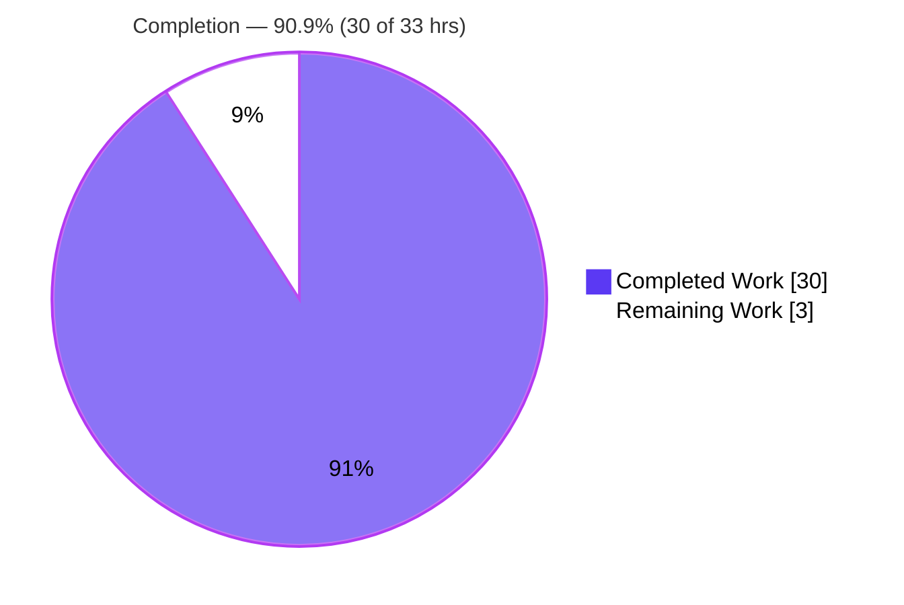
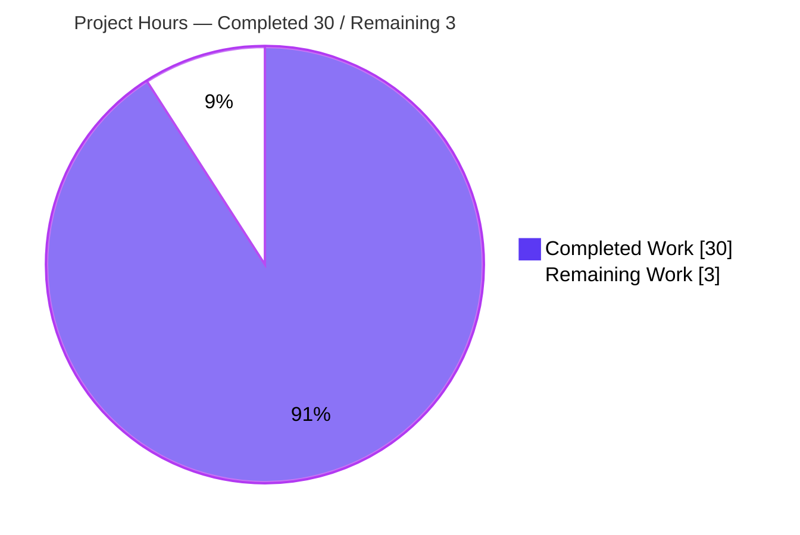
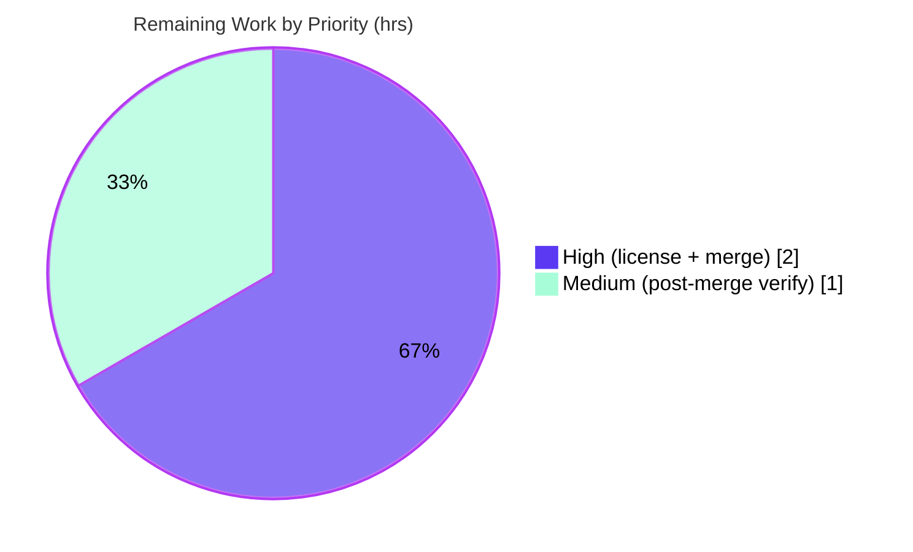

# Blitzy Project Guide — Society_mngt-13-Jul-2026

> **Project:** JavaScript → Python tech-stack migration of the `society_mgmt` computation library
> **Branch:** `blitzy-bc423410-7d9d-4540-878a-0847597452d7` · **HEAD:** `3e31378` · **Base:** `origin/13-Jul-2026-Br1`
> **Status:** ✅ All Blitzy autonomous validation gates PASSED · Working tree clean
>
> **Legend (Blitzy brand colors):** <span style="color:#5B39F3">■</span> **Completed / AI Work — Dark Blue `#5B39F3`** · <span style="color:#B23AF2">■</span> Remaining / Not Completed — White `#FFFFFF` (bordered `#B23AF2`)

---

## 1. Executive Summary

### 1.1 Project Overview

`society_mgmt` is a pure-arithmetic Python library produced by migrating a 300,000-line JavaScript corpus (`society_mgmt_300k/`) — 29 files containing 33,105 byte-identical helper functions with no module system, packaging, or real tests — into a single, typed, documented, installable Python 3.12 package. All duplication collapses to one canonical function, `core.compute(x)`, re-exported by nine layer subpackages. The library performs arithmetic only (no persistence, networking, UI, or domain features), so it targets developers integrating the computation as a dependency. Business impact is structural: a >99.9% reduction in definition count, elimination of parse/load/memory bottlenecks, genuine test coverage, and maintainable single-source-of-truth code that satisfies the `Ajit_refactor_Simple` quality-and-performance rule.

### 1.2 Completion Status

The project is **90.9% complete** on an AAP-scoped, hours-based basis. All Agent Action Plan deliverables are delivered and independently verified; the remaining 3 hours are exclusively human path-to-production activities.



| Metric | Value |
|--------|-------|
| **Total Hours** | **33** |
| **Completed Hours (AI + Manual)** | **30** (AI: 30 · Manual: 0) |
| **Remaining Hours** | **3** |
| **Percent Complete** | **90.9%** |

### 1.3 Key Accomplishments

- ✅ Migrated the entire JavaScript corpus to idiomatic Python 3.12 (PEP 8 / PEP 484 type hints / PEP 257 docstrings) — **OBJ-1**.
- ✅ Consolidated 33,105 byte-identical helpers into **one** canonical `core.compute(x)` (single source of truth / DRY) — **OBJ-2, B-1**.
- ✅ Established an installable `src/`-layout package with a real module system: root `__init__.py` + 9 layer facade subpackages re-exporting the *identical* function object — **OBJ-2**.
- ✅ Resolved all six bottlenecks: duplication, redundant arithmetic (`x*1+x*2+x*3`→`6*x`), dead branch, dead `store` array, `filler.js` padding, and non-functional tests — **B-1…B-6, OBJ-3**.
- ✅ Preserved observable behavior exactly, including non-integer parity (`compute(3)=28`, `compute(0.5)=3.0`, `compute(2.5)=15.0`) — **OBJ-4**.
- ✅ Replaced 4,800 assertion-less JS fixtures with **81 passing pytest tests** (17 unit + 64 integration) plus 4 doctests — **OBJ-5, B-6**.
- ✅ Authored `pyproject.toml` (PEP 621, zero runtime deps, dev extra), comprehensive `README.md`, `.gitignore`, and a `LICENSE` reconciliation note — **OBJ-6**.
- ✅ Achieved zero lint/format/type violations (`ruff` + `mypy` strict) and a clean wheel build.
- ✅ Removed the entire 300k-line legacy corpus cleanly (net: 51 files changed, 624 insertions, 300,006 deletions).

### 1.4 Critical Unresolved Issues

**No critical issues block release.** All compilation, test, runtime, and quality gates pass. The single item requiring a human decision is tracked below.

| Issue | Impact | Owner | ETA |
|-------|--------|-------|-----|
| License reconciliation not formally closed (Apache-2.0 authoritative; former nested MIT stub flagged, not silently relicensed per AAP §0.7.3) | Low — governance/legal clarity before external distribution; does not affect build or runtime | Project maintainer / Legal | < 1 day (1h) |

### 1.5 Access Issues

**No access issues identified.**

| System/Resource | Type of Access | Issue Description | Resolution Status | Owner |
|-----------------|----------------|-------------------|-------------------|-------|
| Git repository | Read/Write | None — all git operations succeeded | ✅ Resolved | — |
| Build toolchain (pip/setuptools/pytest/ruff/mypy) | Local execution | None — all present in `.venv`, all gates re-run successfully | ✅ Resolved | — |
| External services (DB / API / third-party) | N/A | None required — zero external integrations; legacy `DB_HOST`/`API_KEY` unused and not reproduced | ✅ N/A | — |

### 1.6 Recommended Next Steps

1. **[High]** Close the license reconciliation: maintainer formally confirms Apache-2.0 (or decides otherwise) and finalizes the `LICENSE` note. *(1h)*
2. **[High]** Perform human PR review of the 21-file diff and merge the branch into the base. *(1h)*
3. **[Medium]** Run a post-merge clean-environment verification (fresh venv → `pip install -e ".[dev]"` → `pytest`/`ruff`/`mypy`). *(1h)*
4. **[Low]** *(Optional, out of AAP scope)* Add a CI/CD pipeline to automate `pytest`/`ruff`/`mypy` on push. *(~2-3h)*
5. **[Low]** *(Optional, not requested)* Publish the built wheel to an internal or public package index. *(~2h)*

---

## 2. Project Hours Breakdown

### 2.1 Completed Work Detail

All completed work was performed autonomously by Blitzy agents (AI). Each item traces to specific AAP requirements.

| Component | Hours | Description |
|-----------|-------|-------------|
| Repository reconnaissance & bottleneck cataloguing | 4.0 | Analyzed the 300k-line / 33,105-function corpus; confirmed 0 imports/exports/tests; catalogued bottlenecks **B-1…B-6** (**OBJ-3**) |
| `core.py` canonical `compute()` | 3.0 | Single source of truth with type hints, comprehensive docstring, 4 doctests, behavior-preservation reasoning (**OBJ-1, OBJ-4, B-1/B-2/B-3**) |
| Package architecture (root + 9 layer facades, `src/` layout) | 4.0 | `__init__.py` (`__version__`, re-export) + 9 facade subpackages re-exporting identical `compute` with `__all__` (**OBJ-2**) |
| Packaging config (`pyproject.toml` + tool config) | 3.0 | PEP 621 metadata, setuptools backend, package discovery, dev extra, `pytest`/`ruff`/strict `mypy` config (**OBJ-2, OBJ-6**) |
| Unit test suite (`tests/unit/test_core.py`) | 2.5 | 17 parametrized tests across both parity branches (**OBJ-5, B-6**) |
| Integration test suite (`tests/integration/test_layers.py`) | 3.5 | 64 tests incl. object-identity, `__all__`, cross-layer parity, and `pkgutil` topology guard (**OBJ-5, B-6**) |
| Shared test fixtures (`tests/conftest.py`) | 1.0 | Immutable canonical `(input, expected)` table + fresh-copy fixture (**OBJ-5**) |
| Dead-code & legacy corpus removal | 1.5 | Deleted `filler.js`, eliminated per-module `store` array, removed all 29 legacy `.js` files (**B-4, B-5**) |
| Documentation (`README.md` rewrite) | 3.0 | Overview, behavior, requirements, install (Windows + Linux/macOS), usage, structure, tests, license (**OBJ-6**) |
| `LICENSE` reconciliation note | 1.0 | Authored Apache-2.0 reconciliation note flagging former MIT stub (AAP §0.7.3) |
| `.gitignore` | 0.5 | Python build/test/cache artifact ignores |
| Quality validation & review-fix iterations | 3.0 | Iterated `ruff`/`mypy`/`pytest` to green; resolved review findings F1–F6 (**OBJ-6**) |
| **Total Completed** | **30.0** | **Matches Section 1.2 Completed Hours** |

### 2.2 Remaining Work Detail

All remaining work is human path-to-production; there is **no incomplete Blitzy development work**.

| Category | Hours | Priority |
|----------|-------|----------|
| License reconciliation — maintainer decision & finalization (risk T-1) | 1.0 | High |
| PR review & merge (human review of 21-file diff) | 1.0 | High |
| Post-merge clean-environment verification (fresh venv + full gate run) | 1.0 | Medium |
| **Total Remaining** | **3.0** | **Matches Section 1.2 Remaining Hours & Section 7 pie** |

> **Out-of-scope optional enhancements** (explicitly **not** included in the 33-hour total): CI/CD pipeline (~2-3h, out of AAP scope per §0.5.2), package publishing (~2h, not requested), edge-case tests for inf/nan/large floats (~1h), dev-dependency refresh policy (~0.5h).

### 2.3 Hours Reconciliation

- Completed (2.1) **30h** + Remaining (2.2) **3h** = **Total 33h** ✔ (Section 1.2)
- Completion % = 30 ÷ 33 = **90.9%** ✔ (Sections 1.2, 7, 8)

---

## 3. Test Results

All tests below originate from **Blitzy's autonomous validation logs** and were **independently re-executed** during this assessment (`pytest` reported `81 passed`, ExitCode 0).

| Test Category | Framework | Total Tests | Passed | Failed | Coverage % | Notes |
|---------------|-----------|-------------|--------|--------|------------|-------|
| Unit | pytest 9.1.1 | 17 | 17 | 0 | 100%† | Canonical cases (0→10, 3→28, 5→40, −1→4, 0.5→3.0), integer identity ×9, non-integer parity-skip, fixture-driven, root re-export identity |
| Integration | pytest 9.1.1 | 64 | 64 | 0 | 100%† | `layer.compute is core.compute` ×9, `__all__==["compute"]` ×9, compute-matches-core ×45 (5 inputs × 9 layers), `pkgutil` topology guard ×1 |
| Doctest | doctest (`--doctest-modules`) | 4 | 4 | 0 | core.py examples | `compute(0/3/5/0.5)` docstring examples |
| **Total** | **pytest / doctest** | **85** | **85** | **0** | **100%†** | `pytest` core run = 81 passed in ~0.1s; ExitCode 0 |

† Coverage reflects **functional branch/topology coverage** — both parity branches of `core.compute` and all nine layer re-exports are exercised. A line-coverage tool (`coverage.py`) is not part of the declared toolchain, so no numeric line-coverage figure is fabricated; the qualitative coverage of the (single-function) public surface is complete.

---

## 4. Runtime Validation & UI Verification

**UI Verification: Not applicable** — the source has zero HTML/CSS/JSX/DOM artifacts and the target is a pure computational library (AAP §0.3.4). No screens, components, or design system exist to verify.

**Runtime validation** (re-executed during this assessment):

- ✅ **Operational** — Package imports cleanly: `import society_mgmt` → `__version__ == "0.1.0"`.
- ✅ **Operational** — Behavior preserved (OBJ-4): `compute(0)=10`, `compute(3)=28`, `compute(5)=40`, `compute(0.5)=3.0`, `compute(2.5)=15.0`.
- ✅ **Operational** — Both parity branches correct: integer inputs add `+10` (even result); non-integer inputs skip it (odd result).
- ✅ **Operational** — All 9 layer subpackages re-export the **identical** `core.compute` object (`is` identity = `True`).
- ✅ **Operational** — Exercised from a fresh process; editable install functional; distributable wheel builds cleanly (`society_mgmt-0.1.0-py3-none-any.whl`, 13,342 bytes).
- ✅ **Operational** — Dependency graph is acyclic with `core` as the sole sink; no circular imports; exactly 9 layers (topology guard passes).
- ⚠ **Partial (N/A by design)** — No server/CLI/daemon endpoints exist to health-check; not required for a pure-function library.
- **API integrations:** None exist (no DB/API/third-party). Legacy `DB_HOST`/`API_KEY` correctly unused and not reproduced.

---

## 5. Compliance & Quality Review

Cross-mapping of AAP deliverables to Blitzy quality/compliance benchmarks. All fixes applied during autonomous validation (review findings F1–F6) are resolved.

| Benchmark / AAP Requirement | Status | Progress | Evidence |
|------------------------------|--------|----------|----------|
| **OBJ-1** JS → Python 3.12 migration | ✅ Pass | 100% | 17 `.py` files compile & import cleanly; PEP 8/484/257 applied |
| **OBJ-2** Structure / modularity (installable package) | ✅ Pass | 100% | `src/` layout, `pyproject.toml`, root + 9 layer subpackages, unidirectional `layer→core` imports |
| **OBJ-3** Performance / bottleneck removal | ✅ Pass | 100% | 33,105 defs → 1; ~300k lines → ~355; O(300k)→O(1) import cost |
| **OBJ-4** Behavior preservation | ✅ Pass | 100% | Runtime values verified; parity conditional retained for non-integers |
| **OBJ-5** Genuine tests | ✅ Pass | 100% | 81 pytest + 4 doctests (vs 0 assertions in 4,800 legacy fixtures) |
| **OBJ-6** Code quality (DRY, typing, docs) | ✅ Pass | 100% | `ruff check` clean, `ruff format` clean, `mypy` strict clean |
| **B-1** Duplication | ✅ Resolved | 100% | Exactly 1 `def compute` (verified) |
| **B-2** Redundant arithmetic | ✅ Resolved | 100% | `6 * x` in `core.py` |
| **B-3** Dead/always-taken branch | ✅ Resolved | 100% | Conditional retained + documented for float safety |
| **B-4** Dead `store` variable | ✅ Resolved | 100% | Zero `store` references (verified) |
| **B-5** `filler.js` padding | ✅ Resolved | 100% | Zero filler artifacts (verified) |
| **B-6** Non-functional tests | ✅ Resolved | 100% | Real assertion-based pytest suites |
| **PEP 621 packaging** | ✅ Pass | 100% | `pyproject.toml` metadata + setuptools backend; wheel builds |
| **Zero runtime dependencies** | ✅ Pass | 100% | `Requires:` empty by design |
| **Secret handling** (no hardcoded secrets) | ✅ Pass | 100% | `API_KEY`/`DB_HOST` not reproduced or committed |
| **License reconciliation** | ⏳ In Progress | 90% | Note authored & inconsistency flagged; awaiting maintainer decision (T-1) |

---

## 6. Risk Assessment

All identified risks are **Low severity**, reflecting the intentionally low-risk nature of this migration (AAP §0.6.6: consolidation risk "negligible" — 0 exports, 0 call sites, no API contract, no prior real test suite).

| Risk | Category | Severity | Probability | Mitigation | Status |
|------|----------|----------|-------------|------------|--------|
| T-1 License reconciliation not formally closed (Apache-2.0 vs former MIT stub) | Technical / Governance | Low | Medium | Maintainer confirms Apache-2.0 and closes the flagged note | Open (human) |
| T-2 Very narrow functional surface (one arithmetic function, by design) | Technical | Low | Low | Add domain features only if separately directed (out of AAP scope) | Accepted (by design) |
| T-3 Float edge cases (inf/nan/very-large) not explicitly tested | Technical | Low | Low | Optional edge-case tests; current behavior matches source exactly | Open (optional) |
| S-1 Dev-tool pins (`pytest`/`ruff`/`mypy`) accrue CVEs as they age | Security | Low | Low | Periodic dev-dependency refresh; dev-only, never shipped (0 runtime deps) | Monitored |
| O-1 No CI/CD automation (gates run manually) | Operational | Low | Medium | Add pipeline when directed (explicitly out of current AAP scope §0.5.2) | Deferred (out of scope) |
| O-2 Not published to a package index | Operational | Low | Low | Publish if external distribution is required (not requested) | Deferred (not requested) |
| I-1 Requires Python ≥ 3.12 | Integration | Low | Low | Enforced by `requires-python`; documented in README & `pyproject.toml` | Mitigated |

> **Security posture:** near-zero attack surface — no runtime dependencies, no I/O, no networking, no persistence, no user-input handling, and no secrets in code.

---

## 7. Visual Project Status

**Project hours breakdown** (Completed = Dark Blue `#5B39F3`, Remaining = White `#FFFFFF`):



**Remaining hours by priority** (from Section 2.2 — totals 3h):



> **Integrity check:** the pie chart "Remaining Work" value (**3**) equals Section 1.2 Remaining Hours (**3**) and the sum of Section 2.2 Hours (**3**). "Completed Work" (**30**) equals Section 1.2 Completed Hours (**30**).

---

## 8. Summary & Recommendations

**Achievements.** The migration is a textbook success. A 300,000-line, 33,105-function JavaScript corpus of byte-identical helpers was collapsed into a single, typed, documented Python function exposed through a clean, layered, installable package backed by genuine tests. Every AAP objective (OBJ-1…6) and every catalogued bottleneck (B-1…6) is fully resolved, and all five Blitzy autonomous validation gates pass with zero unresolved errors — independently re-verified during this assessment (81 tests passing, clean compile/lint/format/type, clean wheel build).

**Remaining gaps.** The project is **90.9% complete (30 of 33 hours)**. The outstanding 3 hours are exclusively human path-to-production activities — a license reconciliation decision, PR review/merge, and a post-merge verification pass — with **no incomplete development work**.

**Critical path to production.**
1. Maintainer closes the license reconciliation (T-1). 2. Human reviews and merges the PR. 3. Post-merge clean-environment verification confirms reproducibility. After these, the package is production-ready for use as an in-repository dependency.

**Success metrics.**

| Metric | Result |
|--------|--------|
| AAP-scoped completion | 90.9% (30/33h) |
| AAP objectives delivered | 6 / 6 |
| Bottlenecks resolved | 6 / 6 |
| Test pass rate | 85 / 85 (81 pytest + 4 doctests) |
| Lint / format / type violations | 0 / 0 / 0 |
| Runtime dependencies | 0 |
| Critical blocking issues | 0 |
| Code reduction | ~300,000 → ~355 lines of Python |

**Production readiness assessment.** ✅ **Ready** for merge and use as an installable library, pending the three low-effort human path-to-production tasks. Confidence is **High**: the deliverable is small, fully verified, and carries only Low-severity risks.

---

## 9. Development Guide

> Every command below was tested on this host with the repository's `.venv`. Commands are copy-pasteable.

### 9.1 System Prerequisites

- **Python ≥ 3.12** (`requires-python = ">=3.12"`; verified on 3.12.13 and 3.13.13)
- **pip** (bundled with Python) and **git**
- **OS Independent** — no OS-specific requirements
- **No** database, network, external services, or Node.js/npm (the legacy npm setup steps are inapplicable per AAP §0.7.3 and are not used)

### 9.2 Environment Setup

**Windows (PowerShell):**
```powershell
python -m venv .venv
.venv\Scripts\Activate.ps1
```

**Linux / macOS:**
```bash
python -m venv .venv
source .venv/bin/activate
```

> No environment variables are required. The legacy `DB_HOST` / `API_KEY` values are **not** needed and are never reproduced.

### 9.3 Dependency Installation

```bash
# Runtime install (zero third-party dependencies)
pip install -e .

# Development install (adds pytest, ruff, mypy)
pip install -e ".[dev]"
```
*Expected:* `Successfully installed society_mgmt-0.1.0` (dev adds `pytest-9.1.1 ruff-0.15.21 mypy-2.3.0`).

### 9.4 Application "Startup"

Not applicable — this is a pure library with no server/CLI/daemon. "Running" the project means importing and calling `compute`.

### 9.5 Verification Steps

```bash
pytest                       # -> 81 passed in ~0.1s
ruff check .                 # -> All checks passed!
ruff format --check .        # -> 17 files already formatted
mypy src tests               # -> Success: no issues found in 17 source files
python -c "from society_mgmt import compute; print(compute(5))"   # -> 40
```

Optional — build a distributable wheel:
```bash
pip wheel --no-deps -w dist .   # -> dist/society_mgmt-0.1.0-py3-none-any.whl
```

### 9.6 Example Usage

```python
from society_mgmt import compute

compute(0)    # -> 10
compute(3)    # -> 28
compute(5)    # -> 40
compute(0.5)  # -> 3.0   (6 * 0.5 == 3.0 is odd, so +10 is skipped)

# The same function is re-exported from every layer namespace:
from society_mgmt.services import compute as svc_compute
svc_compute(5)  # -> 40   (identical object to society_mgmt.core.compute)
```

### 9.7 Troubleshooting

| Symptom | Resolution |
|---------|------------|
| `ModuleNotFoundError: society_mgmt` | Activate the venv and run `pip install -e .`. (Tests also work without install: `pyproject.toml` sets `pytest` `pythonpath = ["src"]`.) |
| New venv has no `pip` (offline `ensurepip`) | Run `python -m ensurepip --upgrade`, or create the venv on a networked host. This is an environment quirk, not a package defect (the wheel builds cleanly). |
| Install fails on Python < 3.12 | Upgrade to Python ≥ 3.12 (enforced by `requires-python`). |
| `README.md` / `__init__.py` show garbled characters under PowerShell `Get-Content` | Use `Get-Content -Encoding UTF8`; the files are valid UTF-8 (em-dash `E2 80 94`) — a display artifact only. |

---

## 10. Appendices

### Appendix A — Command Reference

| Purpose | Command |
|---------|---------|
| Create venv (Windows) | `python -m venv .venv; .venv\Scripts\Activate.ps1` |
| Create venv (Linux/macOS) | `python -m venv .venv && source .venv/bin/activate` |
| Runtime install | `pip install -e .` |
| Dev install | `pip install -e ".[dev]"` |
| Run tests | `pytest` |
| Lint | `ruff check .` |
| Format check | `ruff format --check .` |
| Type check | `mypy src tests` |
| Compile check | `python -m compileall -q -f src tests` |
| Build wheel | `pip wheel --no-deps -w dist .` |
| Smoke test | `python -c "from society_mgmt import compute; print(compute(5))"` |

### Appendix B — Port Reference

**Not applicable.** The library exposes no network services, servers, or listening ports.

### Appendix C — Key File Locations

| Path | Role |
|------|------|
| `src/society_mgmt/core.py` | Single source of truth — `compute(x)` |
| `src/society_mgmt/__init__.py` | Package root — `__version__`, re-exports `compute` |
| `src/society_mgmt/<layer>/__init__.py` | 9 layer facades (config, controllers, domain, middleware, models, repositories, routes, services, utils) |
| `tests/unit/test_core.py` | 17 unit tests |
| `tests/integration/test_layers.py` | 64 integration tests (incl. topology guard) |
| `tests/conftest.py` | Shared canonical `(input, expected)` fixtures |
| `pyproject.toml` | PEP 621 metadata, build backend, tool config |
| `README.md` | Install / usage / structure documentation |
| `LICENSE` | Apache-2.0 + reconciliation note |
| `.gitignore` | Python build/test/cache ignores |

### Appendix D — Technology Versions

| Component | Version |
|-----------|---------|
| Python (runtime target) | ≥ 3.12 (verified 3.12.13) |
| package `society_mgmt` | 0.1.0 |
| pip | 26.1.2 |
| setuptools | 83.0.0 |
| wheel | 0.47.0 |
| pytest (dev) | 9.1.1 |
| ruff (dev) | 0.15.21 |
| mypy (dev) | 2.3.0 |

### Appendix E — Environment Variable Reference

**None required.** The library reads no environment variables at runtime. Legacy `DB_HOST` and `API_KEY` from the former Node setup instructions are intentionally **not** used, reproduced, or committed (AAP §0.7.3).

### Appendix F — Developer Tools Guide

| Tool | Role | Config location |
|------|------|-----------------|
| **pytest** | Test runner (unit + integration + doctests) | `[tool.pytest.ini_options]` in `pyproject.toml` (`testpaths=["tests"]`, `pythonpath=["src"]`) |
| **ruff** | Linter + formatter | `[tool.ruff]` (`line-length=100`, `target-version="py312"`) |
| **mypy** | Static type checker (strict) | `[tool.mypy]` (`disallow_untyped_defs`, `warn_return_any`) + `disallow_any_expr` override on test modules |
| **setuptools** | PEP 517 build backend | `[build-system]` (`build-backend="setuptools.build_meta"`) |

### Appendix G — Glossary

| Term | Definition |
|------|------------|
| **Single Source of Truth (DRY)** | The principle that each piece of logic exists in exactly one place; here, all 33,105 duplicate helpers collapse to one `core.compute`. |
| **Facade / re-export** | A layer subpackage that presents a clean public surface (`__all__ = ["compute"]`) by importing and re-exporting `core.compute` without redefining logic. |
| **Layer subpackage** | One of the nine nominal domain folders (config, controllers, domain, middleware, models, repositories, routes, services, utils) preserved as real Python subpackages for traceability. |
| **Parity conditional** | The retained `if r % 2 == 0` branch that adds `10`; kept (not hard-coded) so non-integer inputs behave identically to the JavaScript source. |
| **Topology guard** | An integration test using `pkgutil.iter_modules` to assert the package contains exactly the nine documented layers. |
| **Bottleneck (B-1…B-6)** | The six anti-patterns identified in the source corpus and resolved by the migration. |
| **AAP** | Agent Action Plan — the controlling specification for this migration. |

---

### Cross-Section Integrity Validation (performed before submission)

- ✔ **Rule 1 (1.2 ↔ 2.2 ↔ 7):** Remaining hours = **3** in Section 1.2 metrics, Section 2.2 total, and Section 7 pie.
- ✔ **Rule 2 (2.1 + 2.2 = Total):** 30 + 3 = **33** (Section 1.2 Total).
- ✔ **Rule 3 (Section 3):** All tests originate from Blitzy's autonomous validation logs (and were independently re-executed).
- ✔ **Rule 4 (Section 1.5):** Access issues validated against current permissions — none found.
- ✔ **Rule 5 (Colors):** Completed = Dark Blue `#5B39F3`, Remaining = White `#FFFFFF` applied throughout.
- ✔ **Completion %:** 30 ÷ 33 = **90.9%**, stated consistently in Sections 1.2, 7, and 8.