# Technical Specification

> **⚠ HISTORICAL PRE-REFACTOR SNAPSHOT — this document describes the *original* repository, not the current one.**
>
> This Technical Specification is a point-in-time record of the **pre-migration** `Society_mngt-13-Jul-2026` repository — the 300,000-line JavaScript corpus under `society_mgmt_300k/` (original corpus at commit `4263fe3`) — captured **before** the JavaScript → Python migration. It describes the legacy source that motivated the refactor; it does **not** describe the current repository.
>
> **Current state:** the migration is complete. At HEAD `13e7dd0` the tree is the consolidated, installable Python package `society_mgmt` (`src/` layout, one canonical `core.compute`, nine layer facades that re-export it, real `pytest` suites, and `pyproject.toml`); `society_mgmt_300k/` and all `.js` files have been removed. For the current repository state, see `README.md` and `blitzy/documentation/Project Guide.md`.


# 1. Introduction

## 1.1 Executive Summary

This Technical Specification documents the *original*, pre-migration `Society_mngt-13-Jul-2026` repository as it existed in source control **before** the JavaScript → Python migration (see the historical-snapshot note at the top of this document); the current repository is the migrated Python `society_mgmt` package described in that note. As captured in that pre-migration snapshot, the repository consisted of a top-level project marker (`README.md`, `LICENSE`) and a single nested code corpus, `society_mgmt_300k/`, whose name signals a "society management" theme and a scale target of roughly 300,000 lines. That scale target is met precisely: the corpus contains **exactly 300,000 lines** of JavaScript distributed across 29 `.js` files, organized beneath conventional application-layer directory names (`controllers/`, `services/`, `repositories/`, `routes/`, `models/`, `domain/`, `middleware/`, `config/`, `utils/`) with a parallel `tests/` tree (`unit/`, `integration/`).

**Project overview.** Despite the application-oriented directory taxonomy, the *observed* implementation is a **generated, dependency-free code corpus** rather than a functioning society-management application. Every executable module in `society_mgmt_300k/src/` and `society_mgmt_300k/tests/` follows one uniform template: a `// mod_<N> - society module` label comment, an unused module-scoped `const store = [];`, and a large batch of standalone synchronous arithmetic helper functions. The 28 executable modules collectively define **33,105** such helpers (28,305 under `src/`, 4,800 under `tests/`), and every helper body is byte-identical — each accepts a numeric `x`, accumulates `x*1 + x*2 + x*3` (equivalent to `6*x`), adds `10` when the intermediate result is even, and returns it:

```javascript
function mod_1_0(x){ let r=0; r+=x*1; r+=x*2; r+=x*3; if(r%2===0){r+=10} return r; }
```

A single comment-only file, `society_mgmt_300k/src/utils/filler.js`, contributes 1,999 lines of numbered padding (`// filler 298001` … `// filler 299999`) that pad the corpus to its exact 300,000-line total.

**Core business problem.** No business problem, product requirement, user story, or domain narrative is stated or implemented anywhere in the repository. The `README.md` contains only the project title (`# Society_mngt-13-Jul-2026`) with no descriptive prose, and there is no specification, design document, or in-code domain logic — no members, dues, households, committees, billing, notices, or governance constructs — that would evidence a concrete business problem being solved.

**Key stakeholders and users.** The repository does not define, name, or reference any stakeholders, user roles, personas, actors, or access groups. There is no authentication, authorization, user model, permission construct, or human-facing interface present in the code.

**Business impact and value proposition.** No business impact, value proposition, monetization model, or benefit metric is documented or derivable from the source. The repository's demonstrable, evidence-based value is that of a large, uniformly structured, fixed-size (300,000-line) JavaScript artifact — the kind of corpus useful for scale, tooling, indexing, or throughput exercises rather than a deployable product delivering end-user functionality.

**Repository snapshot.** The following table summarizes the authoritative, verified characteristics of the artifact:

| Attribute | Observed Value |
|-----------|----------------|
| Repository name | `Society_mngt-13-Jul-2026` |
| Primary corpus | `society_mgmt_300k/` (nested single corpus) |
| Total lines of code | Exactly 300,000 across 29 `.js` files |
| Executable modules | 28 (`mod_0` … `mod_27`), each an isolated arithmetic fixture |
| Helper functions | 33,105 total (28,305 in `src/`, 4,800 in `tests/`), all byte-identical bodies |
| Language / runtime | JavaScript; no runtime, framework, or entry point declared |
| Dependencies / manifest | None — no `package.json`, lockfile, or config anywhere |
| Licensing | Root `LICENSE` = Apache-2.0; nested `LICENSE/LICENSE.txt` = truncated MIT notice |

In summary, the naming of `society_mgmt_300k/` and its directory taxonomy *suggest* a layered society-management service, but the artifact's factual content is a deterministic, integration-free numeric-function corpus. All subsequent sub-sections of this Introduction characterize both this nominal (name-implied) intent and the observed reality, without inferring capabilities, stakeholders, or metrics that the code does not contain.

## 1.2 System Overview

This System Overview characterizes the repository's context, capabilities, and success criteria. Because the artifact is a generated code corpus (see Section 1.1), each part below distinguishes the **nominal** intent implied by the `society_mgmt_300k/` name and directory taxonomy from the **observed** implementation actually present in the code.

### 1.2.1 Project Context

**Business context and market positioning.** The repository name `Society_mngt-13-Jul-2026` and the corpus name `society_mgmt_300k/` nominally point to a "society management" domain — a category commonly associated with housing societies, residents' welfare associations, cooperatives, and clubs. However, no business context, target market, market positioning, competitive framing, or domain description is documented anywhere in the repository. The `README.md` holds only the project title, and there are no product briefs, design notes, or domain models in `society_mgmt_300k/src/domain/` (its files contain the same generic arithmetic helpers as every other layer). The domain association is therefore purely nominal.

**Current system limitations (replacement/upgrade context).** The repository references no predecessor system, no legacy platform, and no migration or upgrade path. There are no data-migration scripts, no compatibility adapters, no versioned APIs, and no deprecation notices. Consequently there is no "existing system" being replaced or upgraded that could be characterized from the code.

**Integration with the existing enterprise landscape.** The corpus is fully self-contained and integration-free. Verified across `society_mgmt_300k/src/` and `society_mgmt_300k/tests/`, there are zero occurrences of module imports (`require`/`import`), exports (`module.exports`/`export`), HTTP/network clients (`http`, `fetch`, `axios`), web frameworks (e.g., `express`), database or ORM clients, message brokers, or environment/configuration loading. There is no `package.json` or any manifest declaring external dependencies. The following table summarizes the integration surface:

| Integration Dimension | Observed Evidence | Status |
|-----------------------|-------------------|--------|
| External dependencies | No `package.json`, lockfile, or `require`/`import` | None |
| Inbound interfaces (API/UI) | No routes, handlers, or servers despite `routes/`, `controllers/` names | None |
| Outbound interfaces (DB/HTTP/queue) | No network, persistence, or client code | None |
| Cross-module composition | No calls between helpers; each is standalone | None |

### 1.2.2 High-Level Description

**Primary system capabilities.** The single implemented capability is a pure, deterministic numeric transformation. Every one of the 33,105 helper functions computes the identical result — `x*1 + x*2 + x*3` (i.e., `6*x`), plus `10` when that sum is even — and returns it synchronously with no side effects. The module-scoped `const store = [];` present in each executable file is never read or written. No society-management capability (membership, dues, notices, facilities, complaints, accounting, elections, etc.) is implemented.

**Major system components.** The corpus is organized under `society_mgmt_300k/src/` (nine layer-named folders) and `society_mgmt_300k/tests/` (two folders). The directory names imply a layered service architecture, but each folder contains the same class of standalone arithmetic fixtures. The structure and verified counts are:

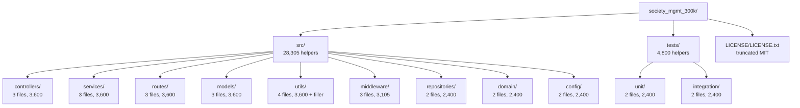

| Directory | Nominal Role (name-implied) | Files | Helper Functions |
|-----------|-----------------------------|-------|------------------|
| `src/controllers/` | Request handlers | 3 | 3,600 |
| `src/services/` | Business logic | 3 | 3,600 |
| `src/routes/` | Endpoint routing | 3 | 3,600 |
| `src/models/` | Data models | 3 | 3,600 |
| `src/utils/` | Utilities | 4 (incl. `filler.js`) | 3,600 |
| `src/middleware/` | Cross-cutting middleware | 3 | 3,105 |
| `src/repositories/` | Persistence access | 2 | 2,400 |
| `src/domain/` | Domain model | 2 | 2,400 |
| `src/config/` | Configuration | 2 | 2,400 |
| `tests/unit/` | Unit tests | 2 | 2,400 |
| `tests/integration/` | Integration tests | 2 | 2,400 |

Note that the nominal roles above describe only what each folder's *name* implies; the observed content of every folder is a set of isolated arithmetic helpers with no behavior specific to its layer. The `tests/` files contain the same helper definitions (`mod_9_*`, `mod_10_*`, `mod_20_*`, `mod_21_*`) with no test runner, assertions, or `describe`/`it`/`expect` calls — they do not exercise the `src/` code.

**Core technical approach.** The corpus is plain, ES5-style JavaScript composed entirely of top-level function declarations. Its defining characteristics, all verified, are: (1) **generation-based uniformity** — a repeated `// mod_<N> - society module` header, one `const store = [];`, and sequentially named helpers `mod_<N>_0 … mod_<N>_(k-1)`; (2) **determinism and purity** — identical, side-effect-free bodies with no randomness, time, or I/O; (3) **no module system** — nothing is imported or exported, so modules cannot compose or be invoked as a unit; and (4) **fixed-size padding** — `src/utils/filler.js` supplies 1,999 comment-only lines to reach exactly 300,000 total lines.

### 1.2.3 Success Criteria

Because the repository documents no product goals, the only success criteria that can be stated are **verifiable structural properties of the artifact**, not product KPIs. No key performance indicators are defined or instrumented in the code: there is no logging, metrics emission, telemetry, benchmark harness, or monitoring anywhere in `society_mgmt_300k/`. The measurable, objectively-checkable properties actually satisfied by the corpus are:

| Verifiable Property | Target / Definition | Observed Result |
|---------------------|---------------------|-----------------|
| Corpus size | Fixed 300,000-line scale target (per `300k` name) | Met exactly (300,000 lines) |
| Structural uniformity | Single repeated module/helper template | Met (only 6 distinct body lines corpus-wide) |
| Determinism | Pure functions, reproducible outputs | Met (no I/O, randomness, or state) |
| Dependency footprint | Zero external dependencies | Met (no manifest, no imports) |

**Critical success factors and KPIs.** No critical success factors, acceptance criteria, service-level objectives, or KPIs are documented or derivable from the repository. Any such metrics would have to be defined externally; this specification does not infer them, in keeping with the evidence-based scope of the artifact.

## 1.3 Scope

This section delimits the boundaries of the `society_mgmt_300k/` artifact as it actually exists. "In-Scope" enumerates the elements the repository genuinely contains and that this specification documents; "Out-of-Scope" enumerates capabilities that the repository's naming and directory taxonomy *imply* but that are demonstrably absent from the code.

### 1.3.1 In-Scope

**Core features and functionalities.** The repository's substantive content is a single computational capability plus organizational and licensing artifacts:

| In-Scope Element | Description | Evidence |
|------------------|-------------|----------|
| Deterministic numeric transformation | The sole implemented behavior — `6*x`, plus `10` when even — replicated across 33,105 identical helper functions | `society_mgmt_300k/src/`, `society_mgmt_300k/tests/` |
| Layered directory taxonomy | Nine `src/` layer folders and `unit/`+`integration/` test folders, used as organization only | `society_mgmt_300k/src/`, `society_mgmt_300k/tests/` |
| Fixed-size corpus padding | Comment-only lines that pad the corpus to exactly 300,000 lines | `society_mgmt_300k/src/utils/filler.js` |
| License artifacts | Apache-2.0 at the root; a truncated MIT notice nested in the corpus | `LICENSE`, `society_mgmt_300k/LICENSE/LICENSE.txt` |

- **Must-have capabilities:** only the deterministic arithmetic transformation described above is present and in scope.
- **Primary user workflows:** none. No user-facing workflow, screen, command, or endpoint exists to be documented; the functions are not invoked by any caller in the repository.
- **Essential integrations:** none. There are no first-party or third-party integrations in scope because none are implemented.
- **Key technical requirements:** the corpus is plain JavaScript source files; it declares no runtime, build tooling, package manifest, or execution entry point.

**Implementation boundaries.**

| Boundary Dimension | Observation |
|--------------------|-------------|
| System boundary | A static JavaScript source tree only; there is no compiled, packaged, or running system, and no process/service boundary |
| User groups covered | None — no users, roles, tenants, or actors are defined anywhere |
| Geographic / market coverage | None — no locale, region, currency, language, or market data is present |
| Data domains included | None — no schemas or persisted entities; the only "data" are the numeric arguments passed to helper functions |

### 1.3.2 Out-of-Scope

Every capability that the `society_mgmt` naming and the conventional layer folder names might suggest is **out of scope because it is not implemented**. The table below records the principal name-implied areas and the evidence confirming their absence:

| Name-Implied / Excluded Capability | Status | Evidence of Absence |
|------------------------------------|--------|---------------------|
| Society-management domain features (membership, dues, billing, notices, facilities, complaints, accounting, elections) | Absent | `src/domain/`, `src/models/` contain only arithmetic helpers |
| HTTP API, routing, and request handling | Absent | No servers, routes, or handlers despite `routes/`, `controllers/` names |
| Persistence and data access | Absent | No database/ORM clients or queries despite `repositories/` name |
| Authentication, authorization, user management | Absent | No user model, credentials, sessions, or permission constructs |
| Middleware behavior (validation, logging, error handling) | Absent | `src/middleware/` contains only arithmetic helpers |
| Configuration management | Absent | No env/config loading despite `config/` name; no config files exist |
| Executable test suites, assertions, and CI | Absent | No test runner, `describe`/`it`/`expect`, or assertions in `tests/` |
| External / enterprise integrations | Absent | No imports, network, messaging, or client code corpus-wide |
| Build, packaging, deployment, and runtime | Absent | No `package.json`, lockfile, `Dockerfile`, CI, or scripts |
| Observability (logging, metrics, tracing) | Absent | No `console`/telemetry/metrics instrumentation |

**Future phase considerations.** The repository documents no roadmap, backlog, milestones, `TODO`s, or planned phases; therefore no future-phase scope can be stated from the evidence.

**Integration points not covered.** All integration points are out of scope because none exist in the code — there are no inbound APIs/UIs, no outbound service/database/queue clients, and no cross-module composition among the isolated helpers.

**Unsupported use cases.** Any use of the repository as a runnable or deployable society-management application is unsupported: the corpus has no entry point, exports nothing, and its functions are never invoked. Its supportable use is limited to static analysis of a large, uniform JavaScript source corpus.

## 1.4 References

The following repository files and folders were inspected directly and cited as the evidence basis for this Introduction. No external web sources were used, and no other Technical Specification sections were available for cross-reference.

**Files**

- `README.md` — Established that the root README contains only the project title `# Society_mngt-13-Jul-2026` with no descriptive prose, setup, or documentation.
- `LICENSE` — Confirmed the root license is the full Apache License, Version 2.0.
- `society_mgmt_300k/LICENSE/LICENSE.txt` — Confirmed the nested license is a truncated MIT notice ("Permission is hereby granted...", Copyright 2026).
- `society_mgmt_300k/src/services/file_1.js` — Representative source module (`mod_1`); established the canonical helper template (`const store = []`, byte-identical `6*x` (+10 if even) bodies) and the 1,200-helper file size.
- `society_mgmt_300k/src/controllers/file_0.js` — Confirmed the identical header/`store`/helper pattern in the `controllers/` layer.
- `society_mgmt_300k/src/config/file_17.js` — Confirmed the identical pattern in the `config/` layer.
- `society_mgmt_300k/src/middleware/file_27.js` — Confirmed the single shorter module (705 helpers), yielding the 28,305 `src/` helper total.
- `society_mgmt_300k/src/utils/filler.js` — Established the 1,999-line comment-only padding (`// filler 298001` … `// filler 299999`) that fixes the corpus at exactly 300,000 lines.
- `society_mgmt_300k/tests/unit/file_9.js`, `society_mgmt_300k/tests/unit/file_20.js`, `society_mgmt_300k/tests/integration/file_10.js`, `society_mgmt_300k/tests/integration/file_21.js` — Established that the test-labeled files contain the same helper fixtures (`mod_9/20/10/21`) with no runner, assertions, or `describe`/`it`/`expect` calls.

**Folders**

- `` (repository root) — Established the three first-order children (`README.md`, `LICENSE`, `society_mgmt_300k/`) and the absence of any root-level manifests or configuration.
- `society_mgmt_300k/` — The single nested corpus root; established the `LICENSE/`, `src/`, and `tests/` structure and the overall 300,000-line scale.
- `society_mgmt_300k/src/` — Established the nine layer-named folders (`controllers/`, `services/`, `repositories/`, `routes/`, `models/`, `domain/`, `middleware/`, `config/`, `utils/`) and the 28,305 `src/` helper functions.
- `society_mgmt_300k/tests/` — Established the `unit/` and `integration/` folders and the 4,800 test-file helper functions.

**Repository-wide verification**

- Corpus-wide inspection of `society_mgmt_300k/src/` and `society_mgmt_300k/tests/` — Confirmed exactly 300,000 total lines across 29 `.js` files, 33,105 identically-bodied helpers, and zero occurrences of `require`/`import`/`export`/`module.exports`, web frameworks, HTTP/DB/queue clients, `async`/`await`, `class`, `console`/`process`, or test-runner assertions; confirmed no `package.json`, lockfile, `tsconfig`, `Dockerfile`, YAML, or environment/config files anywhere in the repository.
- Git metadata — Inspected commit history (two commits: "Initial commit" and "Add files via upload"), confirming the repository is a freshly uploaded corpus with no development history.

# 2. Product Requirements

## 2.1 Feature Catalog

This section decomposes the `society_mgmt_300k/` artifact into discrete, testable features. A critical constraint governs the entire section: as established in Sections 1.1, 1.2, and 1.3, the repository **documents no business problem, product requirement, user story, user role, or KPI**, and it implements **no** society-management functionality (no membership, dues, billing, notices, facilities, complaints, accounting, or governance logic). The `README.md` contains only the project title, and no specification or design document exists anywhere in source control.

Consequently, this catalog does **not** invent product features. It documents only the capabilities and verifiable properties that are demonstrably present in the code, grounded in direct inspection of the repository. Three such features are observable:

| Feature ID | Feature Name | Priority | Status |
|------------|--------------|----------|--------|
| F-001 | Deterministic Numeric Transformation | Critical | Completed |
| F-002 | Fixed-Size 300,000-Line Corpus Composition | High | Completed |
| F-003 | Uniform Generative Structure & Layered Taxonomy | Medium | Completed |

Interpretation notes that apply to every feature below:

- **Priority Level** reflects each feature's *centrality to the artifact's observed design* — it is an engineering assessment, not a business priority, because no business priorities are documented in the repository.
- **Status** is `Completed` for all features because the artifact is fully committed to source control (two commits: `Initial commit` and `Add files via upload`) with no open `TODO`s, roadmap, or backlog.
- **Business Value** and **User Benefits** are recorded as *not documented* wherever the repository provides no evidence; the only value the evidence supports is that of a large, uniform, fixed-size JavaScript corpus useful for scale, tooling, indexing, or throughput exercises (per Section 1.1).
- **Version** is tracked as `1.0`, corresponding to the uploaded corpus at commit `4263fe3` ("Add files via upload").

### 2.1.1 F-001 — Deterministic Numeric Transformation

#### Feature Metadata

| Attribute | Value |
|-----------|-------|
| Feature ID | F-001 |
| Feature Name | Deterministic Numeric Transformation |
| Feature Category | Core Computation |
| Priority Level | Critical |
| Status | Completed |
| Version | 1.0 (commit `4263fe3`) |

#### Description

**Overview.** F-001 is the single implemented behavior of the entire corpus. Each of the 33,105 helper functions (named `mod_<N>_<k>`) accepts one numeric argument `x` and returns the accumulation `x*1 + x*2 + x*3` (equivalent to `6*x`), adding `10` when that accumulated value is even. Every function body is byte-identical across all 29 `.js` files; the only variation between functions is their name. The canonical body is:

```javascript
function mod_1_0(x){ let r=0; r+=x*1; r+=x*2; r+=x*3; if(r%2===0){r+=10} return r; }
```

Empirically verified outputs (executing an extracted helper): `0 → 10`, `1 → 16`, `2 → 22`, `3 → 28`, `10 → 70`, `-4 → -14`. Because `6*x` is always even for integer `x`, the `+10` branch always fires and the result is `6x + 10` for integer inputs. For non-integer inputs where `6*x` is odd, the branch is skipped and the raw `6*x` is returned (`2.5 → 15`, `0.5 → 3`).

**Business Value.** Not documented. No business problem, monetization model, or benefit metric is stated or derivable from the source.

**User Benefits.** None documented. The repository defines no users, roles, personas, actors, or user-facing interface that could benefit from this behavior; the functions are never invoked by any caller.

**Technical Context.** The transformation is implemented as plain, ES5-style top-level function declarations — pure, deterministic, synchronous, and side-effect-free (no randomness, time, I/O, network, or state mutation). Each executable module declares a module-scoped `const store = [];`, but F-001 never reads or writes it (0 occurrences of `store.push`, `store[...]`, or `return store` corpus-wide).

#### Dependencies

| Dependency Type | Detail |
|-----------------|--------|
| Prerequisite Features | None — F-001 is atomic and self-contained. |
| System Dependencies | A JavaScript engine capable of evaluating ES5 function declarations; no runtime, engine version, or execution entry point is declared in the repository. |
| External Dependencies | None. There is no `package.json`, lockfile, or any `require`/`import` statement anywhere in the corpus. |
| Integration Requirements | None. Nothing is exported (`module.exports`/`export` absent), and no helper calls any other helper, so F-001 cannot be composed or invoked as part of a larger system from within the repository. |

### 2.1.2 F-002 — Fixed-Size 300,000-Line Corpus Composition

#### Feature Metadata

| Attribute | Value |
|-----------|-------|
| Feature ID | F-002 |
| Feature Name | Fixed-Size 300,000-Line Corpus Composition |
| Feature Category | Artifact Packaging / Scale Target |
| Priority Level | High |
| Status | Completed |
| Version | 1.0 (commit `4263fe3`) |

#### Description

**Overview.** The corpus is composed to total **exactly 300,000 lines** across 29 `.js` files, matching the `300k` scale signaled by the corpus folder name `society_mgmt_300k/`. The bulk of the line count is contributed by 33,105 helper functions across 28 executable modules; the exact total is then reached by a dedicated padding file, `society_mgmt_300k/src/utils/filler.js`, which contributes 1,999 comment-only lines numbered `// filler 298001` through `// filler 299999`.

**Business Value.** Not documented. The verifiable, evidence-based value is that of a fixed-size artifact suitable for scale/throughput/indexing exercises (per Section 1.1).

**User Benefits.** None documented (no users are defined in the repository).

**Technical Context.** `filler.js` is non-executable (it defines 0 functions and contains only sequentially numbered line comments plus a trailing blank line). The line budget is therefore the sum of the generated executable modules plus the filler padding, which together resolve to the precise 300,000-line target.

#### Dependencies

| Dependency Type | Detail |
|-----------------|--------|
| Prerequisite Features | F-001 (determines the helper-function line volume) and F-003 (determines the module layout and per-file sizes); together these set the pre-padding line count that filler must top up. |
| System Dependencies | None beyond a filesystem/version-control system able to store plain text; no build or packaging tool participates. |
| External Dependencies | None. |
| Integration Requirements | None. Corpus composition is a static, file-level property with no runtime integration surface. |

### 2.1.3 F-003 — Uniform Generative Structure & Layered Taxonomy

#### Feature Metadata

| Attribute | Value |
|-----------|-------|
| Feature ID | F-003 |
| Feature Name | Uniform Generative Structure & Layered Taxonomy |
| Feature Category | Code Organization / Structural Uniformity |
| Priority Level | Medium |
| Status | Completed |
| Version | 1.0 (commit `4263fe3`) |

#### Description

**Overview.** Every one of the 28 executable modules follows one uniform template: a `// mod_<N> - society module` header comment, a single unused `const store = [];` declaration, then sequentially named helpers `mod_<N>_0 … mod_<N>_(k-1)`. The modules are organized under nine conventional `src/` layer-named folders — `controllers/`, `services/`, `repositories/`, `routes/`, `models/`, `domain/`, `middleware/`, `config/`, `utils/` — plus a parallel `tests/` tree (`unit/`, `integration/`). Corpus-wide there are only six distinct body code lines and a single repeated header shape (28 occurrences of `// mod_N - society module`).

**Business Value.** Not documented. The layer names *suggest* a layered society-management service, but this association is purely nominal — each folder holds the same class of arithmetic helpers with no layer-specific behavior.

**User Benefits.** None documented.

**Technical Context.** There is no module system: nothing is imported or exported, and each module is fully isolated. The taxonomy is organizational only. Per-directory helper counts are fixed and verifiable (see the requirements table in Section 2.2.3 and the structure diagram in Section 1.2.2).

#### Dependencies

| Dependency Type | Detail |
|-----------------|--------|
| Prerequisite Features | F-001 — the uniform structure exists to host repeated copies of the F-001 helper. |
| System Dependencies | A filesystem/version-control layout capable of representing nested directories; no runtime is involved. |
| External Dependencies | None (no manifest, no dependencies, no build configuration). |
| Integration Requirements | None. Module isolation is intrinsic: the absence of `require`/`import`/`export` means modules neither integrate with one another nor with any external system. |

## 2.2 Functional Requirements

This section specifies testable requirements for each feature in the catalog. Requirement IDs follow the format `F-XXX-RQ-YYY`. Because the corpus performs only pure arithmetic with no persistence, network, or user interface, several conventional requirement dimensions (data persistence, security controls, regulatory compliance) are recorded as *not applicable* or *none present* — this is an accurate reflection of the code, not an omission. Every acceptance criterion below is objectively verifiable by static inspection or by executing an extracted helper.

### 2.2.1 F-001 — Deterministic Numeric Transformation Requirements

#### Requirement Details

| Requirement ID | Description | Priority | Complexity |
|----------------|-------------|----------|------------|
| F-001-RQ-001 | Accumulate `x*1 + x*2 + x*3` (i.e., `6*x`) into the local result `r`. | Must-Have | Low |
| F-001-RQ-002 | When the accumulated result is even, add `10`; otherwise return it unchanged. | Must-Have | Low |
| F-001-RQ-003 | Compute purely and deterministically, with no side effects and no use of the module `store`. | Must-Have | Low |
| F-001-RQ-004 | Return the result synchronously. | Must-Have | Low |

#### Acceptance Criteria

| Requirement ID | Acceptance Criteria (testable) |
|----------------|--------------------------------|
| F-001-RQ-001 | For any numeric `x`, the pre-parity accumulation equals `6*x` (each helper contains exactly `r+=x*1; r+=x*2; r+=x*3;`, verified as the only such body lines corpus-wide). |
| F-001-RQ-002 | Integer inputs yield `6x+10` (`0→10`, `1→16`, `2→22`, `10→70`, `-4→-14`); non-integer inputs whose `6*x` is odd yield `6x` (`2.5→15`, `0.5→3`). Verified by executing an extracted helper. |
| F-001-RQ-003 | Repeated calls with the same `x` return the same value; no I/O, randomness, or time is used; the module-scoped `store` remains empty (0 occurrences of `store.push`, `store[...]`, or `return store`). |
| F-001-RQ-004 | The function returns a `Number` directly; no `async`, `await`, `Promise`, or callback appears anywhere in the corpus. |

#### Technical Specifications

| Requirement ID | Input Parameters | Output / Response | Data Requirements |
|----------------|------------------|-------------------|-------------------|
| F-001-RQ-001 | One argument `x` (JavaScript `Number`); no type guard is present. | Intermediate numeric `r` = `6*x`. | None — no persisted or external data. |
| F-001-RQ-002 | Intermediate `r` from RQ-001. | `Number`: `r+10` when `r` is even, else `r`. | None. |
| F-001-RQ-003 | One argument `x`. | Deterministic `Number`. | None; `store` array is declared but unused. |
| F-001-RQ-004 | One argument `x`. | Synchronously returned `Number`. | None. |

**Performance Criteria (feature-level).** No performance targets are documented or instrumented anywhere in the repository. Each helper is constant-time O(1) arithmetic (three additions, one modulo, and at most one further addition). There is no benchmark harness, timing, logging, or metrics emission against which a performance SLA could be measured.

#### Validation Rules

| Rule Category | Detail |
|---------------|--------|
| Business Rules | None documented. The `6*x` (+10 when even) rule is a computational fixture, not a stated business rule. |
| Data Validation | None present. Arguments are not validated; there is no type checking or `NaN`/`null`/`undefined` handling. |
| Security Requirements | None present and none required within scope — the function performs pure arithmetic with no I/O, no secrets, no external input source, and no attack surface. |
| Compliance Requirements | None documented. No data-protection, privacy, or regulatory constructs exist in the code. |

### 2.2.2 F-002 — Fixed-Size 300,000-Line Corpus Composition Requirements

#### Requirement Details

| Requirement ID | Description | Priority | Complexity |
|----------------|-------------|----------|------------|
| F-002-RQ-001 | The corpus totals exactly 300,000 lines across all JavaScript files. | Must-Have | Low |
| F-002-RQ-002 | A dedicated filler file supplies comment-only padding to reach the exact total. | Must-Have | Low |

#### Acceptance Criteria

| Requirement ID | Acceptance Criteria (testable) |
|----------------|--------------------------------|
| F-002-RQ-001 | Summing line counts across the 29 `.js` files (`find . -name "*.js" \| xargs wc -l`) yields exactly `300000`. |
| F-002-RQ-002 | `society_mgmt_300k/src/utils/filler.js` contains 1,999 lines that are all comments numbered `// filler 298001` … `// filler 299999`, and defines 0 functions. |

#### Technical Specifications

| Requirement ID | Input Parameters | Output / Response | Data Requirements |
|----------------|------------------|-------------------|-------------------|
| F-002-RQ-001 | Not applicable — a static, file-level composition property, not a runtime function. | A source tree of 29 `.js` files summing to 300,000 lines. | None. |
| F-002-RQ-002 | Not applicable. | 1,999 comment-only lines contributing padding. | None. |

**Performance Criteria (feature-level).** Not applicable — corpus composition is a static property with no execution and therefore no runtime performance dimension.

#### Validation Rules

| Rule Category | Detail |
|---------------|--------|
| Business Rules | The only implicit rule is the 300,000-line scale target signaled by the `society_mgmt_300k/` (`300k`) name; it is met exactly. |
| Data Validation | Not applicable. |
| Security Requirements | None — the filler file contains only inert line comments and no executable code. |
| Compliance Requirements | None documented. |

### 2.2.3 F-003 — Uniform Generative Structure & Layered Taxonomy Requirements

#### Requirement Details

| Requirement ID | Description | Priority | Complexity |
|----------------|-------------|----------|------------|
| F-003-RQ-001 | Each executable module follows one uniform template (header comment, single `store` declaration, sequentially named helpers). | Must-Have | Low |
| F-003-RQ-002 | Modules are organized under a fixed layered directory taxonomy with fixed per-directory helper counts. | Should-Have | Low |
| F-003-RQ-003 | Modules are fully isolated with zero external dependencies and no module system. | Must-Have | Low |

#### Acceptance Criteria

| Requirement ID | Acceptance Criteria (testable) |
|----------------|--------------------------------|
| F-003-RQ-001 | All 28 executable files start with `// mod_<N> - society module` and declare exactly one `const store = [];`; all 33,105 functions match the name pattern `mod_<N>_<k>`. |
| F-003-RQ-002 | Nine `src/` layer folders and two `tests/` folders exist, with verified helper counts: `controllers`/`services`/`routes`/`models`/`utils` = 3,600 each; `middleware` = 3,105; `repositories`/`domain`/`config` = 2,400 each; `tests/unit` = 2,400; `tests/integration` = 2,400. |
| F-003-RQ-003 | Zero occurrences of `require`/`import`/`export`/`module.exports`; no `package.json` or lockfile exists; no helper invokes another helper. |

#### Technical Specifications

| Requirement ID | Input Parameters | Output / Response | Data Requirements |
|----------------|------------------|-------------------|-------------------|
| F-003-RQ-001 | Not applicable — a static structural property. | 28 uniformly templated modules. | None. |
| F-003-RQ-002 | Not applicable. | An 11-folder layout (9 `src/` layers + `unit/` + `integration/`). | None. |
| F-003-RQ-003 | Not applicable. | A dependency-free, non-composing set of isolated modules. | None. |

**Performance Criteria (feature-level).** Not applicable — structure and taxonomy are static properties with no runtime performance dimension.

#### Validation Rules

| Rule Category | Detail |
|---------------|--------|
| Business Rules | The only conventions are naming rules: files `file_<N>.js`, modules `mod_<N>`, helpers `mod_<N>_<k>`. No business rule is documented. |
| Data Validation | Not applicable. |
| Security Requirements | None required — module isolation and the absence of `require`/`import`/`export` mean there is no dependency-based attack surface within the corpus; no credentials or secrets are present. |
| Compliance Requirements | Licensing artifacts exist (Apache-2.0 at the repository root; a truncated MIT notice nested at `society_mgmt_300k/LICENSE/LICENSE.txt`); no other regulatory or data-protection compliance constructs are present. |

## 2.3 Feature Relationships

This section documents only the relationships that are clearly evident in the source code. Because the corpus has no module system and no runtime composition, the relationships between features are *structural and compositional* (how the artifact is assembled), not *runtime* (features calling one another). No runtime feature interaction exists.

### 2.3.1 Feature Dependency Map

The evidence-based dependencies are: F-001 is the atomic capability that is replicated across the structure defined by F-003; the line volume produced by F-001, arranged per the F-003 layout, together with the `filler.js` padding, satisfies the exact size target of F-002.

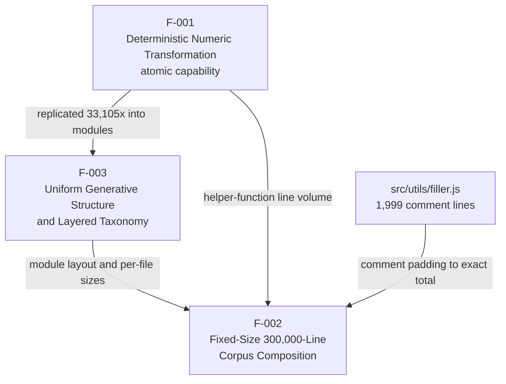

The map is acyclic and one-directional: there is no feedback edge because no feature invokes another at runtime. A tabular restatement of the same dependencies:

| Feature | Depends On | Nature of Dependency |
|---------|-----------|----------------------|
| F-001 | — | Atomic; no prerequisites. |
| F-002 | F-001, F-003 | Compositional — the padded line total is a function of the replicated helpers and their layout. |
| F-003 | F-001 | Structural — the template exists to host replicated copies of the F-001 helper. |

### 2.3.2 Integration Points

There are **no** integration points of any kind. This is verified corpus-wide:

| Integration Dimension | Status | Evidence |
|-----------------------|--------|----------|
| Inter-feature / inter-module runtime calls | None | No helper calls any other helper; no module system (`require`/`import`/`export` absent). |
| Inbound interfaces (API / UI / CLI) | None | No routes, handlers, servers, or execution entry point despite `routes/` and `controllers/` names. |
| Outbound interfaces (DB / HTTP / queue) | None | No database, network, or messaging clients anywhere. |
| External / enterprise systems | None | No `package.json`, lockfile, or external dependency is declared. |

### 2.3.3 Shared Components

The corpus contains repeated, identical constructs rather than *shared runtime components* (nothing is imported or reused via a module boundary). The elements common across modules are:

| Shared Element | Nature | Related Features |
|----------------|--------|------------------|
| Canonical helper body (`6*x`, plus `10` when even) | Byte-identical code replicated 33,105 times | F-001, F-003 |
| `const store = [];` | Declared once per executable module (28 total); never read or written | F-003 (structural), F-001 (declared alongside, unused) |
| `// mod_<N> - society module` header | Uniform header comment in all 28 executable modules | F-003 |
| `society_mgmt_300k/src/utils/filler.js` | Comment-only padding file | F-002 |

### 2.3.4 Common Services

There are **no** common services. The repository defines no service layer behavior, no dependency-injection container, no shared utility invoked in common, and no cross-cutting runtime service (logging, configuration, validation, error handling). The `src/services/`, `src/middleware/`, `src/config/`, and `src/utils/` folders are nominal groupings only; each contains the same isolated arithmetic helpers as every other layer, and none is consumed by another module.

## 2.4 Implementation Considerations

This section records the technical constraints, performance, scalability, security, and maintenance considerations that the evidence supports for each feature. Many considerations follow directly from the corpus being a static, dependency-free artifact with massive intentional duplication.

The core computation process implemented by F-001 (and replicated identically across the corpus per F-003) is:

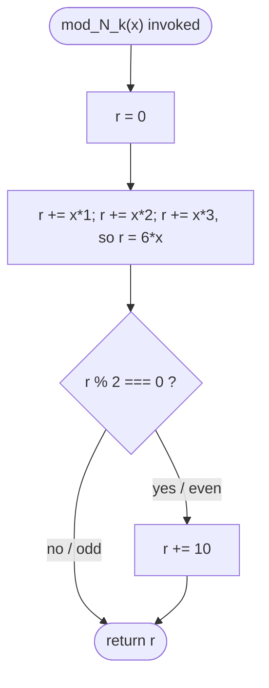

### 2.4.1 F-001 — Deterministic Numeric Transformation

| Dimension | Consideration |
|-----------|---------------|
| Technical Constraints | Plain ES5 function declarations with no argument type guard; behavior relies on IEEE-754 double arithmetic, so non-integer inputs can make `6*x` odd and skip the `+10` branch. No runtime, engine version, or entry point is declared, so an external harness is required to execute a helper. |
| Performance Requirements | None documented or instrumented. Each call is constant-time O(1) arithmetic. No timing, logging, or metrics exist to measure against a target. |
| Scalability Considerations | Each helper is stateless and independent, making calls trivially parallelizable; however, the 33,105 copies are identical, so adding new *behaviors* would require regenerating modules rather than reusing code. No runtime scaling model applies (there is no service). |
| Security Implications | Negligible runtime attack surface — pure arithmetic with no I/O, no external input channel, and no secrets. The absence of input validation means any caller must guard argument types itself. |
| Maintenance Requirements | High duplication, low logical complexity: because the body is byte-identical across all 33,105 functions, any algorithm change requires a corpus-wide regeneration. No test asserts the behavior, so there is no automated regression safety net. |

### 2.4.2 F-002 — Fixed-Size 300,000-Line Corpus Composition

| Dimension | Consideration |
|-----------|---------------|
| Technical Constraints | The exact 300,000-line total is brittle: any edit to the executable modules requires recomputing the `filler.js` length to preserve the total. The filler line numbers (`298001`…`299999`) are hardcoded. |
| Performance Requirements | Not applicable — a static composition property with no runtime execution. |
| Scalability Considerations | Changing the size target requires regenerating helper modules and/or the filler; the composition does not scale dynamically. |
| Security Implications | None — the filler file contains only inert line comments and no executable code. |
| Maintenance Requirements | The coupling between helper-function volume and filler padding must be kept in sync manually; the total is easy to break with any hand edit. |

### 2.4.3 F-003 — Uniform Generative Structure & Layered Taxonomy

| Dimension | Consideration |
|-----------|---------------|
| Technical Constraints | Rigid template and naming conventions (`file_<N>.js`, `mod_<N>`, `mod_<N>_<k>`). The layer folder names are nominal and do not reflect behavior, which can mislead readers who expect layered semantics. |
| Performance Requirements | Not applicable — a static structural property. |
| Scalability Considerations | The structure scales by adding more `file_<N>.js` modules following the same template; there is no architectural limit, but also no code reuse across modules. |
| Security Implications | Module isolation and zero external dependencies mean there is no dependency or supply-chain attack surface to compromise; no credentials or secrets are present. |
| Maintenance Requirements | Uniformity aids mechanical/automated tooling, but the mismatch between layer names and arithmetic content, combined with large-scale duplication and the absence of documentation beyond the project title, are maintenance liabilities for human readers. |

### 2.4.4 Cross-Cutting Assumptions and Constraints

The following assumptions and constraints apply to this entire section and are stated explicitly for traceability:

- **Assumption — engine.** Helpers are assumed to run under a standard ECMAScript engine on numeric input; the repository itself declares no runtime, so this is an external assumption, not a repository fact.
- **Constraint — no execution wiring.** No feature can be invoked as part of a running system from within the repository (no entry point, no exports, no callers).
- **Constraint — evidence boundary.** No SLAs, KPIs, capacity limits, or availability targets are documented anywhere; none are asserted here.
- **Constraint — nominal naming.** Folder names imply a society-management service but carry no behavioral meaning; documentation must not treat them as functional requirements.

## 2.5 Traceability Matrix

The matrices below provide end-to-end traceability from features to their requirements, from requirements to the repository evidence that verifies them, and from features back to the scope defined in Section 1. All requirements are version `1.0`, corresponding to the corpus as committed at `4263fe3` ("Add files via upload"); the repository's two-commit history records no subsequent requirement changes.

### 2.5.1 Feature-to-Requirement Traceability

| Feature | Requirement IDs | Priority | Version |
|---------|-----------------|----------|---------|
| F-001 | F-001-RQ-001, F-001-RQ-002, F-001-RQ-003, F-001-RQ-004 | Critical | 1.0 |
| F-002 | F-002-RQ-001, F-002-RQ-002 | High | 1.0 |
| F-003 | F-003-RQ-001, F-003-RQ-002, F-003-RQ-003 | Medium | 1.0 |

### 2.5.2 Requirement-to-Evidence Traceability

| Requirement ID | Repository Evidence | Verification Method |
|----------------|---------------------|---------------------|
| F-001-RQ-001 | `society_mgmt_300k/src/services/file_1.js` (canonical body); identical body lines across all 29 `.js` files. | Static inspection |
| F-001-RQ-002 | Extracted helper `mod_1_0` executed for representative inputs. | Dynamic execution |
| F-001-RQ-003 | Corpus-wide scan: 0 occurrences of `store.push`/`store[...]`/`return store`; repeated identical outputs. | Static + dynamic |
| F-001-RQ-004 | Corpus-wide scan: 0 occurrences of `async`/`await`/`Promise`. | Static inspection |
| F-002-RQ-001 | Line-count sum across the 29 `.js` files equals `300000`. | Static (line count) |
| F-002-RQ-002 | `society_mgmt_300k/src/utils/filler.js` — 1,999 comment lines, 0 functions. | Static inspection |
| F-003-RQ-001 | 28 `// mod_<N> - society module` headers; 28 `const store = [];`; all functions match `mod_<N>_<k>`. | Static inspection |
| F-003-RQ-002 | Per-directory helper counts across the nine `src/` layers and the two `tests/` folders. | Static inspection |
| F-003-RQ-003 | 0 occurrences of `require`/`import`/`export`/`module.exports`; no `package.json`. | Static inspection |

### 2.5.3 Feature-to-Scope Traceability

Each feature traces to an in-scope element or verifiable property defined in Section 1. Critically, **no requirement traces to any out-of-scope capability** in Section 1.3.2 (membership, dues, billing, notices, HTTP API, persistence, authentication, etc.), confirming this section introduces no invented society-management functionality.

| Feature | Section 1 Reference | Traced Scope Element |
|---------|---------------------|----------------------|
| F-001 | §1.2.2 (Primary system capabilities), §1.3.1 (In-Scope) | "Deterministic numeric transformation" — the sole implemented behavior. |
| F-002 | §1.2.3 (Verifiable properties), §1.3.1 (In-Scope) | "Corpus size" property and "Fixed-size corpus padding" in-scope element. |
| F-003 | §1.2.2 (Major system components), §1.3.1 (In-Scope) | "Layered directory taxonomy" in-scope element and "Structural uniformity" property. |

## 2.6 References

The following repository files and folders were inspected directly and cited as the evidence basis for this Product Requirements section. No external web sources were used.

**Files**

- `README.md` — Confirmed the repository documents no product requirements, user stories, or domain narrative; contains only the project title.
- `LICENSE` — Confirmed the root license is Apache-2.0 (referenced for the F-003 compliance validation row).
- `society_mgmt_300k/LICENSE/LICENSE.txt` — Confirmed the nested license is a truncated MIT notice, copyright 2026 (F-003 compliance row).
- `society_mgmt_300k/src/services/file_1.js` — Established the canonical helper body (`mod_1_0`) used for F-001 requirements and the runtime behavior test (`0→10`, `1→16`, `2→22`, `2.5→15`, `0.5→3`).
- `society_mgmt_300k/src/utils/filler.js` — Established the 1,999-line, comment-only padding (`// filler 298001` … `// filler 299999`) supporting F-002.
- `society_mgmt_300k/src/middleware/file_27.js` — Established the single 705-helper module that yields the 28,305 `src/` helper total (F-003-RQ-002).

**Folders**

- `` (repository root) — Established the three first-order children (`README.md`, `LICENSE`, `society_mgmt_300k/`) and the absence of any manifest, build, or configuration file.
- `society_mgmt_300k/` — The nested corpus root; established the `LICENSE/`, `src/`, and `tests/` structure and the 300,000-line scale (F-002).
- `society_mgmt_300k/src/` — Established the nine layer-named folders and the 28,305 `src/` helper functions (F-003).
- `society_mgmt_300k/tests/` — Established the `unit/` and `integration/` folders (2,400 helpers each) and confirmed the test-labeled files contain the same helper fixtures with no runner or assertions.

**Repository-wide verification**

- Corpus-wide inspection of `society_mgmt_300k/src/` and `society_mgmt_300k/tests/` — Confirmed exactly 300,000 lines across 29 `.js` files, 33,105 byte-identical helper bodies, per-directory helper counts, 28 module headers, 28 unused `const store = [];`, and zero occurrences of `require`/`import`/`export`/`module.exports`/`async`/`await`/`class`/`console`/`process`/`fetch`/`http`/`express`.
- Git metadata — Two commits (`c1ad0d0` "Initial commit", `4263fe3` "Add files via upload"), establishing requirement version `1.0` with no subsequent changes.

**Cross-referenced Technical Specification sections**

- `1.1 Executive Summary` — Basis for the "no business problem/value" framing and the artifact-utility characterization.
- `1.2 System Overview` — Source of the primary-capability, component-structure, and verifiable-property references used in the traceability matrix.
- `1.3 Scope` — Source of the in-scope elements (traced to features) and out-of-scope capabilities (confirmed untraced).
- `1.4 References` — Corroborated the file/folder evidence inventory.

# 3. Technology Stack

## 3.1 Programming Languages

This Technology Stack section documents the technologies **actually present** in the `Society_mngt-13-Jul-2026` repository, established by direct inspection of the source tree and cross-referenced against the Introduction (Section 1) and Product Requirements (Section 2). As those sections establish, the artifact is a *generated, dependency-free JavaScript corpus* rather than a functioning society-management application (see Sections 1.1 and 1.2). Consequently, several conventional technology-stack categories are legitimately empty. In keeping with the evidence-based scope of this specification, each sub-section below reports the observed reality with file-level evidence and explicitly records the categories that contain no technology, rather than inferring a stack the code does not contain.

The following diagram summarizes the complete technology footprint of the repository — the small set of technologies that are actually present, and the categories that are verifiably absent (each detailed in Sections 3.2–3.6):

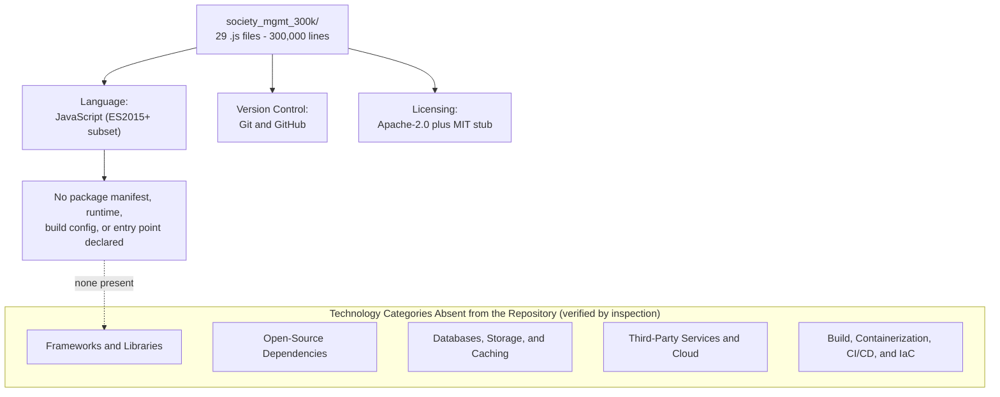

### 3.1.1 Language Inventory by Component

A single programming language is present across the entire repository: **JavaScript**. All 29 source files under `society_mgmt_300k/` carry the `.js` extension, and no other programming, markup, styling, query, templating, or configuration language appears anywhere in the tree. The only non-JavaScript files in the repository are the plain-text project marker `README.md`, the root `LICENSE`, and `society_mgmt_300k/LICENSE/LICENSE.txt` — none of which contain source code.

Because the directory taxonomy under `society_mgmt_300k/src/` is nominal — the folder names imply application layers, but every folder contains the same class of standalone arithmetic helper functions (see Section 2.4.3) — "component" maps here to the organizational layer folders rather than to distinct runtime platforms or deployment targets. The table maps each observed component to its language and content:

| Component / Layer (directory) | Files | Language | Observed Content |
|---|---|---|---|
| `src/controllers/`, `src/services/`, `src/routes/`, `src/models/` | 3 each | JavaScript | Standalone synchronous arithmetic helpers |
| `src/middleware/` | 3 | JavaScript | Standalone synchronous arithmetic helpers |
| `src/repositories/`, `src/domain/`, `src/config/` | 2 each | JavaScript | Standalone synchronous arithmetic helpers |
| `src/utils/` | 4 | JavaScript | Helpers plus comment-only `filler.js` padding |
| `tests/unit/`, `tests/integration/` | 2 each | JavaScript | Same helper definitions; no runner or assertions |

There is no second language and no second platform. Despite the default technology stack contemplating web (React/TypeScript), mobile (React Native), and native (Swift/Kotlin/Objective-C) tiers, **none of those languages or platforms exist in this repository** — there is no TypeScript (`.ts`/`.tsx`), no Swift, Kotlin, or Objective-C source, and no Python. The language inventory is therefore uniform: JavaScript only.

### 3.1.2 Language Edition and Syntax Profile

The corpus uses a deliberately minimal subset of JavaScript. Verified by scanning all 29 files, the only ECMAScript feature beyond the classic ES5 baseline is the use of **block-scoped `const` and `let` declarations**, which were introduced in ECMAScript 2015 (ES6). Every executable file declares its module-scoped array with `const store = [];` and each helper initializes its accumulator with `let r = 0;`. All routines are written as classic top-level **function declarations**; no arrow functions, classes, template literals, destructuring, generators, `var`, or shebang lines appear anywhere in the tree.

A representative helper illustrates the entire syntax profile in use:

```javascript
const store = [];
function mod_1_0(x){ let r=0; r+=x*1; r+=x*2; r+=x*3; if(r%2===0){r+=10} return r; }
```

This precisely reconciles the "ES5-style" characterization used in Sections 1.2.2 and 2.4.1: the structural style (top-level function declarations, no module system, no classes) is that of classic ES5, while the presence of `const`/`let` means the code requires an **ECMAScript 2015-or-later engine** to execute without transpilation. The observed/absent feature matrix is:

| Language Feature | Introduced In | Present in Corpus |
|---|---|---|
| Function declarations, arithmetic operators, `if` | ES5 and earlier | Yes (universal) |
| `const` / `let` block-scoped bindings | ES2015 (ES6) | Yes (all 28 executable files) |
| Arrow functions, classes, template literals, destructuring | ES2015+ | No (zero occurrences) |
| `import` / `export` (ES modules) | ES2015+ | No (zero occurrences) |
| `require` / `module.exports` (CommonJS) | Node.js convention | No (zero occurrences) |
| `async` / `await`, Promises | ES2017 / ES2015 | No (zero occurrences) |

### 3.1.3 Version and Runtime Declaration Status

A defining property of this repository is that **no component version is declared anywhere**. The section prompt calls for version numbers for all components; the evidence-based answer is that none exist to report, and the following table records that fact explicitly:

| Version-Bearing Artifact | Expected Location | Present? | Consequence |
|---|---|---|---|
| Language/runtime version (`engines`, `.nvmrc`) | `package.json`, `.nvmrc` | No | No pinned Node.js/ECMAScript version |
| Package manifest | `package.json` | No | No declared dependency versions |
| Dependency lockfile | `package-lock.json`, `yarn.lock` | No | No resolved version graph |
| Build/transpiler config | `tsconfig.json`, `.babelrc` | No | No target ECMAScript version declared |

The **minimum** ECMAScript edition can only be *inferred* from syntax (ES2015+, because of `const`/`let`); it is not *asserted* by the repository. Section 2.4.4 records the corresponding cross-cutting constraint: the code declares no runtime, so execution under a standard ECMAScript engine is an external assumption rather than a repository fact.

### 3.1.4 Selection Criteria, Constraints, and Dependencies

**Selection rationale (as observed).** Because the repository contains no design documents, ADRs, or README prose beyond the project title (see Section 1.1), there is no *documented* rationale for choosing JavaScript. What the evidence supports is that JavaScript is well suited to the artifact's demonstrable purpose — a large, uniform, fixed-size source corpus (see Section 1.1's value framing) — for two reasons grounded in the code: (1) JavaScript executes directly from source with no compilation step, which is consistent with the total absence of any build tooling (Section 3.6); and (2) its permissive, interpreter-driven syntax allows the byte-identical helper template to be replicated tens of thousands of times without type declarations or module wiring. These are characterizations of fitness for the observed artifact, not claims of a deliberate, documented selection process.

**Language-level constraints.** The helpers use untyped parameters and rely on IEEE-754 double-precision arithmetic; as Section 2.4.1 notes, there is no argument type guard, so callers must supply appropriate numeric input. The absence of a module system (neither ES modules nor CommonJS) means the source files cannot import or invoke one another and expose nothing to an external caller.

**Runtime and platform dependencies.** The only dependency implied by the language is an **ECMAScript 2015+ engine** (for example a Node.js or browser JavaScript engine) capable of interpreting `const`/`let` and function declarations. This is an implicit, external requirement — the repository neither bundles nor references any specific engine or version. Beyond that engine assumption, the JavaScript source has **zero language-level dependencies**: it imports no standard-library modules and no third-party packages (detailed in Sections 3.2 and 3.3).


## 3.2 Frameworks & Libraries

**No application framework or software library is used anywhere in this repository.** This is a positive finding verified by inspection, not an omission. A corpus-wide scan of all 29 `.js` files returns zero references to any web, UI, testing, ORM, or utility framework, and zero module-loading statements of any kind:

| Framework / Library Category | Tokens Searched | Occurrences in Corpus |
|---|---|---|
| Backend web frameworks | `express`, `koa`, `fastify`, `nest`, `flask` | 0 |
| Frontend / UI frameworks | `react`, `angular`, `vue` | 0 |
| CSS frameworks | `tailwind` | 0 |
| AI / LLM frameworks | `langchain` | 0 |
| Module loading (CommonJS / ESM) | `require(`, `import`, `from '…'` | 0 |
| Data / ORM libraries | `mongoose`, `sequelize`, `prisma` | 0 |

Every routine in the corpus is a self-contained function built exclusively from core JavaScript arithmetic operators and a single `if` statement (see the syntax profile in Section 3.1.2). Because there are no `require`/`import` statements, the source files neither load nor depend on any framework at runtime, and they do not compose with one another.

**Version reporting.** The section prompt requests core frameworks *with versions* and supporting libraries. Since no framework or library is present, there is no version, no supporting-library set, and no per-choice justification to record. The honest, evidence-based answer for every field in this category is *not applicable*.

**Compatibility requirements.** With no framework in the picture, the only compatibility requirement is at the language level: an ECMAScript 2015-or-later engine capable of interpreting `const`/`let` and function declarations (Section 3.1.3). There are no framework-version compatibility matrices, peer-dependency constraints, or transitive-library conflicts to manage.

**Reconciliation with the default technology stack.** The default stack contemplated a Flask backend, a React/TailwindCSS frontend, React Native for mobile, and a Langchain AI framework. **None of these are present in this repository.** Sections 1.2 and 1.3 already establish why: the artifact is a generated code corpus with no HTTP layer, no UI, no persistence, and no AI functionality, so the frameworks that would implement those capabilities are correspondingly absent. This section documents the observed reality rather than the aspirational default.


## 3.3 Open Source Dependencies

**The repository declares and consumes zero third-party or open-source dependencies.** This is corroborated at three independent levels, each verified by inspection:

1. **No package manifest exists.** There is no `package.json`, and therefore no `dependencies`, `devDependencies`, `peerDependencies`, or `optionalDependencies` section to enumerate. A search for manifest files (`package.json`, `requirements.txt`, `Gemfile`, `go.mod`, `pom.xml`) across the tree returns nothing.
2. **No dependency lockfile or installed tree exists.** There is no `package-lock.json`, `yarn.lock`, or `pnpm-lock.yaml`, and no `node_modules/` directory anywhere in the repository. There is consequently no resolved dependency graph, no pinned transitive versions, and no vendored package code.
3. **No dependency is imported at the code level.** As established in Sections 3.1.4 and 3.2, the corpus contains zero `require`/`import` statements, so even if packages were installed, none would be loaded.

The following table records the standard dependency-inventory fields against the evidence:

| Dependency Attribute | Expected Source | Observed Value |
|---|---|---|
| Direct dependencies | `package.json` → `dependencies` | None (no manifest) |
| Development dependencies | `package.json` → `devDependencies` | None (no manifest) |
| Package registry | `.npmrc` / manifest registry field | None declared (no npm/registry reference) |
| Resolved versions | Lockfile | None (no lockfile) |
| Vendored packages | `node_modules/`, `vendor/` | None present |

**Registry.** Because there is no manifest and no lockfile, the repository references no package registry (for example, the public npm registry) and pins no registry-hosted versions. Package management is entirely absent from the artifact.

**Standard-library usage.** The JavaScript source relies only on built-in language operators (arithmetic, comparison, assignment) and the `if` control-flow statement. It does not call into the Node.js standard library (`fs`, `path`, `http`, `crypto`, etc.) or any browser Web API, so there is not even an implicit standard-library dependency surface beyond the core language.

**Security implication.** A zero-dependency posture means the repository has **no third-party supply-chain attack surface**: there are no transitive packages to audit, no known-vulnerability (CVE) exposure inherited from external code, and nothing for a dependency scanner to flag. The corresponding trade-off is that no security tooling, dependency-pinning, or update policy is configured either, because there is nothing for such tooling to act upon.


## 3.4 Third-Party Services

**The repository integrates with no external services of any kind.** Section 1.2's integration analysis already records that external dependencies, inbound interfaces, and outbound interfaces are all *None*; this section confirms that finding at the code level and details each service category the prompt enumerates.

A corpus-wide scan returns **zero** occurrences of any cloud-provider, authentication, payment, messaging, or observability SDK token, and **zero** HTTP/HTTPS URL or endpoint literals anywhere in the source:

| Service Category | Tokens / Signals Searched | Occurrences | Status |
|---|---|---|---|
| External APIs / integrations | `http://`, `https://` URLs, `fetch(`, `axios`, `http.`/`https.` | 0 | None |
| Cloud services | `aws`, `s3`, `azure`, `gcp`, `google`, `firebase` | 0 | None |
| Authentication services | `auth0`, `okta`, `oauth`, `jwt` | 0 | None |
| Payment / messaging | `stripe`, `twilio`, `sendgrid` | 0 | None |
| Monitoring / observability | `datadog`, `sentry`, `prometheus`, `newrelic`, `cloudwatch` | 0 | None |

**External APIs and integrations.** The source performs no network I/O. There is no HTTP client, no request-issuing code, and not a single URL literal, so the corpus neither calls outbound APIs nor exposes an inbound API surface. Section 1.3 lists the HTTP/API layer as explicitly out of scope, consistent with this evidence.

**Authentication services.** No identity or authentication provider is integrated. The default technology stack named Auth0; there is no Auth0 client, no OAuth/JWT handling, and no credential-management code present. Authentication is therefore not a technology in this repository.

**Monitoring tools.** No observability, logging, metrics, or tracing service is wired in. There are zero references to monitoring SDKs, and — as recorded in Section 3.3 — the code does not even use the standard `console` for logging. There are no dashboards, alerts, or telemetry exporters.

**Cloud services.** No cloud platform is used. The default stack named AWS (with Docker/Terraform); there is no AWS SDK, no cloud-storage or queue client, and no cloud configuration anywhere in the tree (see also Section 3.6 for the absence of deployment/IaC tooling).

**Security implication.** Because the code opens no network connections and embeds no service credentials, API keys, or endpoint URLs, it has **no outbound-egress or secret-exposure surface** at the application level. There are correspondingly no third-party service authentication flows, rate limits, or availability SLAs to document, because no such integrations exist.


## 3.5 Databases & Storage

**The repository contains no database, no persistence layer, no caching solution, and no external storage service.** Section 1.3 lists persistence as explicitly out of scope, and a code-level scan confirms zero references to any database driver, ORM, cache, or storage client:

| Storage Category | Tokens / Signals Searched | Occurrences | Status |
|---|---|---|---|
| Relational / NoSQL databases | `mongo`, `mongoose`, `postgres`, `mysql`, `sqlite`, `dynamodb` | 0 | None |
| Query builders / ORMs | `sequelize`, `prisma`, `knex` | 0 | None |
| Caching solutions | `redis`, `memcached` | 0 | None |
| Browser / client storage | `localstorage`, `indexeddb` | 0 | None |
| Object / file storage | `s3`, filesystem `fs` calls | 0 | None |

**Primary and secondary databases.** There are none. No database client library is imported (consistent with Sections 3.2 and 3.3), no connection string or URL is present (Section 3.4), and no schema, migration, or model-mapping code exists. The default technology stack named MongoDB; there is no MongoDB driver, `mongoose` model, or any other datastore integration in the repository.

**The only storage-like construct — and why it is inert.** Each of the 28 executable files declares a single module-scoped array with `const store = [];`. Inspection shows this array is **dead code**: across the entire corpus there are zero mutation sites — no `store.push(...)`, no `store.pop/shift/unshift/splice(...)`, and no indexed assignment `store[...] = ...`. The helper functions never read from or write to `store`; they operate solely on their `x` parameter and a local accumulator `r` (see Section 3.1.2). The declaration is therefore a uniform structural artifact of the generative template (Section 2.4.3), not a functioning in-memory data store.

```javascript
const store = [];   // declared once per module file; never mutated or read anywhere
```

**Data persistence strategies.** None exist. Every helper is a pure, stateless numeric transformation (`6*x`, plus 10 when the result is even — see Section 2.4.1); results are returned to the caller and never persisted. There is no read/write path to any durable medium.

**Caching solutions.** None. No cache library, in-memory cache abstraction, or memoization layer is present — the inert `store` array is the only collection in the codebase, and it is unused.

**Storage services.** None. No object store (for example S3), file-storage client, or filesystem access (`fs`) appears anywhere in the source, so the repository neither reads from nor writes to any storage backend.


## 3.6 Development & Deployment

Development and deployment tooling is almost entirely absent from this repository. The single development-time technology actually present is **version control**; every other category in this area — build system, containerization, CI/CD, infrastructure-as-code, and test execution — is verifiably not configured. Section 1.3 already lists build, packaging, and deployment as out of scope; this section documents the tooling evidence.

### 3.6.1 Version Control and Licensing (Present)

**Version control.** The repository is a **Git** repository hosted on **GitHub**. The `origin` remote resolves to `github.com/ajitblitzy/Society_mngt-13-Jul-2026`, the working branch is `13-Jul-2026-Br1`, and the history contains exactly two commits ("Initial commit" followed by an "Add files via upload" commit). The two-commit, bulk-upload history is consistent with the Section 1.1 finding that the tree is a *generated* corpus that was uploaded wholesale rather than developed incrementally.

**Licensing artifacts.** Two license files are present, and they are inconsistent with one another:

| License Artifact | Location | Content |
|---|---|---|
| Root license | `LICENSE` | Full Apache License 2.0 text |
| Nested license | `society_mgmt_300k/LICENSE/LICENSE.txt` | Truncated MIT License stub (header and opening permission grant only) |

This dual-license condition is recorded here as an observed fact; reconciling the intended license is a governance decision outside the scope of a technology inventory.

### 3.6.2 Build, Containerization, CI/CD, and IaC (Absent)

Every remaining development-and-deployment category is empty. A scan for the relevant configuration artifacts across the tree (excluding Git internals) returns nothing in each case:

| Category | Artifacts Searched | Present? |
|---|---|---|
| Build system / bundler / transpiler | `package.json` scripts, `webpack.*`, `rollup.*`, `.babelrc`, `Makefile`, `tsconfig.json` | No |
| Containerization | `Dockerfile`, `docker-compose.*` | No |
| CI/CD pipelines | `.github/workflows/`, any `*.yml`/`*.yaml` pipeline files | No |
| Infrastructure as Code | Terraform `*.tf`, any cloud templates | No |
| Linting / formatting | `.eslintrc*`, `.prettierrc*` | No |
| Shell / automation scripts | `*.sh` | No |

- **Build system.** None. Because the source is plain JavaScript with no manifest (Section 3.3) and no transpiler config (Section 3.1.3), there is no build, bundle, compile, or packaging step — the `.js` files are the final artifact.
- **Containerization.** None. There is no `Dockerfile` or Compose file, so no container image is defined. The default technology stack named Docker; it is absent here.
- **CI/CD.** None. There is no `.github/` directory and no pipeline definition of any kind, so no continuous-integration or deployment automation runs against the repository. The default stack named GitHub Actions; no workflow exists.
- **Infrastructure as Code.** None. There are no Terraform files or other IaC templates. The default stack named Terraform (on AWS); no such configuration is present (consistent with the absence of any cloud integration in Section 3.4).
- **Test execution tooling.** Although `tests/unit/` and `tests/integration/` folders exist, they are structural only: a scan of the `tests/` tree returns zero test-runner or assertion tokens (`describe`, `it`, `test`, `expect`, `assert`), and no test framework is installed (Section 3.2). As Section 1.3 notes, these files contain the same helper definitions as `src/` and cannot be executed as a test suite.

**Net deployment posture.** The repository is a source-only artifact with version control as its sole tooling. It has no defined build output, no runnable/deployable unit, and no automation — reflecting the generated-corpus nature of the project rather than a deployable application.


## 3.7 References

The following repository artifacts, version-control metadata, and previously authored specification sections were examined as evidence for this Technology Stack section.

**Files inspected**

- `README.md` — Established that the root readme contains only the project title (single H1), with no technology or setup prose.
- `LICENSE` — Established the root Apache License 2.0 (full text) licensing artifact (Section 3.6.1).
- `society_mgmt_300k/LICENSE/LICENSE.txt` — Established the nested, truncated MIT License stub and the resulting dual-license inconsistency (Section 3.6.1).
- `society_mgmt_300k/src/utils/filler.js` — Established the comment-only padding file used to reach the fixed corpus size; confirmed it contributes no executable code (Sections 3.1.1, 3.5).
- Representative executable modules under `society_mgmt_300k/src/services/`, `.../src/controllers/`, and `.../src/middleware/` (e.g., the `mod_1_0` helper) — Established the canonical helper syntax, the `const store = [];` declaration, and the `const`/`let` ES2015 usage (Sections 3.1.2, 3.5).

**Folders inspected**

- `society_mgmt_300k/` — The complete corpus: 29 `.js` files totaling 300,000 lines; sole language JavaScript (Section 3.1.1).
- `society_mgmt_300k/src/` — Layered nominal taxonomy (controllers, services, routes, models, middleware, repositories, domain, config, utils); source of the component-to-language mapping (Section 3.1.1).
- `society_mgmt_300k/tests/unit/` and `society_mgmt_300k/tests/integration/` — Established that the test folders hold helper definitions only, with no test-runner or assertion tooling (Section 3.6.2).
- `society_mgmt_300k/LICENSE/` — Directory containing the nested MIT stub (Section 3.6.1).

**Version-control metadata inspected**

- Git repository configuration and history — Established the GitHub remote `github.com/ajitblitzy/Society_mngt-13-Jul-2026`, the working branch `13-Jul-2026-Br1`, and the two-commit bulk-upload history (Section 3.6.1). (Any credential embedded in the remote URL is deliberately excluded from this document.)

**Corpus-wide inspection scans**

- Absence-verification scans across all 29 `.js` files — Established zero occurrences of module loading (`require`/`import`/`export`), frameworks, dependency manifests/lockfiles/`node_modules`, database/cache/storage clients, third-party/cloud/auth/monitoring SDKs, network URLs, and build/CI/container/IaC/test-config artifacts, and confirmed the `store` array has zero mutation sites (Sections 3.2, 3.3, 3.4, 3.5, 3.6.2).

**Cross-referenced specification sections**

- Section 1.1 Executive Summary — Corpus framing as a generated, dependency-free code corpus; repository snapshot (language/runtime, dependencies, licensing).
- Section 1.2 System Overview — Integration analysis (external dependencies, inbound/outbound interfaces all None) and the nominal-vs-observed distinction.
- Section 1.3 Scope — Out-of-scope enumeration (HTTP/API, persistence, authentication, build/packaging/deployment, observability).
- Section 2.4 Implementation Considerations — Deterministic transformation semantics, the "plain ES5 function declarations" characterization, and the cross-cutting no-runtime/no-SLA constraints.

**Web sources**

- None. All findings in this section are grounded in direct repository inspection; no external web sources were required.


# 4. Process Flowchart

## 4.1 Workflow Documentation Scope and Conventions

Section 4 documents the process and workflow behavior of the `society_mgmt_300k/` artifact. Consistent with Sections 1.2, 2.1, and 2.2, it separates the **nominal** intent implied by the repository name and its layer-named directories from the **observed** behavior actually present in the code. Every flow, decision point, and diagram below is derived strictly from direct inspection of the source; no workflow, integration, SLA, or recovery procedure is inferred beyond what the code demonstrably contains.

### 4.1.1 Applicability of Workflow Documentation

A conventional Process Flowchart section documents business processes, end-to-end user journeys, and cross-system integrations. This repository supports none of those in executable form. As established across the specification and re-verified for this section:

- There is **no runtime entry point** — no `main`, no server bootstrap, no `app.listen`, and no `package.json` scripts. Per Section 3.6, the `.js` files are themselves the final artifact; there is no runnable or deployable unit.
- There is **no orchestration or composition** — zero `require`/`import`/`module.exports`/`export`, so the 28 modules cannot invoke one another. All 33,105 helper functions are declared and never called (zero in-repository call sites).
- There is **no I/O, network, persistence, messaging, or scheduling** — zero HTTP clients, database drivers, message queues, timers, or cron definitions.
- There is **no error handling, no asynchrony, and no state mutation** — zero `try`/`catch`/`throw`/`finally`, zero `Promise`/`await`/`setTimeout`, and the single `const store = []` declared per module is never read or written.

Consequently, the only executable process in the corpus is the **intra-function control flow of a single helper**: the F-001 deterministic numeric transformation (Sections 2.1.1 and 2.2.1). Section 4 therefore documents (a) that one real control flow in full detail, (b) the *notional* layered request path implied by the directory taxonomy — explicitly labeled as name-implied and unrealized — and (c) the *inferred authoring/composition* activity that produced the fixed-size corpus (F-002). Where the prompt calls for integration flows, event processing, batch sequences, validation rules, authorization checkpoints, compliance checks, caching, transactions, retries, and recovery, this section records each as **not present**, with supporting evidence, rather than fabricating flows the code does not contain.

### 4.1.2 Workflow Coverage Matrix

The following table maps each workflow dimension requested for a Process Flowchart section to its observed status in `society_mgmt_300k/`:

| Workflow Dimension | Observed Status | Evidence |
|---|---|---|
| End-to-end user journey | Absent | No UI, users, roles, or entry point defined anywhere |
| System-to-system interaction | Absent | Zero network/DB/queue clients; modules isolated |
| Decision points | Exactly one kind | `if(r%2===0)` — the sole branch, 33,105 occurrences |
| Error-handling paths | Absent | Zero `try`/`catch`/`throw`/`finally` |
| Data flow between systems | Absent | No external system; no I/O of any kind |
| API interactions | Absent | No routes/handlers/server despite `routes/`, `controllers/` names |
| Event processing flows | Absent | Zero emitters/listeners; zero `Promise`/callbacks |
| Batch processing sequences | Absent at runtime | No scheduler or build; only inferred bulk authoring/upload (2 commits) |
| Validation rules | Absent | No type guards, business rules, or data validation |
| Authorization checkpoints | Absent | No authentication, identity, or access control |
| Regulatory compliance checks | Absent | No compliance constructs; only license files |
| State transitions | Local and transient only | Function-local `r`; module `store` never mutated |
| Data persistence points | Absent | No database/file/cache writes |
| Caching requirements | Absent | No cache of any kind |
| Transaction boundaries | Absent | No transactions; each call is atomic O(1) |
| Retry / fallback / recovery | Absent | No retry, fallback, notification, or recovery logic |
| Timing / SLA considerations | Not documented | No timing/metrics/SLA; each call is O(1) arithmetic |

### 4.1.3 Diagram Conventions and Swim Lanes

All diagrams in Section 4 use Mermaid.js. To satisfy the swim-lane requirement while remaining faithful to the evidence, actor/system lanes are rendered as labeled subgraphs, and edge styles distinguish reality from intent:

- **Solid arrows (`-->`)** denote the single control flow that actually executes (F-001).
- **Dotted arrows (`-.->`)** denote *nominal* or *unrealized* relationships (for example, the layered call path implied by folder names, or absent external integrations). A dotted edge in this section means "not implemented in code."
- **Lanes** used across diagrams: *External Caller* (hypothetical — there are zero in-repository callers), *JavaScript Engine* (the assumed ECMAScript runtime; not bootstrapped by the repository), and *society_mgmt_300k Corpus* (the source-only artifact).
- **Decision diamonds** represent the only branch present in the code: `r % 2 === 0` (rendered in prose as "Is r even?").

## 4.2 System Workflows

This sub-section addresses the two workflow families requested by the prompt — core business processes and integration workflows. For `society_mgmt_300k/`, both are characterized primarily by absence: the corpus implements no business process and integrates with no external system. The single realizable execution path and the notional (name-implied) layered path are diagrammed below with explicit labeling.

### 4.2.1 Core Business Processes

**No business processes are implemented.** The repository defines no users, roles, personas, sessions, or user-facing interface, and no society-management capability (membership, dues, billing, notices, facilities, complaints, accounting, or governance). There is therefore no end-to-end user journey to document. The only executable behavior is the F-001 deterministic numeric transformation, which is a pure computational fixture rather than a business process.

**System interactions.** There are none between modules. With zero `require`/`import`/`export` and zero call sites, each of the 28 modules is fully isolated; no module invokes another, and there is no controller-to-service-to-repository call chain despite those folder names.

**Decision points.** The corpus contains exactly one kind of decision, the parity test `if(r%2===0)`, which appears once in every helper (33,105 occurrences total). This single branch is documented in detail in Section 4.3.1.

**User touchpoints and error-handling paths.** There are no user touchpoints (no UI, API, or CLI) and no error-handling paths (zero `try`/`catch`/`throw`). 

**Timing / SLA.** No timing budget, latency target, throughput target, or SLA is documented or instrumented anywhere in the repository (consistent with Section 2.2's performance criteria). Each helper is constant-time O(1) arithmetic — three additions, one parity test, and at most one further addition.

The high-level system workflow below uses swim lanes for the three relevant actors/systems. The **solid** path is the only execution that can actually occur; the **dotted** path is the name-implied layered route that is not wired in code.

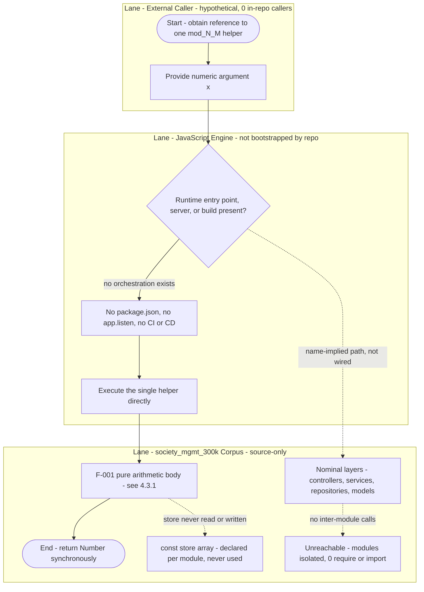

### 4.2.2 Integration Workflows

**No integration workflows exist.** The corpus is a closed, self-contained artifact with no integration surface, re-verified for this section and consistent with the integration table in Section 1.2.1. Each requested integration dimension resolves to "none":

| Integration Type | Requested Detail | Observed in Corpus |
|---|---|---|
| Data flow between systems | Inbound/outbound data movement | None — no external system and no I/O |
| API interactions | REST/RPC/GraphQL request handling | None — no routes, handlers, or server |
| Event processing flows | Publish/subscribe, async events | None — zero `Promise`, callbacks, or emitters |
| Batch processing sequences | Scheduled or bulk jobs | None at runtime — no scheduler or build; only inferred bulk authoring/upload (Section 4.3.2) |

The absence of any integration boundary is depicted below. All edges are dotted to indicate that no channel is implemented; the external systems are shown only to enumerate the categories that are *not* present.

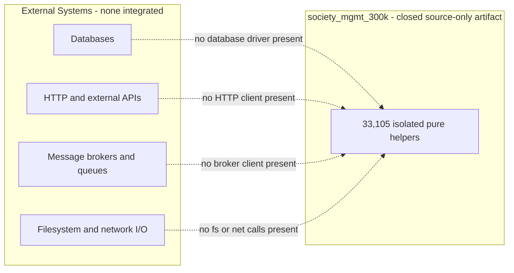

The only interaction that could ever occur is a direct, in-process function call from a hypothetical caller to a single helper. That interaction — the closest analogue to an "integration sequence" that the evidence supports — is diagrammed as a sequence diagram in Section 4.3.1, where it is shown to involve no network, database, queue, or other module.

## 4.3 Detailed Process Flows for Core Features

This sub-section provides detailed process flows for the three core features cataloged in Section 2.1: F-001 (Deterministic Numeric Transformation), F-002 (Fixed-Size 300,000-Line Corpus Composition), and F-003 (Uniform Generative Structure & Layered Taxonomy). Only F-001 is executable and therefore has a genuine runtime control flow. F-002 and F-003 are static, authoring-time properties of the artifact; their "flows" are reconstructed from the observable structure and history and are explicitly labeled as inferred, non-runtime processes.

### 4.3.1 F-001 — Deterministic Numeric Transformation (Runtime Control Flow)

F-001 is the single implemented behavior of the corpus and the only real process in the repository. Each helper accepts one numeric argument `x`, accumulates `x*1 + x*2 + x*3` (i.e., `6*x`) into a local variable `r`, and adds `10` when `r` is even before returning it synchronously. The canonical body — byte-identical across all 33,105 helpers (Section 2.1.1) — is:

```javascript
function mod_N_M(x){ let r=0; r+=x*1; r+=x*2; r+=x*3; if(r%2===0){r+=10} return r; }
```

**Control-flow flowchart.** The diagram below shows the complete process with its start and end points, sequential process steps, the single decision diamond (`r % 2 === 0`), and — as a dotted annotation — the absence of any input validation (there is no type guard, so a non-numeric `x` silently produces `NaN` rather than an error; see Section 4.5). This flow satisfies requirements F-001-RQ-001 through F-001-RQ-004.

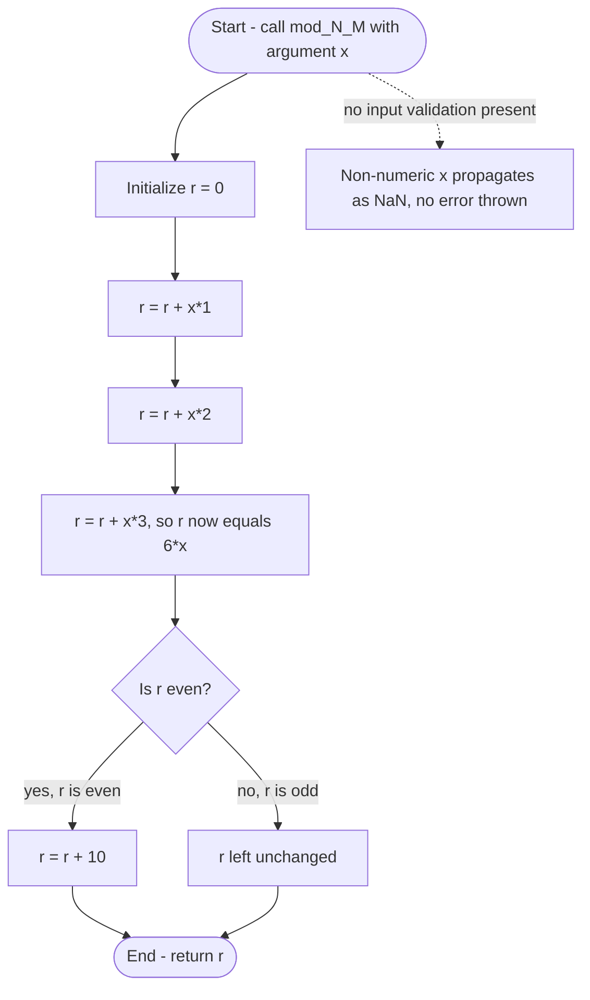

**Invocation sequence.** The only interaction F-001 supports is a direct, in-process call from a caller to a single helper. The sequence below is the closest analogue to an integration sequence that the evidence supports; it involves no network, database, queue, or other module, and (per the zero-call-sites finding) no such caller exists within the repository itself.

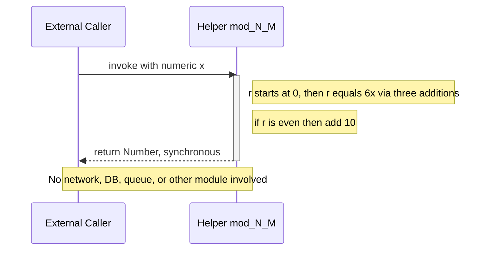

**Validation rules.** Consistent with Section 2.2.1, no validation, authorization, or compliance rule is present at any step:

| Rule Category | Requirement Reference | Observed at This Step |
|---|---|---|
| Business rules | F-001-RQ-002 | None documented — "6x, plus 10 if even" is a computational fixture, not a business rule |
| Data validation | F-001-RQ-001 | None — `x` is not validated; no type, `NaN`, `null`, or `undefined` checks |
| Authorization checkpoints | Not applicable | None — no identity, session, or access control exists |
| Regulatory compliance checks | Not applicable | None — no compliance constructs; only license files |

**Timing / SLA.** The flow is constant-time O(1) (three additions, one parity test, at most one further addition) and fully synchronous (F-001-RQ-004). No latency, throughput, or SLA target is documented or instrumented (Section 2.2.1). **Data persistence and state:** none — the function reads and writes only its local `r`; the module-scoped `store` array is never touched (see Section 4.4).

### 4.3.2 F-002 — Fixed-Size Corpus Composition (Inferred Authoring Flow)

F-002 is a static, file-level property: the corpus totals exactly 300,000 lines across 29 `.js` files, with `society_mgmt_300k/src/utils/filler.js` supplying 1,999 comment-only padding lines to reach the exact total (Sections 2.1.2 and 2.2.2). There is **no runtime process** here and **no generator, build, or scheduler in the repository** (Section 3.6). The flow below is an *inferred authoring/composition sequence* reconstructed from the artifact's uniform structure and its two-commit, bulk-upload Git history; it is the only "batch-like" activity the evidence supports, and it occurs at authoring time, not at runtime.

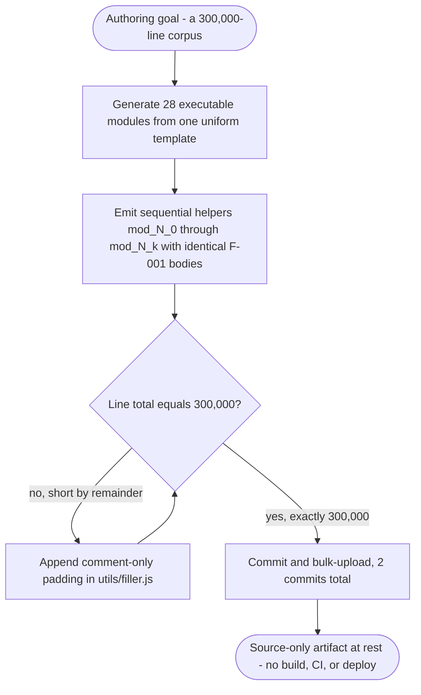

This flow satisfies F-002-RQ-001 (300,000-line total) and F-002-RQ-002 (filler padding). Because the composition is static, it has no decision points at runtime, no error states, no persistence, and no timing/SLA dimension.

### 4.3.3 F-003 — Uniform Generative Structure & Layered Taxonomy (Structural Composition Flow)

F-003 is the uniform template applied to every module and its placement within the layered directory taxonomy (Sections 2.1.3 and 2.2.3). The flow below shows how each module is composed (header comment, one unused `store` declaration, sequentially named helpers) and placed under a nominal layer folder — and, as dotted edges, the observed reality that the layers do not compose because there is no module system (zero `require`/`import`/`export`). Verified per-directory helper counts: `controllers`/`services`/`routes`/`models`/`utils` = 3,600 each; `middleware` = 3,105; `repositories`/`domain`/`config` = 2,400 each; `tests/unit` and `tests/integration` = 2,400 each.

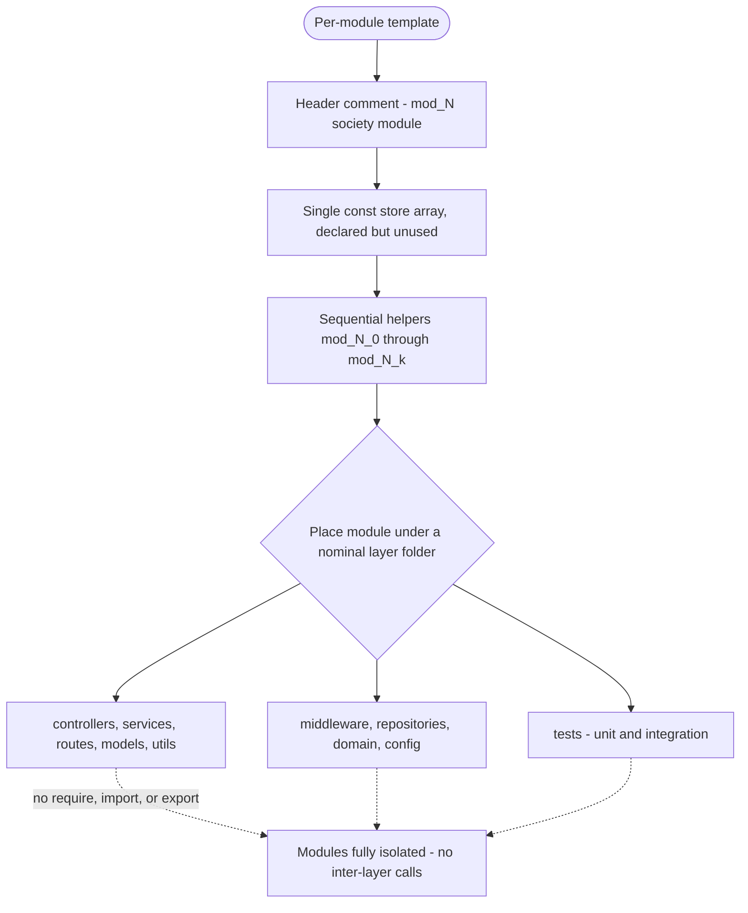

This flow satisfies F-003-RQ-001 (uniform template), F-003-RQ-002 (fixed taxonomy and counts), and F-003-RQ-003 (module isolation, zero dependencies). Like F-002, it is a static structural property with no runtime decision points, error states, persistence, or SLA.

## 4.4 State Management and Transitions

State management in `society_mgmt_300k/` is minimal and entirely transient. There is no persistent state, no shared mutable state, no cache, and no transaction anywhere in the corpus. The only two forms of state are a function-local variable used during a single F-001 call and a module-scoped array that is declared but never used.

### 4.4.1 State Transitions

**Module `store` lifecycle (permanently empty).** Each of the 28 executable modules declares one `const store = [];`, but the array is never read or written — there are zero occurrences of `store.push`, `store[...]`, `store.pop`, or `return store` corpus-wide. It is therefore dead code that stays empty for the entire lifetime of the module. Its trivial state machine has a single reachable state:

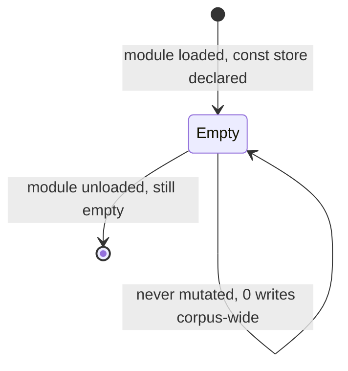

**F-001 local computation state.** The only meaningful state transition is the progression of the local variable `r` within a single helper call. This state is created on entry and discarded on return; nothing survives the call. The transitions correspond exactly to the control flow in Section 4.3.1:

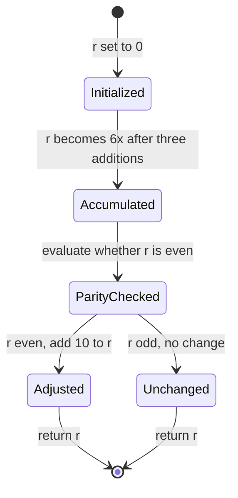

### 4.4.2 Data Persistence Points

There are **no data persistence points**. The corpus contains no database driver, no filesystem write, no network client, and no external store (Sections 1.2.1 and 3.5). No data crosses a call boundary and nothing is persisted between calls: each F-001 invocation consumes its argument, computes a result, and returns it, retaining nothing. The only stateful container in the code — the module-scoped `store` array — is never populated (Section 4.4.1) and thus persists no data.

### 4.4.3 Caching Requirements

There are **no caching requirements and no cache implementation** — no memoization, no time-to-live logic, and no cache store of any kind. Because every F-001 helper is pure and deterministic (identical inputs always yield identical outputs, per F-001-RQ-003), its results would be trivially memoizable in principle; however, no such mechanism exists in the repository, and the absence is recorded here as an observed fact rather than a recommendation.

### 4.4.4 Transaction Boundaries

There are **no transaction boundaries**. The corpus defines no transactions, no atomic multi-step operations spanning resources, no commit/rollback semantics, and no coordination primitives (locks, semaphores, or queues). Each helper call is a self-contained, atomic O(1) computation over its single argument with no shared or external state to coordinate, so the concept of a transaction boundary does not arise.

## 4.5 Error Handling and Recovery Flows

The corpus implements **no error handling and no recovery of any kind**. There are zero `try`, `catch`, `throw`, and `finally` constructs anywhere in `src/` or `tests/`, no logging or telemetry (zero `console`, zero `process`), and no asynchronous or timer-based constructs that a retry could use (zero `Promise`, `setTimeout`, `for`, or `while`). This is consistent with F-001-RQ-004 (purely synchronous return) and the "no data validation" finding in Section 2.2.1.

### 4.5.1 Error Detection and the Degenerate Path

Because F-001 performs only arithmetic and never raises, the sole theoretical failure mode is a non-numeric argument. With no type guard present, such an input flows through the same arithmetic and yields `NaN`, which is then returned to the caller **silently** — no exception is thrown, no error is logged, and no signal is emitted. The flowchart below makes this explicit: there is no exception path, only the normal return and the degenerate silent-`NaN` return, after which no notification, retry, fallback, or recovery step exists.

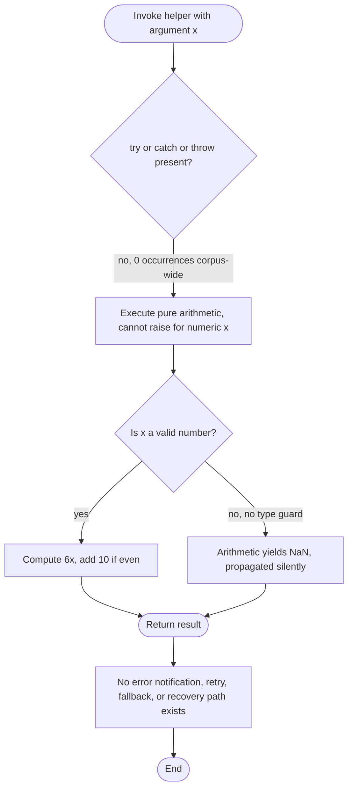

### 4.5.2 Retry, Fallback, Notification, and Recovery

Each error-handling capability requested by the prompt is absent, as summarized below:

| Error-Handling Capability | Observed | Evidence |
|---|---|---|
| Exception handling | Absent | Zero `try`/`catch`/`throw`/`finally` |
| Retry mechanisms | Absent | No loops or timers (zero `for`/`while`/`setTimeout`) |
| Fallback processes | Absent | No alternate branch; the only decision is the parity test |
| Error notification flows | Absent | No logging or telemetry (zero `console`, zero `process`) |
| Recovery procedures | Absent | No persisted or shared state to recover; no checkpoints |

These absences are intrinsic to the artifact's nature: because F-001 is a pure, deterministic, stateless computation with no I/O and no external dependencies (Sections 2.2.1 and 4.4), there is no fault domain in which retries, fallbacks, notifications, or recovery procedures would operate. They are recorded here as observed facts, not as gaps to be inferred or as recommendations.

## 4.6 References

The following repository files, folders, static analyses, and specification sections were examined as evidence for Section 4.

**Repository files and folders inspected**

- `society_mgmt_300k/` - Established the overall structure (nine layer-named `src/` folders, `tests/` tree, `LICENSE/`), the 29 `.js` files, and the 300,000-line total.
- `society_mgmt_300k/src/controllers/file_0.js` - Established the canonical helper body and the single `if(r%2===0)` decision point (head and tail inspected); representative of all 28 executable modules.
- `society_mgmt_300k/src/` - Established the layered taxonomy and the verified per-directory helper counts used in Sections 4.2 and 4.3.
- `society_mgmt_300k/src/utils/filler.js` - Established the 1,999 comment-only padding lines underlying the F-002 corpus-composition flow.
- `society_mgmt_300k/tests/` - Established that `unit/` and `integration/` contain the same arithmetic fixtures with no test runner or assertions.
- `society_mgmt_300k/tests/unit/file_9.js` - Confirmed the test files are filler arithmetic (no `require`/`describe`/`it`/`expect`), not executable tests.
- `society_mgmt_300k/LICENSE/LICENSE.txt` - Established the (truncated MIT) licensing artifact referenced under compliance checks.
- `README.md` - Confirmed the repository documents no workflow, process, or business context (title only).
- `LICENSE` - Root license artifact noted under regulatory/compliance references.

**Repository-wide static analysis (terminal scans)**

- Static scans across `society_mgmt_300k/src/` and `society_mgmt_300k/tests/` - Established the decisive absences that shape every flow in Section 4: zero `require`/`import`/`export`/`module.exports`; zero `try`/`catch`/`throw`/`finally`; zero `for`/`while`/`switch`/`case`; zero `Promise`/`setTimeout`/`then`/callbacks; zero `console`/`process`; zero `store` mutations. Established the single decision `if(r%2===0)` occurs exactly 33,105 times, matching 33,105 function declarations with zero call sites.
- Git history - Confirmed the two-commit, bulk-upload history (`c1ad0d0` "Initial commit"; `4263fe3` "Add files via upload") underpinning the inferred F-002 authoring flow.

**Cross-referenced Technical Specification sections**

- `1.2 System Overview` - Nominal-vs-observed framing; single capability (pure numeric transformation); integration surface recorded as None.
- `2.1 Feature Catalog` - Definitions of features F-001, F-002, and F-003 referenced throughout Section 4.
- `2.2 Functional Requirements` - Requirement IDs F-001-RQ-001..004, F-002-RQ-001/002, F-003-RQ-001/002/003, and the validation-rule tables (all None/Not Applicable).
- `3.5 Databases & Storage` - Confirmed no persistence, no cache, and the inert `store` array cited in Section 4.4.
- `3.6 Development & Deployment` - Confirmed no build/CI/CD/deploy and that the `.js` files are the final artifact, cited in Sections 4.1 and 4.3.2.

# 5. System Architecture

## 5.1 High-Level Architecture

This section documents the architecture of the `society_mgmt_300k/` artifact. As established in Sections 1.2, 2.1, and 4.2, the repository is a **generated code corpus**, not a running system. Accordingly, every architectural statement below distinguishes the **nominal** architecture implied by the directory names from the **observed** architecture actually realized in the code. The controlling fact is that the corpus has **no runtime composition**: there is no entry point, no bootstrap, no module graph, and no wiring between files (verified: zero `require`/`import`/`export`/`module.exports` and zero inter-function calls across all 29 `.js` files).

### 5.1.1 System Overview

**Overall architectural style and rationale.** The *observed* style is a **flat, source-only corpus of independent pure functions** — a collection of 33,105 byte-identical arithmetic helpers replicated across a directory taxonomy, with no executing service, no shared state, and no inter-module coupling. The *nominal* style, implied only by the `src/` folder names (`controllers/`, `services/`, `routes/`, `models/`, `domain/`, `repositories/`, `middleware/`, `config/`, `utils/`) plus a parallel `tests/` tree (`unit/`, `integration/`), is a conventional **layered / N-tier server-side JavaScript service** with a test pyramid. This nominal style is name-only: no layer exhibits any layer-specific behavior, and no request ever traverses the layers. The rationale for characterizing the artifact structurally rather than functionally is evidentiary — with no manifest, business logic, or specification present, the only architecture that can be truthfully described is the one embodied in the files: a uniform generative template (feature F-003) hosting a single deterministic computation (feature F-001), padded to a fixed 300,000-line scale target (feature F-002).

**Key architectural principles and patterns (observed).** The corpus consistently embodies the following properties, each verified corpus-wide:

- **Purity and determinism** — every helper is a pure function of its single argument `x`; there is no randomness, clock, I/O, or state mutation, so identical inputs always yield identical outputs.
- **Zero coupling / module isolation** — the defining architectural property. With no module system in use, each of the 28 executable files is a self-contained island that neither imports nor exports anything and never calls another module.
- **Statelessness** — no durable or in-memory application state participates in the computation; the per-file `const store = []` is inert (never read or written).
- **Structural uniformity (generative templating)** — a single repeated template (`// mod_<N> - society module` header, one `store` declaration, then sequentially named helpers) is applied identically to every file.
- **Zero external dependency** — no `package.json`, lockfile, framework, or third-party library participates at any layer.

**Patterns explicitly NOT present.** Despite the suggestive folder names, the corpus implements none of the following: MVC or layered request-handling call chains, dependency injection or inversion of control, the repository/data-mapper pattern, a middleware/interceptor pipeline, URL routing, or a service/domain object model. These are absent because the wiring that would create them (imports, exports, and call sites) does not exist.

**System boundaries and major interfaces.** The system boundary is the **filesystem/version-control artifact** itself — there is no process, network, or trust boundary, because nothing runs as a service. The only conceivable interface is a **direct, in-process function call** to an individual helper, `mod_<N>_<k>(x) → Number`. Because nothing is exported, even this interface is reachable only by evaluating a file's source directly in a JavaScript engine and invoking a helper by name. There are **no inbound interfaces** (no HTTP API, UI, or CLI) and **no outbound interfaces** (no database, HTTP client, message broker, or filesystem access).

### 5.1.2 Core Components

The artifact decomposes into the following core components. "Primary Responsibility" states the nominal (name-implied) role alongside the observed reality; "Dependencies & Integration Points" combines both dimensions because, for this corpus, every component resolves to the same answer — none.

| Component | Primary Responsibility (nominal → observed) | Dependencies & Integration Points | Critical Considerations |
|-----------|---------------------------------------------|-----------------------------------|--------------------------|
| Helper-Function Corpus (F-001) | Business/computation logic → the sole behavior: compute `6*x`, add `10` when even, return synchronously | None (a bare JavaScript engine only); not exported and never invoked in-repo | The only executable behavior in the system; 33,105 byte-identical copies |
| Layered `src/` Taxonomy (F-003) | Layered service (controllers/services/routes/models/domain/repositories/middleware/config) → organizational folders only | None; modules are isolated (0 imports/exports/calls) | Folder names carry no runtime meaning; no layer boundary is enforced or crossed |
| Inert Module Store (`const store = []`) | In-memory data store → declared once per executable file, never used | None; not read, written, or shared | Dead code (0 `push`/index/`return store` sites); not a functioning store or cache |
| Filler Padding (`src/utils/filler.js`, F-002) | Utility → non-executable line padding to reach exactly 300,000 lines | None; comment-only, defines 0 functions | 1,999 sequential `// filler N` comments; contributes no behavior |
| Tests Corpus (`tests/unit/`, `tests/integration/`) | Unit/integration test suites → identical arithmetic helpers | None; does **not** import or exercise `src/` | No assertions, `describe`/`it`/`expect`, or test runner; not real tests |

### 5.1.3 Data Flow Description

**Primary data flows between components.** There is exactly one data flow, and it is entirely **intra-function and in-process**: a caller passes a numeric argument `x` to a single helper; the helper accumulates `r = x*1 + x*2 + x*3` (i.e., `6*x`), applies one parity test, conditionally adds `10`, and returns the resulting `Number` synchronously. No data ever crosses a module boundary, a process boundary, or the system boundary, because there are no inter-module calls and no I/O.

**Integration patterns and protocols.** None. There is no inter-process communication, network protocol, serialization format, or message-passing mechanism. The only "protocol" is the JavaScript calling convention: a single numeric value in, a single numeric value out, by value.

**Data transformation points.** There is a single transformation point per invocation — the arithmetic accumulation followed by the lone conditional. No transformation pipelines, ETL stages, serialization/deserialization, validation, or normalization steps exist.

<pre><code class="language-javascript">r += x*1; r += x*2; r += x*3;   // r = 6*x  (the only transformation)
if (r % 2 === 0) { r += 10 }     // the only decision point in the entire corpus
</code></pre>

**Key data stores and caches.** None are active. The only collection in the codebase is the per-file `const store = []`, which is inert dead code — never read from or written to anywhere in the corpus. There is no database, no cache layer, no in-memory store, and no persistence of results; every computed value is returned to the (hypothetical) caller and immediately discarded.

### 5.1.4 External Integration Points

**The corpus has no external integration points.** It is a closed, self-contained artifact: there is no external system it connects to, and no inbound or outbound channel is implemented (re-verified for this section and consistent with Sections 1.2.1 and 4.2.2). The table below enumerates the integration categories that the folder names *nominally* imply, each resolved to its observed status. Because no integration exists, **no service-level agreements (SLAs) are defined, promised, or instrumented anywhere in the repository** — there are no latency, throughput, or availability targets to record.

| Nominal Category (name-implied) | Nominal Integration Type | Expected Protocol/Format | Observed Status |
|---------------------------------|--------------------------|--------------------------|-----------------|
| Inbound API (`routes/`, `controllers/`) | Request handling / routing | REST/JSON over HTTP | Absent — no server, router, or handler |
| Persistence (`repositories/`, `models/`) | Database / ORM access | SQL or NoSQL wire protocol | Absent — no driver, connection, or schema |
| Cross-cutting pipeline (`middleware/`) | Interceptor / middleware chain | In-process middleware | Absent — no pipeline or interception |
| Configuration (`config/`) | Environment / secrets loading | Env vars / config files | Absent — no `process.env` or config source |
| Messaging / eventing | Publish/subscribe, queues | AMQP / Kafka / etc. | Absent — no broker or event client |
| Outbound third-party services | External API calls | HTTPS / JSON | Absent — no `fetch`/`axios`/`http` client |

## 5.2 Component Details

This section details each major component identified in Section 5.1.2. Because the corpus contains a single functional behavior replicated uniformly, only one component (the helper-function corpus) is a genuine runtime unit; the remaining "components" are the organizational taxonomy and static artifacts that host or pad it. For every component, the requested attributes — purpose, technologies, interfaces/APIs, data persistence, and scaling — are reported strictly from observed evidence.

### 5.2.1 F-001 — Helper-Function Corpus

**Purpose and responsibilities.** This is the only functional component in the system. It comprises 33,105 byte-identical pure functions (28,305 under `src/`, 4,800 under `tests/`), each of which accepts one numeric argument and returns `6*x`, adding `10` when that value is even. It carries the entirety of the system's executable behavior (feature F-001); no other responsibility (validation, orchestration, persistence, transport) is implemented.

**Technologies and frameworks used.** Plain JavaScript expressed as ES5-style top-level function declarations. The only post-ES5 language feature used anywhere is the block-scoped `const`/`let` declaration (ES2015), so an ECMAScript 2015-or-later engine is required to evaluate the source. No framework, library, transpiler, or runtime is declared or used (consistent with Sections 3.1 and 3.2).

**Key interfaces and APIs.** Each function exposes the signature `mod_<N>_<k>(x: Number) → Number`. There is **no public API surface**: nothing is exported (`module.exports`/`export` absent), so a function is reachable only by directly evaluating its file's source in a JavaScript engine and calling it by name. No REST, RPC, GraphQL, event, or CLI interface exists.

**Data persistence requirements.** None. Each helper is stateless and side-effect-free; it neither reads nor writes any store, file, or database. The per-file `const store = []` is never touched, so nothing is persisted or cached.

**Scaling considerations.** Each invocation is constant-time **O(1)** — three additions, one parity test, and at most one further addition — with no allocation beyond the local accumulator. The corpus "scales" only in a **static** sense: additional helpers increase the line count toward the fixed 300,000-line target (F-002). Because nothing runs as a service, there is no runtime throughput, concurrency, clustering, worker-pool, or load-balancing model — no horizontal or vertical scaling construct is present.

### 5.2.2 Nominal Layer Taxonomy (F-003)

The `src/` tree is organized into nine conventional layer-named folders, mirrored by a two-folder `tests/` tree. This taxonomy is the component that gives the artifact the *appearance* of a layered service. Its observed responsibility is **purely organizational**: each folder holds the same class of arithmetic helpers, and no folder implements behavior specific to its name. The verified per-layer inventory is:

| Layer (folder) | Nominal Role (name-implied) | Files | Helper Functions |
|----------------|-----------------------------|-------|------------------|
| `src/controllers/` | Request handlers | 3 | 3,600 |
| `src/services/` | Business logic | 3 | 3,600 |
| `src/routes/` | Endpoint routing | 3 | 3,600 |
| `src/models/` | Data models | 3 | 3,600 |
| `src/utils/` | Utilities | 4 (incl. `filler.js`) | 3,600 |
| `src/middleware/` | Cross-cutting middleware | 3 | 3,105 |
| `src/repositories/` | Persistence access | 2 | 2,400 |
| `src/domain/` | Domain model | 2 | 2,400 |
| `src/config/` | Configuration | 2 | 2,400 |
| `tests/unit/` | Unit tests | 2 | 2,400 |
| `tests/integration/` | Integration tests | 2 | 2,400 |

- **Technologies used.** Identical to Section 5.2.1 — the same ES5-style JavaScript helpers appear in every folder.
- **Key interfaces and APIs.** None. No layer exposes an interface; `routes/` defines no routes, `controllers/` no handlers, `repositories/`/`models/` no schema or data-access API, `middleware/` no pipeline, and `config/` no configuration values.
- **Data persistence requirements.** None. `repositories/` and `models/` contain arithmetic helpers, not entities, migrations, or datastore bindings.
- **Scaling considerations.** Not applicable — the taxonomy is a directory layout, not a runtime tier; it neither partitions load nor defines a deployment unit.

### 5.2.3 Supporting Artifacts

**Filler Padding (`src/utils/filler.js`, F-002).** *Purpose:* pad the corpus to exactly 300,000 lines. *Technologies:* none — it is a non-executable file containing 1,999 comment-only lines (`// filler 298001` … `// filler 299999`) and defines 0 functions. *Interfaces/persistence/scaling:* none; it contributes line volume only.

**Inert Module Store (`const store = []`).** *Purpose (nominal):* an in-memory collection. *Observed:* declared once in each of the 28 executable files and never read or written (0 `push`/index-assignment/`return store` sites corpus-wide). It is a structural artifact of the generative template, not a functioning component; it holds no data at any point.

**Tests Corpus (`tests/unit/`, `tests/integration/`).** *Purpose (nominal):* unit and integration test suites. *Observed:* four files containing the same arithmetic helpers (`mod_9_*`, `mod_20_*`, `mod_10_*`, `mod_21_*`) with **no** assertions, `describe`/`it`/`expect` calls, or test-runner integration, and **no** import of `src/`. They therefore do not exercise the production code and provide no verification behavior; they are structurally identical to the `src/` modules.

### 5.2.4 Architectural Diagrams

The diagrams below are architecture-framed complements to the workflow diagrams in Section 4. They depict component interaction, the state transitions of a single invocation, and the sole realizable call sequence.

#### 5.2.4.1 Component Interaction Diagram

The only interaction that can occur is a direct call from an external caller to one helper (solid edges). The nominal layered call chain implied by the folder names is shown with dotted edges annotated with the number of wired connections — all zero — to make explicit that no layer is coupled to another.

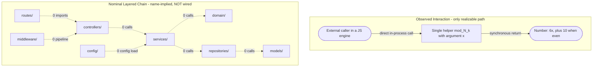

#### 5.2.4.2 State Transition Diagram

A single helper invocation moves through a small, fully deterministic set of states. The only branch is the parity test; there are no error, retry, or waiting states because the computation is synchronous, pure, and cannot raise for numeric input.

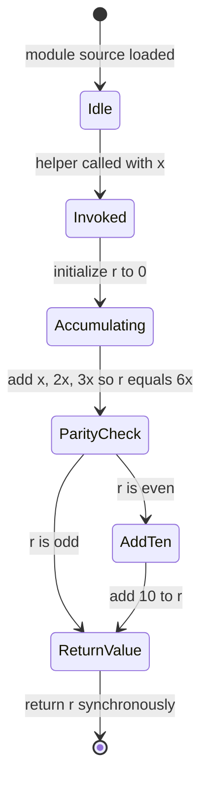

#### 5.2.4.3 Sequence Diagram for the Key Flow

The sole realizable flow involves exactly two participants — the caller and one helper. No database, network endpoint, other module, or middleware participates, which is the defining architectural characteristic of the corpus.

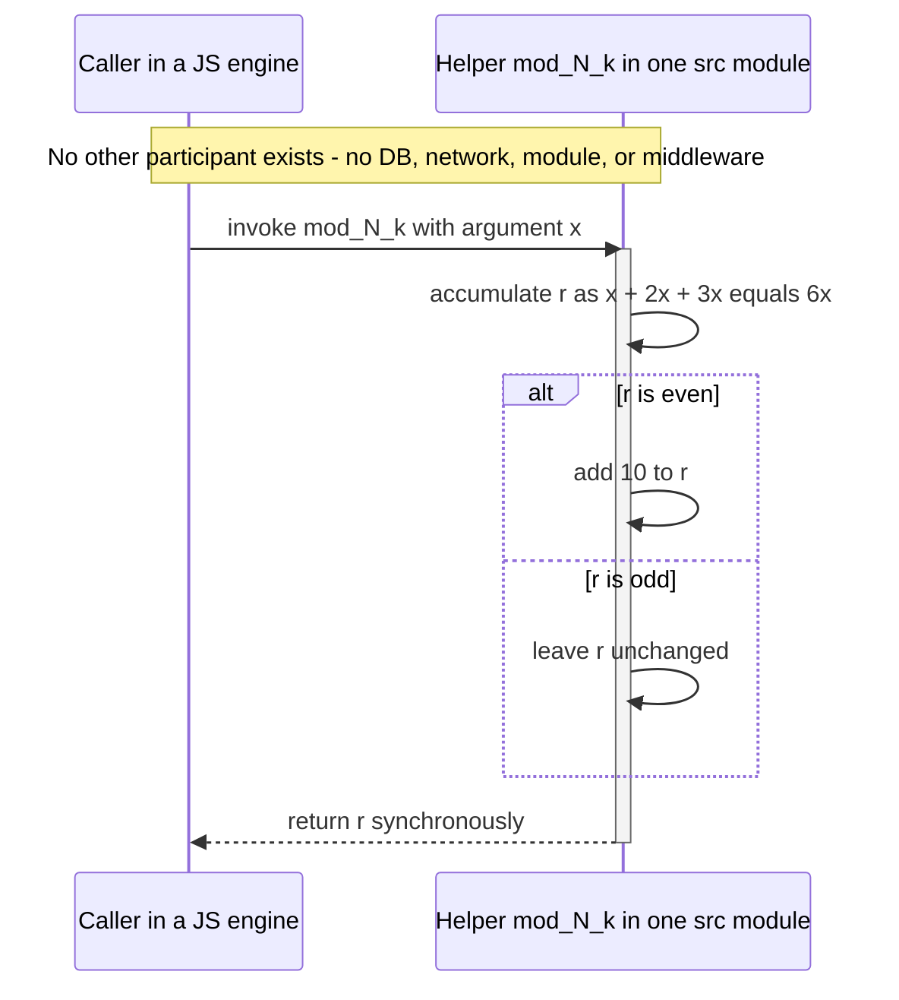

## 5.3 Technical Decisions

The repository contains **no design documents, ADRs, or rationale** of any kind (the `README.md` holds only the project title). The "decisions" documented here are therefore **reverse-engineered, as-built characteristics** inferred directly from the code and its structure, with tradeoffs stated factually. Consistent with Section 2.1, any priority or assessment is an engineering characterization of the artifact, not a business rationale, because none is recorded in source control.

### 5.3.1 Architecture Style Decision and Tradeoffs

The as-built decision is to realize the artifact as a **flat corpus of independent, byte-identical pure functions** arranged under a conventional layered folder taxonomy, rather than as a wired layered service. This is inferred from the complete absence of composition (no entry point, no imports/exports, no inter-function calls). The principal tradeoffs of this as-built style are:

| Dimension | As-Built Choice | Consequence / Tradeoff |
|-----------|-----------------|------------------------|
| Coupling | Zero inter-module coupling (isolated files) | Trivially relocatable and parallelizable, but no composition, reuse, or end-to-end behavior is possible |
| Behavior | Pure, deterministic, synchronous functions | Individually trivial to reason about and test, yet the shipped "tests" assert nothing |
| Runtime | No runtime, server, or process | Zero operational cost and zero attack surface, but nothing executes or serves requests |
| Layer semantics | Folder names only, no layer behavior | Familiar structure for tooling/indexing, but the names are misleading relative to actual content |
| Scale | Fixed generation to exactly 300,000 lines | Predictable size for scale/throughput exercises, but the bulk is redundant duplication |

### 5.3.2 Communication, Data-Storage, and Caching Decisions

The following table records the communication, storage, and caching stances embodied in the artifact and the observation-grounded rationale for each. The unifying rationale is that the sole behavior (F-001) is a **pure, stateless, O(1) computation with no I/O**, so any transport, datastore, or cache would serve no purpose.

| Concern | As-Built Choice | Observed Rationale / Consequence |
|---------|-----------------|----------------------------------|
| Communication pattern | Direct in-process function call only | No transport stack to build, secure, or operate; but no distributed or networked capability exists |
| Inter-service messaging | None (no broker, queue, or pub/sub) | Not applicable — a single artifact with no services to coordinate |
| Data storage | None (no database, ORM, or file persistence) | Stateless computation has nothing to persist; no storage engine or schema decision is needed |
| Caching | None (only the inert `store` array) | A pure O(1) function gains nothing from a cache; no memoization layer is present |
| Serialization | None | Numeric values pass by value in-process; no wire format is required |

### 5.3.3 Security Mechanism Selection

**No security mechanisms are implemented**, and this follows directly from the architecture. With no entry point, no network or filesystem I/O, no execution as a service, and nothing exported, the corpus presents **no runtime attack surface** to defend. The only residual behavioral note is the absence of input validation: a non-numeric argument would flow through the arithmetic and yield `NaN`, returned silently (Section 4.5.1) — a correctness edge, not an exploitable vector, since there is no caller, sink, or side effect. The observed security posture is summarized below.

| Security Concern | Observed Status |
|------------------|-----------------|
| Authentication / authorization | Absent — no users, sessions, roles, or access control |
| Input validation | Absent — no type guard; a non-numeric input returns `NaN` |
| Transport security (TLS) | Not applicable — no network layer exists |
| Secrets management | Not applicable — no secrets, credentials, or `process.env` usage |
| Dependency / supply-chain risk | Minimal — zero third-party dependencies to vet or patch |

### 5.3.4 Architecture Decision Records (ADRs)

No ADRs exist in the repository. The register below reconstructs the de-facto decisions embodied by the corpus as at commit `4263fe3` ("Add files via upload"). Every record has **Status = Accepted (as-built, observed)**, and the common **Context** is that the artifact is a machine-generated code corpus rather than a hand-built application.

| ADR | Decision (as-built) | Key Consequence |
|-----|---------------------|-----------------|
| ADR-001 | No module system; each file fully isolated (0 `require`/`import`/`export`) | Modules cannot compose; behavior is reachable only by directly evaluating a file's source |
| ADR-002 | No persistence or caching; `const store = []` left inert | Fully stateless; no data lifecycle, transactions, or recovery requirements arise |
| ADR-003 | Zero external dependencies; no manifest or lockfile | No supply-chain surface, but also none of the capabilities a framework would provide |
| ADR-004 | Single uniform template plus `filler.js` padding to exactly 300,000 lines | Predictable, reproducible scale at the cost of extreme redundancy (6 distinct body lines corpus-wide) |
| ADR-005 | No error handling and no security controls | No fault domain and no attack surface; the `NaN` edge remains unguarded |

### 5.3.5 Architecture Classification Decision Tree

The decision tree below records the evidence-driven reasoning used to classify the artifact. Each decision node names the signal that was checked; every branch that would indicate a runtime or library architecture is negative, leading to the source-only-corpus classification.

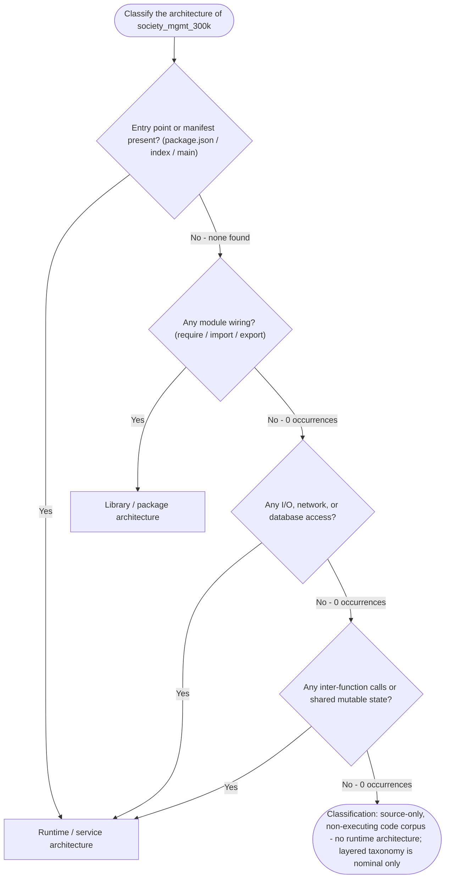

## 5.4 Cross-Cutting Concerns

In a running system these concerns are typically implemented as shared infrastructure that wraps or observes every request. In `society_mgmt_300k/`, **every one of them is absent**, verified by corpus-wide scans and consistent with Sections 3.4, 4.5, and 1.2.3. These are recorded as observed facts intrinsic to the artifact's nature (a source-only corpus that does not execute), not as gaps or recommendations.

### 5.4.1 Cross-Cutting Concern Coverage Summary

| Cross-Cutting Concern | Observed Status | Evidence |
|-----------------------|-----------------|----------|
| Monitoring / metrics | Absent | No metrics or telemetry code; nothing runs to be monitored |
| Observability / tracing | Absent | No tracer, spans, or correlation IDs |
| Logging | Absent | 0 `console.*` and 0 `process.*` usages corpus-wide |
| Error handling | Absent | 0 `try`/`catch`/`throw`/`finally` |
| Authentication / authorization | Absent | No users, roles, sessions, or tokens; no auth code |
| Input validation | Absent | No type guards; non-numeric input returns `NaN` |
| Performance instrumentation / SLA | Absent | No timers or benchmarks; no SLA documented or promised |
| Configuration / secrets management | Absent | No `process.env`, config source, or secrets |
| Disaster recovery | Not applicable | No runtime, state, or data to recover; version control only |

### 5.4.2 Monitoring, Observability, Logging, and Tracing

The corpus emits **nothing**: there are zero `console` and zero `process` references, no logging or metrics library, no tracer, and no health/readiness endpoint. There is consequently no telemetry to collect and, because no process starts, nothing to observe at runtime. No dashboards, alerts, log sinks, or trace exporters are configured (there is no configuration mechanism at all). This is a direct consequence of the architecture described in Section 5.1: a set of pure functions that never run as a service produces no observable runtime signal.

### 5.4.3 Error Handling Patterns

The corpus implements **no error-handling pattern** — there are no `try`/`catch`/`throw`/`finally` constructs, no error-boundary or interceptor, no retry/circuit-breaker, and no fallback path (re-verified here and detailed in Section 4.5). Because each helper performs only arithmetic on its argument, it cannot raise for numeric input; the sole degenerate path is a non-numeric argument, which produces `NaN` that is returned **silently**, with no exception, log, or notification.

Architecturally, the significance is the **absence of the cross-cutting interception layers** that would normally surround a call. The flow below traces an invocation past each interception point a conventional service would provide, showing every one is missing before the pure computation executes and the value returns unguarded.

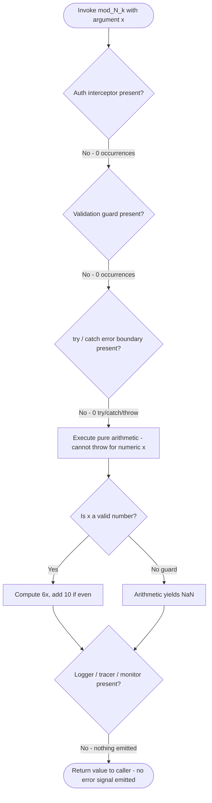

### 5.4.4 Authentication and Authorization

There is **no authentication or authorization framework**. The repository defines no users, roles, personas, sessions, tokens, or access-control checks, and no identity provider is integrated (the aspirational default stack named Auth0, which is entirely absent per Section 3.4). This is architecturally consistent: with no entry point, no exposed interface, and no protected resource, there is nothing to authenticate a principal against or to authorize access to.

### 5.4.5 Performance Requirements and SLAs, and Disaster Recovery

**Performance and SLAs.** Each helper is constant-time **O(1)** — three additions, one parity test, and at most one further addition, with no allocation beyond a local accumulator. No performance requirement, latency/throughput budget, or SLA is defined, promised, or instrumented anywhere in the repository (consistent with Sections 1.2.3, 2.2, and 4.2); there is no benchmark harness, timer, or load model, because the corpus does not run as a service.

**Disaster recovery.** No disaster-recovery procedure exists or is applicable. There is no running system, no persisted or shared state, and no data (the `store` array is inert), so there is nothing to back up, replicate, fail over, or restore, and no RTO/RPO objective to meet. The only recoverability property present is that the artifact is fully captured in Git version control (two commits: `Initial commit` and `Add files via upload`), from which the source can be re-cloned in its entirety.

## 5.5 References

Every architectural statement in Section 5 is grounded in direct inspection of the repository. No external web sources were required or used; all findings are derived from the code, its structure, and corpus-wide scans.

**Repository files examined**

- `README.md` — established that the repository documents only the project title (no architecture, design, or rationale).
- `LICENSE` — confirmed the root license is Apache License 2.0.
- `society_mgmt_300k/LICENSE/LICENSE.txt` — confirmed the nested, truncated MIT-style notice.
- `society_mgmt_300k/src/controllers/file_0.js` — representative executable module; established the canonical helper body, header comment, and inert `const store = []`.
- `society_mgmt_300k/src/services/file_1.js`, `society_mgmt_300k/src/models/file_2.js`, `society_mgmt_300k/src/routes/file_3.js`, `society_mgmt_300k/src/config/file_6.js`, `society_mgmt_300k/src/domain/file_8.js` — confirmed byte-identical function bodies across layers (no layer-specific behavior).
- `society_mgmt_300k/src/middleware/file_27.js` — confirmed the single count anomaly (705 helpers, `mod_27_0`…`mod_27_704`).
- `society_mgmt_300k/src/utils/filler.js` — confirmed 1,999 comment-only padding lines (F-002), 0 functions.
- `society_mgmt_300k/tests/unit/file_9.js` — confirmed test files contain identical helpers with no assertions, runner, or import of `src/`.

**Repository folders examined**

- `society_mgmt_300k/` — nested corpus root (`LICENSE/`, `src/`, `tests/`); no manifest or entry point.
- `society_mgmt_300k/src/` — nine layer-named folders (`controllers/`, `services/`, `routes/`, `models/`, `domain/`, `repositories/`, `middleware/`, `config/`, `utils/`); source of the per-layer file/function counts and the corpus-wide scans establishing zero imports/exports/I/O/calls.
- `society_mgmt_300k/tests/` — `unit/` and `integration/` folders; confirmed no real tests.

**Cross-referenced Technical Specification sections**

- Section 1.2 System Overview — nominal-vs-observed framing; component/structure inventory and success-criteria (no KPIs).
- Section 2.1 Feature Catalog — feature identifiers F-001, F-002, F-003 and their definitions.
- Section 3.2 Frameworks & Libraries — verified absence of any framework/library; ES2015+ language baseline.
- Section 3.5 Databases & Storage — verified absence of any database, persistence, or cache; inert `store` array.
- Section 4.2 System Workflows — absence of business/integration workflows; O(1) constant-time note.
- Section 4.5 Error Handling and Recovery Flows — absence of error handling; silent `NaN` degenerate path.

# 6. SYSTEM COMPONENTS DESIGN

## 6.1 Core Services Architecture

### 6.1.1 Applicability Determination

**Core Services Architecture is not applicable for this system.**

The repository under documentation — `society_mgmt_300k/` — is a *generated, source-only code corpus*, not a running system. It contains no microservices, no distributed architecture, and no distinct service components. This determination is established by direct, corpus-wide inspection of the code and is fully consistent with the High-Level Architecture (Section 5.1), Technical Decisions (Section 5.3), Cross-Cutting Concerns (Section 5.4), and the System Overview (Section 1.2), all of which characterize the artifact as a non-executing corpus of isolated pure functions.

Concretely, the artifact is a single static tree of 29 `.js` files totaling exactly 300,000 lines, containing 33,105 byte-identical, standalone pure functions of the form `mod_<N>_<k>(x)` that each compute `6*x` and add `10` when the result is even. The nine folders under `society_mgmt_300k/src/` (`controllers/`, `services/`, `routes/`, `models/`, `domain/`, `repositories/`, `middleware/`, `config/`, `utils/`) carry conventional layer names, but no folder exhibits behavior specific to its name, and no file references any other file.

A core services architecture presupposes at least three preconditions, none of which the repository satisfies:

- **Two or more independently deployable or executable services.** There is no entry point, bootstrap, or process of any kind — no `index`/`main`/`server`/`app` module and no `package.json` — so nothing can run as a service.
- **A runtime in which services communicate.** There are zero occurrences of module wiring (`require`/`import`/`export`/`module.exports`), networking (`http`/`https`/`fetch`/`axios`/`.listen`/`createServer`), messaging clients (`grpc`/`amqp`/`kafka`/`socket`), or database clients anywhere in the corpus — so no service boundary is ever defined or crossed.
- **Inter-service coordination concerns.** With no services and no runtime, there is nothing to discover, load-balance, scale, or fail over.

The following table records each defining criterion of a core services architecture against the observed evidence.

| Determination Criterion | Required for a Core Services Architecture | Observed in `society_mgmt_300k/` |
|---|---|---|
| Independently deployable services | Two or more separately runnable/deployable units | None — no entry point, no `package.json`, no process; 29 static `.js` files only |
| Inter-service communication | Network / IPC / message transport between services | None — 0 `http`/`https`/`fetch`/`axios`/`grpc`/`amqp`/`kafka`/`socket` occurrences |
| Module composition / wiring | Imports and exports linking components at runtime | None — 0 `require`/`import`/`export`/`module.exports`; 0 inter-function calls |
| Orchestration / infrastructure | Container, orchestrator, or scaling manifests | None — no `Dockerfile`, `docker-compose`, or Kubernetes/YAML manifests |
| Distinct service state / data | Per-service datastore or shared state | None — 28 inert `const store = []` (never read or written); no DB client |

Because the repository is a single, static, non-executing artifact, the remainder of Section 6.1 does not describe a live services topology. Instead, each subsequent sub-section systematically walks the topics the prompt enumerates — Service Components (Section 6.1.2), Scalability Design (Section 6.1.3), and Resilience Patterns (Section 6.1.4) — and records, with evidence, why each is not applicable. The decision path below summarizes the reasoning that produces the "not applicable" determination.

**Figure 6.1.1-1 — Core Services Architecture Applicability Decision Path**

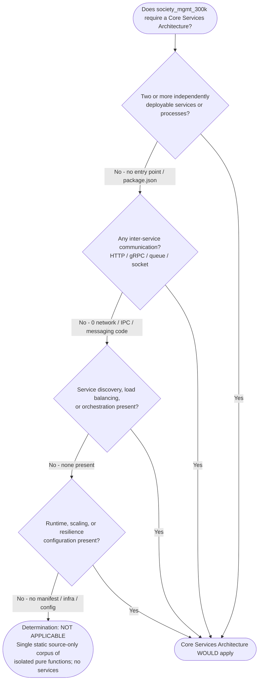

All negative branches in Figure 6.1.1-1 are backed by corpus-wide scans (Section 6.1.5 lists the evidence sources), so the traversal terminates deterministically at the "NOT APPLICABLE" outcome.

### 6.1.2 Service Components Assessment

Because the system exposes no services (Section 6.1.1), none of the six service-component concerns enumerated by the prompt is realized. The `society_mgmt_300k/src/services/` folder — despite its name — contains only 3,600 standalone arithmetic helpers across three files (`file_1.js`, `file_12.js`, `file_23.js`), with no exported operations, no callers, and no dependencies; it defines no service in any runtime sense. The same is true of the sibling `controllers/`, `routes/`, `repositories/`, `middleware/`, and `domain/` folders. The table below assesses each service-component concern against the observed code.

| Service Component Concern | Observed Status | Evidence |
|---|---|---|
| Service boundaries & responsibilities | Not applicable | No deployable/executable service; `src/services/` holds 3,600 isolated pure functions whose only responsibility is `6*x` (+10 when even), with no exported API |
| Inter-service communication patterns | Not applicable | 0 network/IPC transports (`http`/`https`/`fetch`/`axios`/`grpc`/`amqp`/`kafka`/`socket`); only intra-function arithmetic occurs |
| Service discovery mechanisms | Not applicable | No registry, DNS-based discovery, or service mesh; no config source or `process.env`; no manifests of any kind |
| Load balancing strategy | Not applicable | No server, listener, or replicas to balance; 0 `.listen`/`createServer`; no proxy, ingress, or gateway configuration |
| Circuit breaker patterns | Not applicable | No remote calls to protect; 0 resilience libraries; 0 `try`/`catch`/`throw`/`finally` in the corpus |
| Retry & fallback mechanisms | Not applicable | No fallible operation to retry; 0 retry/back-off logic; 0 `Promise`/`async`/`await`/`setTimeout` |

The absence of service interaction is best illustrated by contrasting the call chain the folder names *imply* with the isolation the code *exhibits*. Figure 6.1.2-1 shows the nominal request path a conventional layered service would provide (top lane, drawn with dashed "absent" edges because it is not implemented) alongside the observed reality of independent, non-communicating modules (bottom lane, deliberately edgeless).

**Figure 6.1.2-1 — Service Interaction: Nominal Layered Call Chain vs. Observed Module Isolation**

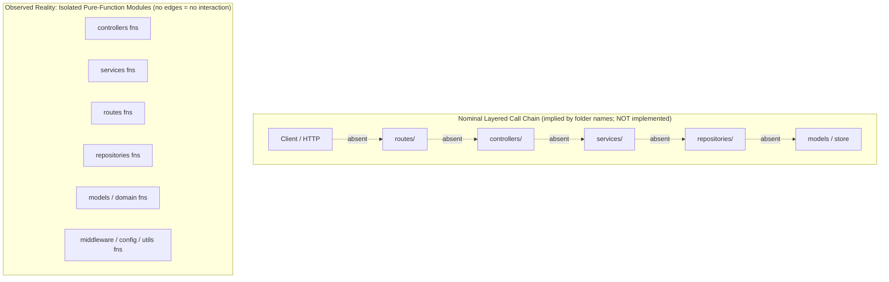

In a running services architecture the top lane of Figure 6.1.2-1 would be realized as an actual request path (client → route → controller → service → repository → model/store). In `society_mgmt_300k/` every one of those edges is absent: the folders exist only as names, and each contains self-contained functions that neither import nor export anything and never call one another (verified: 0 `require`/`import`/`export`/`module.exports` and 0 inter-function calls corpus-wide, per Section 5.1). The only realizable "interaction" is a direct, in-process call to a single helper — `mod_<N>_<k>(x) → Number` — and even that is reachable only by evaluating a file's source directly in a JavaScript engine, because nothing is exported.

### 6.1.3 Scalability Design Assessment

Scalability design applies to systems that serve load at runtime. `society_mgmt_300k/` has no runtime, no process, and no deployable unit, so there is no scaling surface — nothing to replicate horizontally, resize vertically, or auto-scale. The only performance-relevant property present in the code is that each helper is a constant-time **O(1)** computation (three additions, one parity test, and at most one further addition, with no allocation beyond a local accumulator), but this is a static property of the source rather than a runtime characteristic, and no benchmark, timer, or load model exists to exercise it (Section 5.4.5). The table below assesses each scalability concern against the observed code.

| Scalability Concern | Observed Status | Evidence |
|---|---|---|
| Horizontal / vertical scaling approach | Not applicable | No process, container, or deployable unit to replicate or resize; no `package.json` or `Dockerfile` |
| Auto-scaling triggers & rules | Not applicable | No orchestrator or autoscaler; no Kubernetes HPA or YAML, and no emitted metrics to trigger on |
| Resource allocation strategy | Not applicable | No runtime consuming CPU/memory; no resource requests, limits, or configuration declared anywhere |
| Performance optimization techniques | Trivial / not applicable | Each helper is O(1) and side-effect-free (Section 5.4.5); no caching, pooling, batching, or async optimization exists (only the inert `const store = []`) |
| Capacity planning guidelines | Not applicable | No throughput/latency targets, load model, or SLA (Sections 1.2.3, 5.4.5); the only fixed capacity figure is the static 300,000-line corpus size |

Figure 6.1.3-1 traces why no scaling target exists: the transition from a static source corpus to a scalable runtime requires a build manifest, an executable process, and orchestration infrastructure — each of which is absent, so the path terminates before any horizontal or vertical scaling surface can form.

**Figure 6.1.3-1 — Scalability Architecture: Absence of a Runtime Scaling Surface**

```mermaid
flowchart LR
    SRC["Static Source Corpus<br/>29 .js files / 300,000 lines"]
    Q1{"Build / packaging<br/>manifest present?"}
    Q2{"Deployable process<br/>or container present?"}
    Q3{"Load balancer / replicas /<br/>autoscaler present?"}
    NA["No scaling surface exists<br/>no horizontal or vertical<br/>scaling target"]
    SRC --> Q1
    Q1 -->|"No - 0 package.json / Dockerfile"| Q2
    Q2 -->|"No - 0 entry point / runtime"| Q3
    Q3 -->|"No - 0 infra manifests"| NA
```

Every gate in Figure 6.1.3-1 fails closed: with no manifest to build, no process to run, and no infrastructure to orchestrate, the artifact presents no target that could be scaled. A scalability design would first require introducing a runtime — an entry point, a package manifest, and a server or worker process — none of which exists in the repository today. The corpus's only "capacity" attribute is its fixed, generation-time size of exactly 300,000 lines (Sections 1.2.3 and 5.3.1), which is a static build artifact property, not a runtime capacity that can be planned or expanded.

### 6.1.4 Resilience Patterns Assessment

Resilience patterns protect a running system from faults, data loss, and outages. `society_mgmt_300k/` neither runs nor holds state, so there are no faults to tolerate, no data to protect, and no outage surface to guard. This is consistent with Section 5.4, which records that the corpus implements no error handling (0 `try`/`catch`/`throw`/`finally`) and no disaster-recovery procedure. The table below assesses each resilience concern against the observed code.

| Resilience Concern | Observed Status | Evidence |
|---|---|---|
| Fault tolerance mechanisms | Not applicable | 0 `try`/`catch`/`throw`/`finally`; no retry, circuit-breaker, or bulkhead; pure arithmetic cannot fault for numeric input (Section 5.4.3) |
| Disaster recovery procedures | Not applicable | No runtime, state, or data to recover; no RTO/RPO defined; recoverability limited to re-cloning the Git artifact (Section 5.4.5) |
| Data redundancy approach | Not applicable | No datastore or persisted data; the 28 `const store = []` arrays are inert (never written); nothing to replicate |
| Failover configurations | Not applicable | No process, node, or replica; no standby/HA topology; no health checks or readiness probes |
| Service degradation policies | Not applicable | No service to degrade; no feature flags, rate limits, or load-shedding; the sole degenerate path is a silent `NaN` on non-numeric input (Section 5.4.3) |

Figure 6.1.4-1 maps each resilience concern to its observed implementation. Every concern resolves to "absent" or "not applicable" because the two prerequisites for resilience engineering — a running service and stateful data — are both missing.

**Figure 6.1.4-1 — Resilience Pattern Implementation: Observed Coverage**

```mermaid
flowchart TB
    subgraph ASSESS["Resilience Concern to Observed Implementation"]
        direction LR
        FT{"Fault tolerance?<br/>retry / circuit breaker"}
        DR{"Disaster recovery?<br/>RTO / RPO / backup"}
        RED{"Data redundancy?<br/>replicas"}
        FO{"Failover?<br/>standby / HA"}
        DEG{"Graceful degradation?"}
        A1["Absent<br/>0 try / catch / retry"]
        A2["Not applicable<br/>no runtime or state"]
        A3["Not applicable<br/>no datastore"]
        A4["Not applicable<br/>no process / replica"]
        A5["Not applicable<br/>no service to degrade"]
        FT --> A1
        DR --> A2
        RED --> A3
        FO --> A4
        DEG --> A5
    end
```

The only recoverability property the artifact exhibits is version control: the source is fully captured in Git across two commits (`Initial commit` and `Add files via upload`), from which the corpus can be re-cloned in its entirety (Section 5.4.5). This is source-artifact durability, not runtime resilience — there is no live system whose availability, integrity, or continuity could be protected. Should the artifact ever be developed into a service, the resilience patterns listed above would need to be introduced from scratch, together with the runtime and data layers that would make them meaningful.

### 6.1.5 References

The following repository files, folders, and prior specification sections were examined to produce Section 6.1. All architectural claims above are grounded in this evidence.

**Repository files examined**

- `README.md` — Confirmed the repository documents only a project title (`# Society_mngt-13-Jul-2026`), with no architecture, service, or deployment documentation.
- `society_mgmt_300k/src/services/file_1.js`, `file_12.js`, `file_23.js` — Established that the nominal `services/` layer contains 3,600 isolated pure-arithmetic helpers with no exported operations, callers, or dependencies (i.e., no service).
- `society_mgmt_300k/src/routes/file_3.js` — Sample confirming the uniform `mod_<N>_<k>(x)` pure-function pattern and the absence of any route handler, registration, or framework use.
- `society_mgmt_300k/src/config/file_17.js` — Confirmed the nominal `config/` layer holds arithmetic helpers rather than any configuration source, key/value data, or `process.env` access.
- `society_mgmt_300k/src/utils/filler.js` — Comment-only padding (`// filler 298001` … `// filler 299999`) that brings the corpus to its fixed 300,000-line size; contributes no behavior.

**Repository folders examined**

- `society_mgmt_300k/` — The generated, source-only corpus root; established the absence of any `package.json`, `Dockerfile`, orchestration manifest, or runtime entry point.
- `society_mgmt_300k/src/` — Nine layer-named folders (`controllers/`, `services/`, `routes/`, `models/`, `domain/`, `repositories/`, `middleware/`, `config/`, `utils/`) containing 28,305 standalone helpers with no inter-module wiring — the basis for the "no service components" and "no service interaction" findings.
- `society_mgmt_300k/tests/` (`unit/`, `integration/`) — 4,800 helpers with no test runner or assertions; confirmed the corpus exercises no runtime behavior.

**Repository-wide scans (evidence method)**

- Corpus-wide keyword scans across all `.js` files established the zero-occurrence findings for module wiring (`require`/`import`/`export`/`module.exports`), networking (`http`/`https`/`fetch`/`axios`/`.listen`/`createServer`), messaging clients (`grpc`/`amqp`/`kafka`/`socket`), database clients, concurrency (`async`/`await`/`Promise`), error handling (`try`/`catch`/`throw`/`finally`), and datastore usage (`store.push`/`store[`/`return store`) — the direct basis for every "not applicable" determination in Sections 6.1.1–6.1.4.

**Technical Specification cross-references**

- Section 1.2 (System Overview), incl. 1.2.3 — Single deterministic-transformation capability; no integration surface; no KPIs or SLAs.
- Section 5.1 (High-Level Architecture) — Generated corpus with no runtime composition, no entry point, no inbound/outbound interfaces, and no SLAs.
- Section 5.3 (Technical Decisions), incl. 5.3.1 — As-built flat corpus of isolated pure functions under a nominal layered taxonomy; no communication, storage, or caching; Git commit history.
- Section 5.4 (Cross-Cutting Concerns), incl. 5.4.3 and 5.4.5 — All cross-cutting concerns absent; error handling and disaster recovery not applicable; constant-time O(1) helper; no monitoring or performance instrumentation.

## 6.2 Database Design

### 6.2.1 Applicability Determination

**Database Design is not applicable to this system.**

The repository under documentation — `society_mgmt_300k/` — is a *generated, source-only JavaScript corpus*, not a running application. It contains **no database, no persistence layer, no object/file storage, and no caching tier**. There is no schema to design, no entity to model, no index or constraint to define, and no data to store, migrate, replicate, back up, or retain. This determination is established by direct, corpus-wide inspection of the code and is fully consistent with Databases & Storage (Section 3.5), which states the repository "contains no database, no persistence layer, no caching solution, and no external storage service"; with Scope (Section 1.3), which lists persistence and data access as explicitly out of scope; and with Core Services Architecture (Section 6.1), which characterizes the artifact as a non-executing corpus of isolated pure functions.

Concretely, the artifact is a single static tree of **29 `.js` files totaling exactly 300,000 lines**, containing **33,105 byte-identical, standalone pure functions** of the form `mod_<N>_<k>(x)` that each compute `6*x` and add `10` when the result is even. The nine folders under `society_mgmt_300k/src/` carry conventional layer names, and three of them are directly persistence-adjacent — `models/`, `repositories/`, and `config/` — yet none contains a schema, an ORM mapping, a query, a connection, or configuration. Inspection of `src/models/file_2.js`, `src/repositories/file_7.js`, and `src/config/file_6.js` shows each opens with the identical `// mod_<N> - society module` comment, an inert `const store = [];`, and then only the repeated arithmetic helper — no data model, no data-access routine, and no configuration key.

A database design presupposes at least one of the following, none of which the repository satisfies: a datastore client or driver, a schema or model mapping, a connection or configuration source, or a read/write path to durable or cached data. The corpus-wide token scan below returns **zero occurrences** for every persistence signal.

| Persistence Capability | Tokens / Signals Scanned | Occurrences |
|---|---|---|
| Relational databases | `postgres`, `mysql`, `sqlite`, `pg`, `mariadb` | 0 |
| NoSQL / document stores | `mongo`, `mongoose`, `dynamodb`, `cassandra` | 0 |
| ORM / query builders | `sequelize`, `prisma`, `knex`, `typeorm` | 0 |
| Caching tier | `redis`, `memcached`, memoization | 0 |
| Client / browser storage | `localstorage`, `indexeddb` | 0 |
| Object / file storage | `s3`, `fs.`, `readFile`, `writeFile` | 0 |
| Schema / migration artifacts | `schema`, `migration`, `CREATE TABLE`, `.sql`, `.prisma` | 0 |
| Connection / configuration | `connect(`, `createConnection`, `process.env` | 0 |

**The only storage-like construct — and why it is inert.** Each of the 28 executable files declares a single module-scoped array with `const store = [];` (28 declarations corpus-wide). This array is **dead code**: a scan for every mutation and read access (`store.push`/`pop`/`shift`/`unshift`/`splice`/`find`/`filter`/`map` and indexed access `store[...]`) returns **zero** hits. No helper ever writes to or reads from `store`; every function operates solely on its numeric parameter `x` and a local accumulator `r`. The declaration is therefore a uniform structural artifact of the generative template, not a functioning in-memory data store, cache, or table.

The corpus also contains **no data-integrity or transactional constructs** whatsoever: a scan for `async`/`await`/`Promise`/`try`/`catch`/`throw`/`finally`/`transaction`/`rollback`/`commit` returns **zero** occurrences. There are no manifests or configuration files of any kind — no `package.json`, lockfile, `Dockerfile`, `.env`, `.sql`, `.prisma`, YAML, JSON, or `.ini`/`.toml` files exist anywhere in the tree — so no database could be declared, provisioned, or connected even nominally.

The decision path below summarizes the reasoning that produces the "not applicable" determination; every negative branch is backed by the corpus-wide scans recorded above and enumerated in Section 6.2.6.

**Figure 6.2.1-1 — Database Design Applicability Decision Path**

```mermaid
flowchart TD
    START(["Does society_mgmt_300k require a Database Design?"])
    Q1{"Any database / ORM / storage<br/>client or driver present?"}
    Q2{"Any schema, model mapping,<br/>or migration artifact?"}
    Q3{"Any connection string, DB config,<br/>or process.env access?"}
    Q4{"Any persisted or cached data<br/>(reads/writes to a store)?"}
    APP(["Database Design WOULD apply"])
    NA(["Determination: NOT APPLICABLE<br/>Source-only corpus of stateless pure<br/>functions; no persistence of any kind"])
    START --> Q1
    Q1 -->|"No - 0 db / orm / cache / storage tokens"| Q2
    Q1 -->|"Yes"| APP
    Q2 -->|"No - 0 schema / model / migration"| Q3
    Q2 -->|"Yes"| APP
    Q3 -->|"No - 0 connection / config / env"| Q4
    Q3 -->|"Yes"| APP
    Q4 -->|"No - 28 inert store[] never read or written"| NA
    Q4 -->|"Yes"| APP
```

Because there is no datastore, the system's only "data flow" is the in-process evaluation of a single helper: a numeric argument enters, a numeric result is returned, and nothing is persisted, cached, or emitted. Figure 6.2.1-2 depicts this observed flow (left) alongside the conventional persistence tier that the `models/` and `repositories/` folder names imply but that is **not implemented** (right, drawn with dashed "absent" edges).

**Figure 6.2.1-2 — Observed Data Flow vs. Absent Persistence Tier**

```mermaid
flowchart LR
    subgraph RUNTIME["Observed Execution (in-process, stateless)"]
        direction LR
        IN["Numeric input x"]
        FN["mod_N_k(x)<br/>r = 6*x, +10 if even"]
        OUT["Returned Number r<br/>(never persisted)"]
        IN --> FN --> OUT
    end
    subgraph PERSIST["Persistence Tier implied by models/ and repositories/ (NOT implemented)"]
        direction LR
        DB[("Database /<br/>Collection")]
        CACHE[("Cache")]
        FILE[("Object /<br/>File Store")]
    end
    FN -. "no read / write (absent)" .-> DB
    FN -. "no cache access (absent)" .-> CACHE
    FN -. "no file I/O (absent)" .-> FILE
```

Because the repository is a single, static, non-executing artifact with no persistence, the remainder of Section 6.2 does not describe a live database. Instead, each subsequent sub-section walks the topics the prompt enumerates — Schema Design (Section 6.2.2), Data Management (Section 6.2.3), Compliance Considerations (Section 6.2.4), and Performance Optimization (Section 6.2.5) — and records, with evidence, why each is not applicable. Should the artifact ever be developed into a functioning society-management service, all of these constructs would need to be introduced from scratch together with the datastore that would make them meaningful.

### 6.2.2 Schema Design Assessment

Schema design describes the entities, relationships, structures, indexes, and physical-storage strategy of a datastore. Because `society_mgmt_300k/` has no datastore (Section 6.2.1), **none of the six schema-design concerns enumerated by the prompt is realized**. The `society_mgmt_300k/src/models/` folder — the conventional home for entity definitions — contains only `file_2.js`, `file_13.js`, and `file_24.js`, which together hold 3,600 standalone arithmetic helpers and **zero** schema definitions, classes, type declarations, interfaces, or ORM mappings. The same is true of `src/repositories/` (`file_7.js`, `file_18.js`), whose only "data-access" content is the same `mod_<N>_<k>(x)` computation. The only "data" in the entire corpus are the transient numeric argument `x` passed to a helper and the numeric result `r` it returns; neither is ever persisted.

The table below assesses each schema-design concern against the observed code.

| Schema Design Concern | Observed Status | Evidence |
|---|---|---|
| Entity relationships | Not applicable | No entities, tables, or collections defined; `src/models/` holds 3,600 pure functions and 0 schema objects; no relationships to express |
| Data models & structures | Not applicable | No `class`/type/interface/schema; the sole structure is `function mod_N_k(x) -> Number`; transient numeric `x`/`r` only |
| Indexing strategy | Not applicable | No datastore to index; 0 `index`/`CREATE INDEX`/unique-key declarations corpus-wide |
| Partitioning approach | Not applicable | No tables/collections to partition or shard; no partition/shard keys exist |
| Replication configuration | Not applicable | No database to replicate; 0 primary/replica/standby configuration; only Git-level source replication exists |
| Backup architecture | Not applicable | No data to back up; recoverability is limited to re-cloning the Git source artifact (2 commits) |

**Data models and structures.** No data model exists at any layer. The corpus declares no `class`, no object literal used as a record, no TypeScript/JSDoc type, and no schema builder call. Each helper is a pure numeric transformation whose entire "structure" is a local accumulator `r`; there is no field, column, document, key, or embedded document anywhere. The `const store = []` array present in each executable file is the only collection-typed binding, and it is never populated (Section 6.2.1), so it defines no implicit record shape either.

**Entity relationships and the absence of an ERD.** Because zero entities are defined, **no authentic Entity-Relationship Diagram (ERD) can be produced** — there are no tables/collections, primary or foreign keys, cardinalities, or join paths to render. For completeness, Figure 6.2.2-1 contrasts the domain entities that the "society management" naming *implies* (the membership, dues, billing, notices, facilities, and complaints capabilities that Section 1.3.2 records as name-implied but absent) with the actual, schema-free data footprint of the code.

**Figure 6.2.2-1 — Implied Domain Entities (Not Implemented) vs. Observed Data Footprint**

```mermaid
flowchart TB
    subgraph IMPLIED["Domain Entities Implied by the 'society management' Name (NOT implemented; see Section 1.3.2)"]
        direction LR
        M["Member"]
        U["Unit / Property"]
        D["Dues / Invoice"]
        P["Payment"]
        F["Facility"]
        C["Complaint / Notice"]
    end
    subgraph ACTUAL["Observed Data Footprint (no schema, no persistence)"]
        direction LR
        X["Transient numeric input x<br/>(never stored)"]
        R["Returned Number r = 6*x (+10 if even)<br/>(never persisted)"]
        X -->|"in-process compute"| R
    end
    NOTE["Zero entities, tables, collections, primary/foreign keys,<br/>relationships, indexes, or constraints exist corpus-wide"]
```

**Indexes and constraints.** Documenting "all indexes and constraints" resolves to documenting their complete absence. Because there is no schema, there are no keys, no uniqueness rules, no referential integrity, and no value constraints of any kind. The following table enumerates every index/constraint category and its observed count.

| Index / Constraint Category | Observed Count |
|---|---|
| Primary keys | 0 |
| Foreign keys / referential constraints | 0 |
| Unique constraints | 0 |
| Indexes (b-tree, hash, composite, full-text) | 0 |
| Check / NOT NULL / default-value constraints | 0 |

**Partitioning approach.** Not applicable. Partitioning and sharding distribute rows or documents of a datastore across ranges, hashes, or nodes; with no table or collection defined, there is nothing to partition. No partition key, shard key, or distribution strategy appears anywhere in the corpus.

**Replication configuration and backup architecture.** No database replication exists — there is no primary node, no read replica, no standby, and no replication or high-availability configuration. Likewise, no backup architecture exists at the data layer: there are no snapshots, dumps, WAL/oplog archives, or point-in-time-recovery settings, because there is no data. The only durability mechanism the artifact exhibits is **version control of the source itself**: the corpus is captured in Git across two commits, from which it can be re-cloned in full. This is source-artifact durability, not runtime database replication or backup. Figure 6.2.2-2 contrasts the conventional replication topology implied by a persistence layer (absent) with the observed Git-based source durability.

**Figure 6.2.2-2 — Replication Architecture: Conventional Topology (Absent) vs. Observed Source Durability**

```mermaid
flowchart TB
    subgraph WOULDBE["Conventional DB Replication Topology (NOT implemented)"]
        direction LR
        PRI[("Primary DB")]
        RE1[("Read Replica 1")]
        RE2[("Read Replica 2")]
        PRI -. "async replication (absent)" .-> RE1
        PRI -. "async replication (absent)" .-> RE2
    end
    subgraph OBSERVED["Observed Durability: Git Source Replication Only"]
        direction LR
        SRC["Static source tree<br/>29 .js / 300,000 lines"]
        GIT[("Git repository<br/>2 commits")]
        CLONE["Full re-clone restores<br/>the entire corpus"]
        SRC --> GIT --> CLONE
    end
```

In summary, every schema-design concern maps to "not applicable" for the same root cause: the repository defines no datastore, no entities, and no data. A schema design would first require introducing a database and a data model — neither of which exists in the repository today.

### 6.2.3 Data Management Assessment

Data management covers how data is migrated, versioned, archived, stored, retrieved, and cached over its lifecycle. Since `society_mgmt_300k/` neither persists nor caches any data (Section 6.2.1), **there is no data lifecycle to manage**. Every helper is a pure, stateless numeric transformation: it receives `x`, computes `r`, returns `r`, and retains nothing. The table below assesses each data-management concern against the observed code.

| Data Management Concern | Observed Status | Evidence |
|---|---|---|
| Migration procedures | Not applicable | No schema/ORM to evolve; 0 `migration`/`.sql` files; no migration tool (`knex`/`prisma`/`sequelize`/Flyway/Liquibase) present |
| Versioning strategy | Source-only (Git) | No data or schema versioning; the only versioning is Git VCS over source files (2 commits: "Initial commit", "Add files via upload") |
| Archival policies | Not applicable | No data written, therefore nothing to archive, tier, or purge; no TTL, cold-storage, or retention job exists |
| Data storage & retrieval | Not applicable | No read/write path; helpers use only parameter `x` and local `r`; the 28 `const store = []` arrays are never written or read |
| Caching policies | Not applicable | No cache library, layer, or memoization; each call recomputes `6*x`; `store[]` is never used as a cache |

**Migration procedures.** No database migrations exist because there is no schema to create or evolve. The corpus contains no migration directory, no versioned DDL scripts, no `up`/`down` migration functions, and no migration-runner dependency. Introducing migrations would first require a schema and a datastore, both of which are absent.

**Versioning strategy.** There is no data-versioning or schema-versioning mechanism (no schema-version table, no document `_version` field, no event-sourcing log). The only versioning present is source-code version control: the repository is tracked in Git with two commits. This governs the evolution of the JavaScript source files, not any dataset.

**Archival policies.** No archival, tiering, or purge policy exists. Because the helpers write nothing to any medium, no data ever accumulates that could be archived to cold storage or deleted after a retention window. The fixed corpus size (exactly 300,000 lines, padded by the comment-only `src/utils/filler.js`) is a build-time generation property, not a managed data-archival outcome.

**Data storage and retrieval mechanisms.** There is no storage or retrieval path of any kind. No file I/O (`fs`, `readFile`, `writeFile`), no database queries (`.query`/`.find`/`.save`/`.insert`/`.update`/`.delete`), and no network calls appear anywhere in the corpus (all scanned at 0 occurrences). The sole "retrieval" a caller can perform is a direct in-process function call, `mod_<N>_<k>(x) -> Number`, and even that is reachable only by evaluating a file's source directly in a JavaScript engine, because nothing is exported.

**Caching policies.** No caching exists. There is no cache client (`redis`/`memcached`), no HTTP or query cache, and no memoization wrapper around the helpers. Because every helper is a deterministic `O(1)` computation with no external cost, results are recomputed on each invocation rather than cached. The inert `const store = []` arrays could superficially resemble an in-memory cache, but they are never written to or read from and therefore cache nothing (Section 6.2.1).

In summary, data management is uniformly not applicable: with no persisted or cached data, there is nothing to migrate, version, archive, store, retrieve, or cache. The only version-control mechanism observed operates on source files via Git, not on any dataset.

### 6.2.4 Compliance Considerations Assessment

Compliance considerations govern how persisted data is retained, protected, kept private, audited, and access-controlled. These controls apply to systems that collect, store, or process data. `society_mgmt_300k/` collects and stores **no data** (Section 6.2.1) — its inputs are anonymous numeric arguments that are neither recorded nor retained — so **none of the data-compliance concerns is applicable**. The table below assesses each concern against the observed code.

| Compliance Concern | Observed Status | Evidence |
|---|---|---|
| Data retention rules | Not applicable | No persisted data; no retention window, TTL, or expiry configuration exists to define |
| Backup & fault-tolerance policies | Source-artifact only | No DB backups, RPO/RTO, or failover; only Git source durability; pure deterministic helpers hold no fault state |
| Privacy controls | Not applicable | No PII or personal data collected/stored; inputs are anonymous numbers; no encryption, masking, or consent logic present |
| Audit mechanisms | Not applicable | No audit log or trail; 0 logging (`console`/`process`); no data-change or access events are recorded |
| Access controls | Not applicable | No datastore, rows, or documents to protect; no authentication, RBAC, `GRANT`, or row-level security present |

**Data retention rules.** No retention policy exists because no data is retained. There is no TTL, no expiry field, no scheduled purge, and no legal-hold mechanism. Any retention rule would require a persisted dataset with a lifecycle, which the corpus does not have.

**Backup and fault-tolerance policies.** At the data layer there are no backups, no recovery-point/recovery-time objectives, and no fault-tolerance mechanisms (0 `try`/`catch`/`throw`/`finally` and no retry/circuit-breaker constructs). The only recoverability property the artifact exhibits is source durability through Git version control, from which the corpus can be fully re-cloned (see Section 6.2.2, Figure 6.2.2-2). Functionally, each helper is a pure, deterministic computation that maintains no state and therefore has no fault or corruption surface to protect.

**Privacy controls.** No privacy controls are present or required. The corpus processes only anonymous numeric arguments and stores nothing, so there is no personally identifiable information (PII), no special-category data, and no personal data at rest or in transit. Consequently there is no encryption-at-rest, field-level masking, tokenization, anonymization, consent capture, or data-subject-request handling — none of which is applicable to a stateless numeric transformer.

**Audit mechanisms.** No audit mechanism exists. There is no audit table, no append-only change log, and no access or modification trail. The corpus emits no telemetry whatsoever — scans for `console` and `process` return 0 occurrences — so no data-access, data-change, or administrative event is ever recorded.

**Access controls.** No data access controls exist because there is no datastore to guard. The corpus defines no users, roles, credentials, sessions, permissions, `GRANT`/`REVOKE` statements, or row/column-level security. The only access boundaries that apply to the artifact are those of the host filesystem and the Git repository that stores the source — governance of files, not of data.

**Governance artifacts present.** The only compliance-relevant artifacts in the repository are licensing files: an Apache License 2.0 at the repository root (`LICENSE`) and a short, truncated MIT-style notice nested in the corpus (`society_mgmt_300k/LICENSE/LICENSE.txt`). These govern reuse of the source code; they impose no data-handling, retention, privacy, or audit obligations because the artifact processes no data.

In summary, every data-compliance concern is not applicable for the same reason: the system neither collects nor stores data. Should a datastore ever be introduced, retention, backup, privacy, audit, and access-control policies would all need to be designed from the ground up.

### 6.2.5 Performance Optimization Assessment

Database performance optimization tunes how a datastore executes queries, caches results, manages connections, distributes reads and writes, and processes work in batches. All of these techniques presuppose a datastore and a workload against it. `society_mgmt_300k/` has neither (Section 6.2.1), so **no database performance optimization applies**. The table below assesses each optimization technique against the observed code.

| Optimization Technique | Observed Status | Evidence |
|---|---|---|
| Query optimization patterns | Not applicable | No queries exist; 0 `SELECT`/`.find`/`.query`; no query planner, `EXPLAIN`, or index-tuning surface |
| Caching strategy | Not applicable | No cache tier or memoization; `store[]` inert; deterministic `O(1)` helpers are recomputed each call |
| Connection pooling | Not applicable | No database connections; 0 `pool`/`createPool`/connection configuration; nothing to pool |
| Read/write splitting | Not applicable | No primary/replica topology; no reads or writes to route between nodes |
| Batch processing approach | Not applicable | No batch/bulk/cursor/stream operations; no scheduler or queue; each helper is a single `O(1)` call |

**Query optimization patterns.** There are no queries to optimize. The corpus issues no SQL and no document-store calls, so there is no query plan, no `EXPLAIN`/`ANALYZE` output, no covering-index strategy, and no N+1 or join-tuning concern. The only computation performed is arithmetic on a single numeric argument.

**Caching strategy.** No caching strategy exists at any layer (no result cache, query cache, or object cache). Each helper recomputes `6*x` (plus `10` when the result is even) directly; because the computation is constant-time and side-effect-free, there is no expensive operation whose result would benefit from being cached. The inert `const store = []` arrays are not used for memoization or any other caching purpose (Section 6.2.1).

**Connection pooling.** No connection pooling is present because there are no connections. The corpus opens no database, HTTP, or socket connections, declares no pool size or acquisition/idle timeouts, and imports no pooling library. There is no connection lifecycle to manage.

**Read/write splitting.** No read/write splitting is present because there is no primary/replica database topology (Section 6.2.2) and no read or write operations to route. All work is a single in-process function evaluation, so there is no notion of directing reads to replicas and writes to a primary.

**Batch processing approach.** No batch or bulk processing exists. There are no batch inserts/updates, cursors, streaming reads, job schedulers, or message queues. Each helper is invoked (nominally) with a single argument and returns a single value; there is no collection-oriented or windowed processing anywhere in the corpus.

**The only performance-relevant property.** The sole performance characteristic observable in the code is that each helper is a constant-time **`O(1)`** operation — three additions, one parity test, and at most one further addition, with no allocation beyond a local accumulator and no I/O. This is a static property of the source rather than a tuned database behavior, and no benchmark, timer, load model, or throughput/latency target exists to exercise or optimize it. Consequently, database performance optimization is uniformly not applicable; any such optimization would only become meaningful after a datastore and a real query workload were introduced.

### 6.2.6 References

The following repository files, folders, repository-wide scans, and prior specification sections were examined to produce Section 6.2. Every "not applicable" determination above is grounded in this evidence.

**Repository files examined**

- `society_mgmt_300k/src/models/file_2.js` — Confirmed the nominal `models/` layer contains only the uniform `mod_<N>_<k>(x)` arithmetic helper (opening with `// mod_N - society module` and an inert `const store = [];`), with no schema, entity, class, type, or ORM mapping.
- `society_mgmt_300k/src/repositories/file_7.js` — Confirmed the nominal `repositories/` layer contains no data-access routines, queries, or connections — only the same arithmetic helper.
- `society_mgmt_300k/src/config/file_6.js` — Confirmed the nominal `config/` layer holds no database configuration, connection string, or key/value settings — only arithmetic helpers.
- `society_mgmt_300k/src/utils/filler.js` — Comment-only padding (`// filler 298001` … `// filler 299999`) that fixes the corpus at exactly 300,000 lines; contributes no data behavior.
- `README.md` — Confirmed the repository documents only a project title (`# Society_mngt-13-Jul-2026`), with no database, schema, or persistence documentation.
- `LICENSE` and `society_mgmt_300k/LICENSE/LICENSE.txt` — The only governance artifacts (Apache-2.0 at the root; a truncated MIT-style notice nested in the corpus); govern source reuse, impose no data-handling obligations.

**Repository folders examined**

- `society_mgmt_300k/` — The generated, source-only corpus root; established the absence of any `package.json`, lockfile, `Dockerfile`, `.env`, `.sql`, `.prisma`, YAML/JSON, or `.ini`/`.toml` manifest that could declare or provision a database.
- `society_mgmt_300k/src/` — The nine layer-named folders (including `models/`, `repositories/`, `config/`) holding 28,305 standalone helpers with no schema, data access, or configuration — the basis for the "no schema / no datastore" findings.
- `society_mgmt_300k/tests/` (`unit/`, `integration/`) — 4,800 helpers with no assertions, fixtures, or database access; confirmed no persistence is exercised.

**Repository-wide scans (evidence method)**

- Corpus-wide keyword scans across all `.js` files established the zero-occurrence findings for datastore clients/drivers (`mongo`/`mongoose`/`postgres`/`mysql`/`sqlite`/`dynamodb`/`cassandra`), ORMs/query builders (`sequelize`/`prisma`/`knex`/`typeorm`), caching (`redis`/`memcached`), client/object/file storage (`localstorage`/`indexeddb`/`s3`/`fs.`/`readFile`/`writeFile`), schema/migration artifacts (`schema`/`migration`/`CREATE TABLE`), connections/config (`connect(`/`createConnection`/`process.env`), and query verbs (`.query`/`.find`/`.save`/`.insert`/`.update`/`.delete`) — the direct basis for every determination in Sections 6.2.1–6.2.5.
- Scans for datastore-usage and integrity constructs — `store.push`/`pop`/`shift`/`unshift`/`splice`/`find`/`filter`/`map`, indexed `store[...]`, and `async`/`await`/`Promise`/`try`/`catch`/`throw`/`finally`/`transaction`/`rollback`/`commit` — returned 0, confirming the 28 `const store = []` arrays are inert and no transactional/integrity logic exists.
- Corpus metrics verified directly: 29 `.js` files, exactly 300,000 lines, 33,105 `mod_<N>_<k>` helper declarations (28,305 in `src/`, 4,800 in `tests/`), and 28 `const store = []` declarations.

**Technical Specification cross-references**

- Section 1.3 (Scope), incl. 1.3.2 — Persistence and data access explicitly out of scope; no schemas or persisted entities; enumerates the name-implied society-management domains (membership, dues, billing, notices, facilities, complaints) that are absent.
- Section 3.5 (Databases & Storage) — Establishes "no database, no persistence layer, no caching solution, and no external storage service"; storage-token scan at 0; inert `const store = []` as dead code.
- Section 6.1 (Core Services Architecture) — Characterizes the artifact as a generated, source-only, non-executing corpus of isolated pure functions; provides the Applicability-Determination framing mirrored here and the Git two-commit history.

## 6.3 Integration Architecture

### 6.3.1 Integration Architecture Applicability Determination

**Integration Architecture is not applicable for this system.**

The repository under documentation — `society_mgmt_300k/` — is a *generated, source-only JavaScript corpus*, not an integrated or running system. Integration architecture presupposes that a system exchanges data with at least one party outside its own process: it exposes an interface others call (an API or UI), it consumes an interface elsewhere (an HTTP client, SDK, or database driver), it moves messages across an asynchronous transport (a queue, stream, or event bus), or it declares external services it depends on. This corpus does none of these. It exposes nothing, consumes nothing, and declares nothing — its files do not even integrate with one another.

This determination is established by direct, corpus-wide inspection and is fully consistent with the System Overview (Section 1.2), the Scope statement (Section 1.3), the Third-Party Services analysis (Section 3.4), and the Core Services Architecture determination (Section 6.1), all of which independently characterize the artifact as a self-contained, integration-free corpus of isolated pure functions. Section 1.2's integration table records external dependencies, inbound interfaces, outbound interfaces, and cross-module composition as *None*; Section 1.3 places every integration point out of scope; and Section 3.4 concludes the repository "integrates with no external services of any kind."

Concretely, the corpus is a static tree of 29 `.js` files (24 under `society_mgmt_300k/src/` across nine layer-named folders, four under `society_mgmt_300k/tests/`, plus a comment-only `utils/filler.js`) totaling exactly 300,000 lines. It contains 33,105 byte-identical, standalone pure functions of the form `mod_<N>_<k>(x)` that each compute `x*1 + x*2 + x*3` (i.e., `6*x`) and add `10` when that sum is even. Corpus-wide scans confirm only seven distinct non-comment code line shapes exist, none of which perform any form of communication. The folders named `routes/`, `controllers/`, and `middleware/` — which would normally host an integration surface — contain the same arithmetic helpers as every other folder, with no route, handler, client, or transport of any kind.

An integration architecture requires at least one of the following preconditions; the corpus satisfies none of them.

| Integration Precondition | Required for an Integration Architecture | Observed in `society_mgmt_300k/` |
|---|---|---|
| Exposed inbound interface | An entry point that accepts external requests (API / RPC / UI) | None — 0 `router`/`.listen`/`createServer`; `routes/` and `controllers/` hold only arithmetic helpers |
| Consumed outbound interface | Client code that calls an external API or service | None — 0 `fetch`/`axios`/`http`/`https` clients; 0 URL literals corpus-wide |
| Asynchronous message transport | A broker, stream, or event bus for async exchange | None — 0 `kafka`/`amqp`/`rabbit`/`sqs`/`.emit`/`subscribe` |
| Shared datastore integration | A database or cache accessed across a boundary | None — 0 DB/ORM clients; 28 `const store = []` never read or written |
| Dependency / module wiring | Imports and exports linking components at runtime | None — 0 `require`/`import`/`export`/`module.exports`; 0 inter-function calls |
| Declared external dependencies | A manifest listing external services or libraries | None — no `package.json` or any manifest anywhere in the tree |

The decision path below summarizes the reasoning that produces the "not applicable" determination. Each gate fails closed because the corresponding construct is entirely absent from the code.

**Figure 6.3.1-1 — Integration Architecture Applicability Decision Path**

```mermaid
flowchart TD
    START(["Does society_mgmt_300k require an Integration Architecture?"])
    Q1{"Any exposed inbound interface?<br/>HTTP API / RPC / UI"}
    Q2{"Any consumed outbound interface?<br/>HTTP client / SDK / DB driver"}
    Q3{"Any asynchronous message transport?<br/>queue / stream / event bus"}
    Q4{"Any declared external dependency?<br/>package.json / manifest"}
    APP(["Integration Architecture WOULD apply"])
    NA(["Determination: NOT APPLICABLE<br/>Self-contained corpus of isolated pure<br/>functions; nothing exchanged with any party"])
    START --> Q1
    Q1 -->|"No - 0 router / .listen / createServer"| Q2
    Q1 -->|"Yes"| APP
    Q2 -->|"No - 0 fetch / axios / http / DB client"| Q3
    Q2 -->|"Yes"| APP
    Q3 -->|"No - 0 queue / stream / event bus"| Q4
    Q3 -->|"Yes"| APP
    Q4 -->|"No - no manifest / dependency"| NA
    Q4 -->|"Yes"| APP
```

All negative branches in Figure 6.3.1-1 are backed by corpus-wide keyword scans, so the traversal terminates deterministically at the "NOT APPLICABLE" outcome. Because the repository neither offers nor consumes any interface, the remainder of Section 6.3 does not describe a live integration topology. Instead, the subsequent sub-sections systematically walk each topic the prompt enumerates — API Design (Section 6.3.2), Message Processing (Section 6.3.3), and External Systems (Section 6.3.4) — and record, with evidence, why each is not applicable. Should the corpus ever be developed into an actual service, every integration concern documented below would need to be introduced from scratch, together with the runtime, network, and dependency layers that would make it meaningful.

### 6.3.2 API Design Assessment

Because the system exposes no programmatic interface (Section 6.3.1), none of the six API-design concerns enumerated by the prompt is realized. The `society_mgmt_300k/src/routes/` (3 files, 3,600 helpers), `society_mgmt_300k/src/controllers/` (3 files, 3,600 helpers), and `society_mgmt_300k/src/middleware/` (3 files, 3,105 helpers) folders carry names conventionally associated with an HTTP API layer, but none defines an API. Each contains only standalone arithmetic helpers of the form `mod_<N>_<k>(x)`; there is no server, no route registration, no request/response handling, and no wire protocol anywhere in the corpus. The `README.md` documents only the project title and contains no API reference.

The table below assesses each API-design concern against the observed code. Every entry is "not applicable" because the prerequisite — an interface that accepts or issues requests — does not exist.

| API Design Concern | Observed Status | Evidence |
|---|---|---|
| Protocol specification | Not applicable | No protocol implemented; 0 `http`/`https`/`.route()`/HTTP-verb handlers and 0 `graphql`/`grpc`/`soap`/`websocket` occurrences |
| Authentication methods | Not applicable | No API to authenticate; 0 `oauth`/`jwt`/`passport`/`session`/`bearer` or credential-handling code |
| Authorization framework | Not applicable | No protected resource; 0 `rbac`/`acl`/`scope`/`role`/`permission`/`authorize` constructs |
| Rate limiting strategy | Not applicable | No request path to limit; 0 `rate-limit`/`throttle`/`quota`/bucket logic |
| Versioning approach | Not applicable | No API surface to version; 0 `/v1`·`/v2` paths, version headers, or `api-version` constructs |
| Documentation standards | Not applicable | No API to describe; 0 `swagger`/`openapi`/`apidoc`/`raml`; no `.yaml`/`.yml` spec files |

Figure 6.3.2-1 contrasts the API architecture the folder names *imply* (top lane, drawn with dashed "absent" edges because it is not implemented) with the observed reality of an isolated pure function reachable only by direct evaluation (bottom lane). In a running API, the top lane would carry a request from a client through a gateway, authentication and rate-limiting middleware, a router, and a controller into business logic. In `society_mgmt_300k/` every one of those stages is absent.

**Figure 6.3.2-1 — API Architecture: Nominal Request Pipeline vs. Observed Function Isolation**

```mermaid
flowchart TB
    subgraph NOMINAL["Nominal REST API Pipeline (implied by folder names; NOT implemented)"]
        direction LR
        CLIENT["API Client"]
        GW["API Gateway"]
        AUTH["Auth Middleware<br/>authN / authZ"]
        RL["Rate Limiter"]
        RTR["routes/ router"]
        CTL["controllers/ handler"]
        SVC["services/ logic"]
        CLIENT -.->|"absent"| GW
        GW -.->|"absent"| AUTH
        AUTH -.->|"absent"| RL
        RL -.->|"absent"| RTR
        RTR -.->|"absent"| CTL
        CTL -.->|"absent"| SVC
    end
    subgraph OBSERVED["Observed Reality: Isolated Pure Function (no protocol, no endpoint)"]
        direction LR
        FN["mod_N_k(x)"]
        RET["return 6*x (+10 if even)"]
        FN --> RET
    end
```

The only realizable "interaction" with the corpus is a direct, in-process call to a single helper, and even that is reachable only by evaluating a file's source directly in a JavaScript engine, because nothing is exported (0 `module.exports`/`export` corpus-wide). Figure 6.3.2-2 renders this as a sequence diagram: the nominal client/server exchange (dashed messages) never occurs, while the observed direct call (solid messages) is the sole path that produces a value.

**Figure 6.3.2-2 — Key Flow Sequence: Nominal API Call (Absent) vs. Observed Direct Invocation**

```mermaid
sequenceDiagram
    autonumber
    participant C as API Client
    participant SRV as HTTP Server
    participant CTL as Controller
    participant ENG as JS Engine
    participant FN as mod_N_k(x)
    Note over C,CTL: Nominal API request/response — NOT implemented
    C-->>SRV: request to /api endpoint (no server listening)
    SRV-->>CTL: route and dispatch (no route registered)
    CTL-->>C: serialized response (never produced)
    Note over ENG,FN: Observed reality — the only realizable call
    ENG->>FN: mod_N_k(x) direct in-process call
    FN->>ENG: return 6*x (+10 when even)
```

Consequently there is no protocol, authentication method, authorization model, rate-limiting policy, versioning scheme, or API documentation standard to specify. Were the corpus developed into a service, all six concerns above would have to be introduced together with an HTTP (or equivalent) server, a router, and an export/module system that currently do not exist.

### 6.3.3 Message Processing Assessment

The corpus performs no message processing of any kind. Every one of the 33,105 helpers is fully synchronous and side-effect-free: it accepts a numeric argument, computes `6*x` (plus `10` when even), and returns immediately. There is no producer, consumer, broker, stream, scheduler, or event loop participation anywhere — corpus-wide scans return zero occurrences of asynchronous or concurrency primitives (`async`, `await`, `Promise`, `callback`, `then(`) as well as of any messaging construct. The `society_mgmt_300k/src/services/` folder (3 files, 3,600 helpers), where message handlers would conventionally reside, contains the same arithmetic helpers as every other layer.

The table below assesses each message-processing concern against the observed code. This is consistent with Section 4.5, which records that the corpus implements no retry, fallback, notification, or recovery flows, and with Section 5.4, which records zero error-handling constructs.

| Message Processing Concern | Observed Status | Evidence |
|---|---|---|
| Event processing patterns | Not applicable | No event source or handler; 0 `EventEmitter`/`.emit`/`.on`/`subscribe`/`publish`/`dispatch`; execution is fully synchronous |
| Message queue architecture | Not applicable | No broker, producer, or consumer; 0 `kafka`/`rabbit`/`amqp`/`sqs`/`sns`/`nats`/`bull` |
| Stream processing design | Not applicable | No stream primitives; 0 `stream`/`kinesis`/`readable`/`writable`/`pipe(` |
| Batch processing flows | Not applicable | No scheduled or batch jobs; 0 `batch`/`cron`/`schedule`/`worker`/`setInterval`/`setTimeout` |
| Error handling strategy | Not applicable | No message pipeline and no fallible operation; 0 `try`/`catch`/`throw`/`finally`/`reject`; the sole degenerate outcome is a silent `NaN` on non-numeric input (Sections 4.5, 5.4) |

Figure 6.3.3-1 contrasts a canonical message-processing topology (top lane, drawn with dashed "absent" edges) with the observed synchronous, in-process reality (bottom lane). A real pipeline would move messages from a producer through a broker/queue or stream to a consumer, with failures diverted to a dead-letter queue; none of these elements exists in the corpus.

**Figure 6.3.3-1 — Message Flow: Nominal Async Pipeline vs. Observed Synchronous Call**

```mermaid
flowchart LR
    subgraph NOMINAL["Nominal Message Processing Topology (NOT implemented)"]
        direction LR
        PROD["Producer"]
        BROKER[("Message Broker /<br/>Queue / Stream")]
        CONS["Consumer / Worker"]
        DLQ[("Dead-Letter Queue")]
        PROD -.->|"absent"| BROKER
        BROKER -.->|"absent"| CONS
        CONS -.->|"absent on failure"| DLQ
    end
    subgraph OBSERVED["Observed Reality: Synchronous, In-Process Only"]
        direction LR
        CALLER["Direct caller"]
        HELPER["mod_N_k(x)"]
        RESULT["Numeric result"]
        CALLER --> HELPER
        HELPER --> RESULT
    end
```

Because there is no message transport, there are no delivery semantics (at-most-once / at-least-once / exactly-once), no ordering or partitioning strategy, no back-pressure handling, no consumer groups, and no dead-letter or poison-message policy to document. All of these would need to be introduced from scratch, along with an asynchronous runtime and a broker or stream, before any message-processing design could exist.

### 6.3.4 External Systems Assessment

The corpus integrates with no external systems — first-party, third-party, or legacy. It opens no network connection, embeds no endpoint URL, and declares no dependency, so it has no outbound-egress or inbound surface at the application level. This restates, at the integration-architecture level, the finding of Section 3.4 that the repository "integrates with no external services of any kind." Notably, Section 3.4 records that the project's *default/fallback* technology stack named services such as Auth0 (authentication) and AWS (cloud) — yet none of them appears in the code, so there is no client, credential, or configuration for any of them.

The table below assesses each external-systems concern against the observed code.

| External System Concern | Observed Status | Evidence |
|---|---|---|
| Third-party integration patterns | Not applicable | 0 SDK/HTTP clients (`fetch`/`axios`/`got`/`request`); 0 cloud references (`aws`/`s3`/`gcp`/`azure`/`firebase`); no `package.json` declaring any library |
| Legacy system interfaces | Not applicable | 0 `adapter`/`legacy`/`mainframe`/`ftp`/`sftp`/`edi` constructs; no file-drop, SOAP, or protocol-bridge code |
| API gateway configuration | Not applicable | 0 `gateway`/`nginx`/`kong`/`apigee`/`envoy`/`traefik`/`zuul`; no ingress, proxy, or routing config (no config files exist) |
| External service contracts | Not applicable | 0 `webhook`/`callback`/URL literals; no OpenAPI/schema/IDL; no interface or service-level contract of any kind |

Per the output requirement to document all external dependencies, the inventory below enumerates every category of external dependency that a system of this nominal domain might use, each verified absent by corpus-wide scan (consistent with Sections 3.3, 3.4, and 3.5).

| External Dependency Category | Representative Technologies Searched | Status |
|---|---|---|
| Runtime package dependencies | npm packages via `package.json` / lockfile | None — no manifest exists |
| External APIs / HTTP services | REST / GraphQL / gRPC endpoints | None — 0 URL literals, 0 clients |
| Cloud services | AWS / GCP / Azure / Firebase | None |
| Authentication providers | Auth0 / Okta / OAuth / JWT | None |
| Data stores and caches | MongoDB / SQL / Redis | None |
| Message brokers and streams | Kafka / RabbitMQ / SQS / Kinesis | None |
| Observability services | Datadog / Sentry / Prometheus | None |

Figure 6.3.4-1 depicts the integration flow as an empty one: the corpus is a closed process boundary whose isolated functions neither call out to nor are called by any external system. Every candidate integration edge is drawn dashed and labeled "absent" to make explicit that no such connection exists in the code.

**Figure 6.3.4-1 — Integration Flow: Closed Boundary with No External Systems**

```mermaid
flowchart TB
    subgraph BOUNDARY["society_mgmt_300k Process Boundary"]
        direction LR
        COR["Isolated pure functions<br/>mod_N_k(x) -> 6*x (+10 if even)"]
    end
    EXT1["Third-party APIs / SDKs"]
    EXT2["Legacy systems"]
    EXT3["API gateway"]
    EXT4["Cloud / data / messaging services"]
    EXT3 -. "no inbound endpoint (absent)" .-> COR
    COR -. "no outbound client (absent)" .-> EXT1
    COR -. "no adapter (absent)" .-> EXT2
    COR -. "no client (absent)" .-> EXT4
```

Because no external system is reachable or reaches in, there are no integration patterns (request/reply, publish/subscribe, file transfer, shared database), no legacy bridging or anti-corruption layers, no gateway policies (routing, throttling, transformation, security), and no external service contracts (schemas, versioned interfaces, or SLAs) to document. Any future integration would require introducing a network layer, a dependency manifest, and explicit client or server code — none of which is present today.

### 6.3.5 References

The following repository files, folders, repository-wide scans, and prior specification sections were examined to produce Section 6.3. All determinations above are grounded in this evidence.

**Repository files examined**

- `README.md` — Confirmed the repository documents only a project title (`# Society_mngt-13-Jul-2026`), with no API reference, integration guide, or external-dependency documentation.
- `society_mgmt_300k/src/routes/file_3.js` — Sample confirming the nominal `routes/` layer contains only `mod_<N>_<k>(x)` arithmetic helpers, with no route definition, endpoint registration, or HTTP framework use.
- `society_mgmt_300k/src/controllers/file_0.js` — Sample confirming the nominal `controllers/` layer contains only arithmetic helpers, with no request handling or response serialization.
- `society_mgmt_300k/src/middleware/file_5.js` — Sample confirming the nominal `middleware/` layer contains only arithmetic helpers, with no authentication, authorization, rate-limiting, or validation logic.
- `society_mgmt_300k/src/services/file_1.js` — Confirmed the nominal `services/` layer contains only arithmetic helpers, with no message handler, event listener, or outbound client.
- `society_mgmt_300k/src/config/file_17.js` — Confirmed the nominal `config/` layer holds arithmetic helpers rather than any configuration, endpoint, credential, or `process.env` access.
- `society_mgmt_300k/src/utils/filler.js` — Comment-only padding (`// filler 298001` … `// filler 299999`) that brings the corpus to its fixed 300,000-line size; contributes no behavior and no integration code.

**Repository folders examined**

- `society_mgmt_300k/` — The generated, source-only corpus root; established the absence of any `package.json`, manifest, lockfile, or configuration file that could declare an external dependency or interface.
- `society_mgmt_300k/src/` — Nine layer-named folders (`controllers/`, `services/`, `routes/`, `models/`, `domain/`, `repositories/`, `middleware/`, `config/`, `utils/`) containing 28,305 standalone helpers with no inter-module wiring, no API surface, and no client code — the basis for the API-design and external-systems findings.
- `society_mgmt_300k/tests/` (`unit/`, `integration/`) — 4,800 helpers with no test runner or assertions; confirmed no integration test exercises any interface, because none exists.

**Repository-wide scans (evidence method)**

- Corpus-wide keyword scans across all `.js` files established the zero-occurrence findings underpinning every "not applicable" determination: HTTP/REST/framework/router constructs; authentication and authorization; rate limiting; API versioning and documentation tooling; event, queue, stream, batch, and async primitives; error-handling constructs; third-party SDK, cloud, legacy, API-gateway, and webhook constructs; configuration and secrets; and module wiring (`require`/`import`/`export`/`module.exports`).

**Technical Specification cross-references**

- Section 1.2 (System Overview), incl. 1.2.1 — Integration table recording external dependencies, inbound interfaces, outbound interfaces, and cross-module composition all as *None*.
- Section 1.3 (Scope), incl. 1.3.2 — All integration points, APIs, persistence, authentication, and external integrations enumerated as out of scope and absent.
- Section 3.3 (Open Source Dependencies) — No third-party dependencies, no `package.json`, no registry usage.
- Section 3.4 (Third-Party Services) — Repository integrates with no external services of any kind; default/fallback stack named Auth0 and AWS, none implemented.
- Section 3.5 (Databases & Storage) — No persistent datastore; the per-file `const store = []` arrays are dead/unused.
- Section 4.5 (Error Handling and Recovery Flows) — No retry, fallback, notification, or recovery flows; only a degenerate `NaN` path on non-numeric input.
- Section 5.4 (Cross-Cutting Concerns) — Zero error-handling constructs; no monitoring, logging, or telemetry.
- Section 6.1 (Core Services Architecture) — "Not applicable" determination for a generated, source-only corpus with no runtime, services, or communication.

## 6.4 Security Architecture

### 6.4.1 Applicability Determination

**Detailed Security Architecture is not applicable for this system.**

The repository under documentation — `society_mgmt_300k/` — is a *generated, source-only JavaScript corpus*, not a running, deployed, or network-exposed application. A security architecture presupposes assets worth protecting and an attack surface across which they could be reached: authenticated identities, protected resources behind an exposed interface, sensitive data at rest or in transit, secrets or key material, and security-control code that enforces trust boundaries. Direct, corpus-wide inspection confirms the artifact has **none** of these. It authenticates no one, authorizes nothing, stores and transmits no data, holds no secret, and contains no security-control logic — because it neither executes nor exchanges data with any party.

This determination is established by direct inspection and is fully consistent with the Cross-Cutting Concerns analysis (Section 5.4), which records authentication/authorization and configuration/secrets management as *Absent*; with the Third-Party Services analysis (Section 3.4), which finds no authentication provider and "no outbound-egress or secret-exposure surface at the application level"; with the Database Design determination (Section 6.2), which finds no persisted data, no PII, and no access controls; and with the Core Services (Section 6.1) and Integration Architecture (Section 6.3) determinations, which characterize the artifact as a non-executing corpus of isolated pure functions.

Concretely, the artifact is a static tree of **29 `.js` files totaling exactly 300,000 lines**, containing **33,105 byte-identical, standalone pure functions** of the form `mod_<N>_<k>(x)` that each compute `6*x` and add `10` when the result is even. The folders conventionally used to house security controls — `society_mgmt_300k/src/middleware/` (3,105 helpers across three files), `src/controllers/` (3,600 helpers), and `src/routes/` (3,600 helpers) — carry names associated with authentication middleware, request guards, and route protection, yet each contains only the same arithmetic helper. A corpus-wide scan for every authentication, authorization, and data-protection token returns **zero occurrences** (Section 6.4.7 lists the scans).

The table below records each precondition of a security architecture against the observed evidence.

| Security Precondition | Required for a Security Architecture | Observed in `society_mgmt_300k/` |
|---|---|---|
| Authenticated identities | A user, account, or principal model to authenticate | None — no user/account/identity; inputs are anonymous numbers (Section 5.4.4) |
| Protected resources / attack surface | An exposed interface accepting untrusted input | None — 0 `http`/`router`/`.listen`/`createServer`; no entry point or `package.json` |
| Sensitive data (at rest / in transit) | PII or confidential data stored or transmitted | None — no datastore; 28 inert `const store = []`; 0 network I/O |
| Secrets, keys, or security-control code | Credentials, key material, or authN/authZ/crypto logic | None — 0 secret/key/certificate tokens; 0 auth/crypto/TLS code across all `.js` |

**Figure 6.4.1-1 — Security Architecture Applicability Decision Path**

```mermaid
flowchart TD
    START(["Does society_mgmt_300k require a Security Architecture?"])
    Q1{"Any authenticated identity<br/>or user/account model?"}
    Q2{"Any exposed interface / runtime<br/>accepting untrusted input?"}
    Q3{"Any sensitive data at rest<br/>or in transit?"}
    Q4{"Any secrets, keys, or<br/>security-control code?"}
    APP(["Security Architecture WOULD apply"])
    NA(["Determination: NOT APPLICABLE<br/>Source-only corpus of isolated pure<br/>functions; no assets, no attack surface"])
    START --> Q1
    Q1 -->|"No - 0 user / identity model"| Q2
    Q1 -->|"Yes"| APP
    Q2 -->|"No - 0 server / route / entry point"| Q3
    Q2 -->|"Yes"| APP
    Q3 -->|"No - no datastore; anonymous numeric input"| Q4
    Q3 -->|"Yes"| APP
    Q4 -->|"No - 0 secrets / keys / auth / crypto code"| NA
    Q4 -->|"Yes"| APP
```

All negative branches in Figure 6.4.1-1 are backed by corpus-wide keyword scans, so the traversal terminates deterministically at the "NOT APPLICABLE" outcome. Because the repository presents no runtime, no interface, and no data, the remainder of Section 6.4 does not describe a live security posture. Instead, each subsequent sub-section walks the topics the prompt enumerates — the Authentication Framework (Section 6.4.2), the Authorization System (Section 6.4.3), and Data Protection (Section 6.4.4) — and records, with evidence, why each is not applicable. Section 6.4.5 then models the single, static security zone the artifact occupies, and Section 6.4.6 documents the standard baseline security practices that apply to the source artifact today and that would have to be introduced from scratch should the corpus ever be developed into a functioning society-management service.

### 6.4.2 Authentication Framework Assessment

The corpus implements **no authentication framework**. There is no login flow, no identity store, no credential handling, and no session or token lifecycle anywhere in the 300,000-line tree. This is architecturally inevitable: authentication establishes *who* is making a request, but the artifact exposes no request-accepting interface and defines no principal to identify — every helper is invoked (nominally) with a single anonymous numeric argument `x` and returns `6*x` (plus `10` when the result is even). The `society_mgmt_300k/src/middleware/` folder, the conventional home for authentication middleware, contains only arithmetic helpers (verified across `file_5.js`, `file_16.js`, and `file_27.js`); a scan of `middleware/`, `controllers/`, and `routes/` for any authentication construct returns zero matches.

As Section 3.4 records, the project's *aspirational* default technology stack named Auth0 as an identity provider, but **no Auth0 client, OAuth/JWT handling, or credential-management code is present** — authentication is therefore not a technology in this repository (consistent with Section 5.4.4).

The control matrix below assesses each authentication concern the prompt enumerates against the observed code. Every concern resolves to "Not applicable" for the same root cause: there is no principal to authenticate and no interface at which to authenticate one.

| Authentication Concern | Observed Status | Evidence |
|---|---|---|
| Identity management | Not applicable | No user/account/identity model, user store, or directory; 0 `identity`/`user`/`account` tokens; inputs are anonymous numbers (Section 5.4.4) |
| Multi-factor authentication (MFA) | Not applicable | No primary authentication to augment; 0 `mfa`/`2fa`/`otp`/`totp`/`authenticator` tokens corpus-wide |
| Session management | Not applicable | No session store, cookie, or session lifecycle; 0 `session`/`cookie` tokens; no stateful runtime to hold a session |
| Token handling | Not applicable | No token issuance or validation; 0 `jwt`/`oauth`/`bearer`/`token` tokens; no signing key or verification routine |
| Password policies | Not applicable | No credentials collected or stored; 0 `password`/`bcrypt`/`argon`/`scrypt`/`pbkdf2`/`hash`/`salt` tokens; no complexity, rotation, or lockout rule |

Figure 6.4.2-1 contrasts the authentication flow the `middleware/` and `controllers/` folder names *imply* (top lane, drawn with dashed "absent" edges because it is not implemented) with the observed reality of an unauthenticated, in-process function call (bottom lane).

**Figure 6.4.2-1 — Authentication Flow: Nominal Login Sequence vs. Observed Unauthenticated Invocation**

```mermaid
flowchart TB
    subgraph NOMINAL["Nominal Authentication Flow (implied by middleware/ and controllers/; NOT implemented)"]
        direction LR
        U["User / Client"]
        LOGIN["Login endpoint"]
        IDP["Identity Provider<br/>(Auth0 - aspirational, absent)"]
        MFAC["MFA challenge"]
        ISSUE["Issue session / token"]
        U -.->|"absent"| LOGIN
        LOGIN -.->|"absent"| IDP
        IDP -.->|"absent"| MFAC
        MFAC -.->|"absent"| ISSUE
        ISSUE -.->|"absent"| U
    end
    subgraph OBSERVED["Observed Reality: Unauthenticated Direct Invocation"]
        direction LR
        ENG["JS Engine"]
        FN["mod_N_k(x)"]
        RET["return 6*x (+10 if even)"]
        ENG --> FN
        FN --> RET
    end
```

Because no authentication stage exists, there are no credentials to verify, no factors to combine, no sessions to establish or expire, no tokens to issue, rotate, or revoke, and no password storage or policy to enforce. Every one of these controls would need to be introduced from scratch — together with a runtime, an exposed interface, and an identity store — before an authentication framework could exist. The standard authentication baseline that such a build should adopt is documented in Section 6.4.6.

### 6.4.3 Authorization System Assessment

The corpus implements **no authorization system**. Authorization decides *what* an authenticated principal may do; it therefore presupposes both an authenticated principal (which does not exist — Section 6.4.2) and a protected resource behind an enforced boundary (which does not exist — Section 6.3). Neither precondition is met, and no access-control code is present. The `society_mgmt_300k/src/models/` folder — the conventional home for user, role, and permission entities — contains only arithmetic helpers (verified in `file_2.js`), and a corpus-wide scan for every authorization token returns zero occurrences.

The control matrix below assesses each authorization concern the prompt enumerates against the observed code.

| Authorization Concern | Observed Status | Evidence |
|---|---|---|
| Role-based access control (RBAC) | Not applicable | No roles, personas, or groups defined; 0 `rbac`/`role` tokens; `models/` holds only arithmetic helpers, not user/role entities (Section 5.4.4) |
| Permission management | Not applicable | No permission, privilege, or entitlement model; 0 `permission`/`acl`/`scope`/`claim` tokens corpus-wide |
| Resource authorization | Not applicable | No protected resource or interface to guard; 0 `authorize`/`grant`/`deny`/`policy` tokens; no request path exists (Section 6.3) |
| Policy enforcement points (PEPs) | Not applicable | No middleware guard, interceptor, or decision point; `middleware/` contains only arithmetic helpers (0 authorization constructs) |
| Audit logging | Not applicable | No audit trail, access log, or log sink; 0 `audit`/`access-log` tokens; 0 `console`/`process` emissions corpus-wide (Section 5.4.2) |

Figure 6.4.3-1 contrasts the classic policy-decision path the `middleware/` and `models/` folder names *imply* (top lane, drawn with dashed "absent" edges) — an authenticated request reaching a Policy Enforcement Point that consults a Policy Decision Point before a resource is permitted or denied — with the observed reality of an ungated, in-process function call (bottom lane).

**Figure 6.4.3-1 — Authorization Flow: Nominal Policy Decision Path vs. Observed Absence of Access Control**

```mermaid
flowchart TB
    subgraph NOMINAL["Nominal Authorization Flow (implied by middleware/ and models/; NOT implemented)"]
        direction LR
        REQ["Authenticated request"]
        PEP["Policy Enforcement Point<br/>(middleware guard)"]
        PDP["Policy Decision Point<br/>(role / permission check)"]
        RES["Protected resource"]
        DENY["403 Forbidden"]
        REQ -.->|"absent"| PEP
        PEP -.->|"evaluate (absent)"| PDP
        PDP -.->|"permit (absent)"| RES
        PDP -.->|"deny (absent)"| DENY
    end
    subgraph OBSERVED["Observed Reality: No Principal, No Resource, No Decision"]
        direction LR
        CALL["Direct caller"]
        FN["mod_N_k(x)"]
        OUT["Numeric result (ungated)"]
        CALL --> FN
        FN --> OUT
    end
```

Because there is no principal, no resource, and no enforcement layer, there are no roles or permissions to assign, no resource-level authorization checks to perform, no policy enforcement points to place in the request path, and no authorization events to audit. Notably, the complete absence of an audit trail — a consequence of the corpus emitting no telemetry whatsoever (Section 5.4.2) — means that, even nominally, no access decision could be recorded. All of these controls would need to be designed from scratch alongside an authentication framework and a protected runtime. The standard authorization and audit-logging baseline that such a build should adopt is documented in Section 6.4.6.

### 6.4.4 Data Protection Assessment

The corpus implements **no data-protection controls**, because it processes and retains no data beyond a transient numeric argument. The only "data" that ever exists is the anonymous number `x` passed (nominally) to a helper and the number `r = 6*x` (+10 when even) it returns; neither is persisted to any store, written to any medium, or transmitted across any boundary. There is therefore no data-at-rest state and no data-in-transit state to protect. The `society_mgmt_300k/src/config/` folder — the conventional home for TLS, key, and secret configuration — contains only arithmetic helpers (verified in `file_6.js` and `file_17.js`), and a corpus-wide scan for every encryption, key-management, masking, transport-security, and compliance token returns zero occurrences. This is fully consistent with Section 6.2.4 (no PII, no encryption-at-rest, no masking, no audit) and Section 3.4 (no secret-exposure surface).

The control matrix below assesses each data-protection concern the prompt enumerates against the observed code.

| Data Protection Concern | Observed Status | Evidence |
|---|---|---|
| Encryption standards (at rest / in transit) | Not applicable | No data stored or transmitted; 0 `encrypt`/`decrypt`/`crypto`/`cipher`/`aes`/`rsa` tokens; no cryptographic primitive is used |
| Key management | Not applicable | No keys, keystore, KMS, vault, or HSM; 0 `key`/`kms`/`vault`/`hsm` tokens; no `.env`/`process.env` and no manifest to hold key material |
| Data masking rules | Not applicable | No sensitive fields to mask; 0 `mask`/`redact`/`anonymize`/`pseudonymize`/`tokenize` tokens; inputs are anonymous numbers (Section 6.2.4) |
| Secure communication | Not applicable | No network communication to secure; 0 `tls`/`ssl`/`https`/`mTLS`/`certificate` tokens; closed process boundary (Section 6.3) |
| Compliance controls | Not applicable | No regulated or personal data; 0 `gdpr`/`hipaa`/`pci`/`soc2` tokens; the only governance artifacts are the two `LICENSE` files (Section 6.2.4) |

The absence of any data-protection surface follows directly from the artifact's stateless, non-executing nature. Encryption at rest requires a datastore (there is none — Section 6.2); encryption in transit requires a network channel (there is none — Section 6.3); key management requires secrets to guard (there are none — Section 3.4); and masking, tokenization, and compliance controls require sensitive data to govern (there is none — the inputs are anonymous integers and the results are discarded). The one durability property the artifact does exhibit is source-artifact version control — the entire tree is captured in Git across two commits (`Initial commit` and `Add files via upload`), from which it can be re-cloned in full — but this protects *source code*, not runtime data, and is not a data-protection control. Should the corpus ever be developed into a service that handles member or financial data, encryption, key management, masking, transport security, and compliance controls would all need to be introduced from scratch; the standard data-protection baseline for such a build is documented in Section 6.4.6.

### 6.4.5 Security Zone Model

A security zone model partitions a system into trust zones — typically an untrusted public zone, an edge/DMZ, an application zone, and a data zone — separated by enforced boundaries such as firewalls, TLS-terminating gateways, and authorization checkpoints. This model applies to systems that run and accept traffic. Because `society_mgmt_300k/` has no runtime, no network interface, and no data tier (Sections 6.1, 6.2, 6.3), it presents **no runtime trust boundary** and therefore occupies a single, static trust context: the source tree at rest in Git version control and on the filesystem of whoever clones it.

The table below maps each conventional trust zone to its observed status in the artifact.

| Trust Zone | Conventional Purpose | Observed Status |
|---|---|---|
| Untrusted / public zone | Origin of external client requests | Not present — no exposed endpoint; nothing is reachable over a network |
| Edge / DMZ | TLS termination, WAF, API gateway, rate limiting | Not present — 0 `tls`/`gateway`/`rate-limit` constructs; no server (Section 6.3) |
| Application zone | Authentication/authorization enforcement, business logic | No runtime instance — code exists as static files, never instantiated or wired (Section 6.1) |
| Data zone | Encrypted datastore and secret storage | Not present — no datastore or secret; 28 inert `const store = []` (Section 6.2) |
| Source-artifact zone | Version-controlled source at rest | Present — the only real trust context, governed by filesystem and Git-repository access controls (Section 6.2.4) |

Figure 6.4.5-1 contrasts the multi-zone runtime topology that a deployed service would require (top, drawn with dashed "absent" boundaries because it is not implemented) with the observed single static-artifact zone (bottom).

**Figure 6.4.5-1 — Security Zones: Nominal Deployed Topology (Absent) vs. Observed Single Static-Artifact Zone**

```mermaid
flowchart TB
    subgraph NOMINAL["Nominal Runtime Security Zones (would exist for a deployed service; NOT implemented)"]
        direction LR
        UNTRUSTED["Untrusted Zone<br/>(Internet / clients)"]
        EDGE["Edge / DMZ<br/>(TLS termination, WAF, gateway)"]
        APPZ["Application Zone<br/>(authN / authZ enforcement)"]
        DATAZ["Data Zone<br/>(encrypted datastore, secrets)"]
        UNTRUSTED -.->|"absent boundary"| EDGE
        EDGE -.->|"absent boundary"| APPZ
        APPZ -.->|"absent boundary"| DATAZ
    end
    subgraph OBSERVED["Observed Reality: Single Static-Artifact Zone (no runtime, no network boundary)"]
        direction LR
        VCS["Git repository<br/>(2 commits)"]
        FS["Developer / CI filesystem"]
        SRC["29 .js files / 300,000 lines<br/>isolated pure functions"]
        VCS --> FS
        FS --> SRC
    end
```

The only access boundary that meaningfully applies to the artifact is that of the host filesystem and the Git repository that stores the source — governance of *files*, not of data or requests (echoing Section 6.2.4). No zone-to-zone traffic ever occurs because the code never executes as a service; consequently there is no boundary to firewall, no segment to isolate, and no lateral-movement path to constrain. Were the corpus developed into a deployed service, the four runtime zones in the top lane of Figure 6.4.5-1 would need to be established from scratch, along with the boundary controls (TLS gateway, WAF, authorization checkpoints, encrypted data zone) that separate them.

### 6.4.6 Standard Security Practices and Compliance Baseline

Because Detailed Security Architecture is not applicable in the artifact's current form (Section 6.4.1), no bespoke security controls are warranted today. This sub-section documents, per the section prompt, the standard security practices that apply instead: (a) baseline practices that apply to the artifact **now**, as a version-controlled source corpus, and (b) the standard practices that would become mandatory **if** the corpus were developed into a running society-management service. The forward-looking items in the second and third tables are industry-standard baselines and recommendations; **none is currently implemented** in the repository — every entry is consistent with the zero-match scans recorded in Sections 6.4.2–6.4.4.

**Standard practices applicable to the source artifact today.** These govern the source tree itself, independent of any runtime.

| Practice Area | Standard Practice | Applicability to This Artifact |
|---|---|---|
| Source integrity | Track all changes in version control with reviewable history | Applies and satisfied — source is tracked in Git across 2 commits |
| Secret hygiene | Commit no secrets to source; run secret scanning | Applies and satisfied — 0 secrets, keys, or credentials present (Sections 3.4, 6.4.4) |
| Supply-chain hygiene | Pin and scan third-party dependencies | Not yet relevant — no `package.json` or dependency exists (Section 3.3); applies once dependencies are introduced |
| License governance | Track and reconcile applicable license terms | Applies with a caveat — Apache-2.0 at the root vs. a truncated MIT notice nested in the corpus should be reconciled |
| Least-privilege access | Restrict who can read and write the repository | Applies — governed by filesystem and Git-repository permissions (Section 6.2.4) |

**Standard security baseline that would apply to a functioning service.** If the name-implied society-management capabilities were built, the following industry-standard controls — organized by the three domains this section covers — would be the recommended baseline. The status column records that each is absent from the repository today.

| Security Domain | Recommended Baseline Control | Status in Repository |
|---|---|---|
| Authentication (identity) | Delegate identity to a managed provider (e.g., the aspirational Auth0) and require MFA for privileged accounts | Not implemented (Section 6.4.2) |
| Authentication (session/token) | Issue short-lived signed tokens over TLS; use secure, `httpOnly` cookies; support server-side invalidation | Not implemented (Section 6.4.2) |
| Authentication (passwords) | Store credentials with salted adaptive hashing (bcrypt/argon2/scrypt); enforce complexity and lockout | Not implemented (Section 6.4.2) |
| Authorization | Enforce least-privilege RBAC at server-side policy enforcement points; deny by default | Not implemented (Section 6.4.3) |
| Audit logging | Maintain an append-only trail of authentication and authorization events | Not implemented (Sections 5.4.2, 6.4.3) |
| Data at rest | Encrypt the datastore; manage and rotate keys via a KMS or vault | Not implemented (Section 6.4.4) |
| Data in transit | Require TLS 1.2+ for all communication; enable HSTS | Not implemented (Section 6.4.4) |
| Data minimization | Mask/tokenize PII and enforce retention limits | Not implemented (Sections 6.2.4, 6.4.4) |

**Compliance requirements.** Compliance regimes are triggered by the kind of data a system processes. Because the artifact processes only anonymous numeric arguments and stores nothing, the data-oriented regimes below are **not triggered**; only open-source license compliance is active.

| Compliance Consideration | Typical Trigger | Applicability to This Artifact |
|---|---|---|
| General data protection (GDPR / CCPA) | Processing personal data of members | Not triggered — no personal data collected or stored (Section 6.2.4) |
| Payment security (PCI DSS) | Handling cardholder or payment data (dues, billing) | Not triggered — no payment data or flows (Sections 6.2.4, 6.3) |
| Records retention | Storing member or financial records | Not triggered — nothing is persisted; no retention obligation (Section 6.2.4) |
| Open-source license compliance | Redistributing licensed source code | Applies — Apache-2.0 (root) and a truncated MIT notice (nested) govern reuse and should be reconciled |

The name-implied society-management domains — membership, dues, billing, notices, facilities, and complaints (Section 1.3.2) — would, if implemented, introduce personal and financial data that trigger the general-data-protection, payment-security, and records-retention regimes above, activating the full authentication, authorization, and data-protection baselines in the preceding tables. Because none of that functionality exists in the corpus, none of those regimes is currently triggered, and the single actionable governance item today is reconciling the two conflicting license notices.

### 6.4.7 References

The following repository files, folders, repository-wide scans, and prior specification sections were examined to produce Section 6.4. Every "not applicable" determination above is grounded in this evidence.

**Repository files examined**

- `README.md` — Confirmed the repository documents only a project title (`# Society_mngt-13-Jul-2026`), with no security, authentication, or deployment documentation.
- `LICENSE` — Apache License 2.0 at the repository root; a governance artifact that imposes no data-handling obligation.
- `society_mgmt_300k/LICENSE/LICENSE.txt` — A short, truncated MIT-style notice (`MIT License`, `Copyright (c) 2026`, `Permission is hereby granted...`); the second, conflicting license notice flagged for reconciliation.
- `society_mgmt_300k/src/middleware/file_5.js`, `file_16.js`, `file_27.js` — Confirmed the nominal `middleware/` layer (3,105 helpers) contains only arithmetic helpers, with no authentication, authorization, session, rate-limiting, or validation logic.
- `society_mgmt_300k/src/controllers/file_0.js` — Confirmed the nominal `controllers/` layer contains only arithmetic helpers, with no request authentication or authorization handling.
- `society_mgmt_300k/src/routes/file_3.js` — Confirmed the nominal `routes/` layer contains only arithmetic helpers, with no protected routes or guards.
- `society_mgmt_300k/src/models/file_2.js` — Confirmed the nominal `models/` layer contains only arithmetic helpers, with no user, role, or permission entity.
- `society_mgmt_300k/src/services/file_1.js` — Confirmed the nominal `services/` layer contains only arithmetic helpers, with no credential handling or access-control logic.
- `society_mgmt_300k/src/config/file_6.js`, `file_17.js` — Confirmed the nominal `config/` layer contains only arithmetic helpers, with no TLS, key, secret, or `process.env` configuration.

**Repository folders examined**

- `society_mgmt_300k/` — The generated, source-only corpus root; established the absence of any `package.json`, `.env`, `Dockerfile`, `.pem`/`.key`/`.crt` certificate, or manifest that could declare an identity provider, secret, or security control.
- `society_mgmt_300k/src/` — Nine layer-named folders (`controllers/`, `services/`, `routes/`, `models/`, `domain/`, `repositories/`, `middleware/`, `config/`, `utils/`) holding 28,305 standalone helpers with no security logic — the basis for the authentication, authorization, and data-protection findings.
- `society_mgmt_300k/tests/` (`unit/`, `integration/`) — 4,800 helpers with no test runner or assertions; confirmed no security control is exercised, because none exists.

**Repository-wide scans (evidence method)**

- Corpus-wide keyword scans across all `.js` files established the zero-occurrence findings for authentication (`identity`/`user`/`account`, `mfa`/`2fa`/`otp`/`totp`/`authenticator`, `session`/`cookie`, `jwt`/`oauth`/`bearer`/`token`, `password`/`bcrypt`/`argon`/`scrypt`/`pbkdf2`/`hash`/`salt`), authorization (`rbac`/`role`, `permission`/`acl`/`scope`/`claim`, `authorize`/`grant`/`deny`/`policy`, `audit`/`access-log`), and data protection (`encrypt`/`decrypt`/`crypto`/`cipher`/`aes`/`rsa`, `key`/`kms`/`vault`/`hsm`, `mask`/`redact`/`anonymize`/`pseudonymize`/`tokenize`, `tls`/`ssl`/`https`/`mTLS`/`certificate`, `gdpr`/`hipaa`/`pci`/`soc2`) — the direct basis for every determination in Sections 6.4.1–6.4.6.
- Corpus metrics verified directly: 29 `.js` files, exactly 300,000 lines, 33,105 `mod_<N>_<k>` helpers (28,305 in `src/`, 4,800 in `tests/`), 28 inert `const store = []` declarations, and a 2-commit Git history (`Initial commit`, `Add files via upload`).

**Technical Specification cross-references**

- Section 1.3 (Scope), incl. 1.3.2 — Name-implied society-management domains (membership, dues, billing, notices, facilities, complaints) enumerated as out of scope and absent.
- Section 3.3 (Open Source Dependencies) — No third-party dependencies and no `package.json`.
- Section 3.4 (Third-Party Services) — No authentication provider; the default stack named Auth0 and AWS, neither implemented; "no outbound-egress or secret-exposure surface at the application level."
- Section 5.4 (Cross-Cutting Concerns), incl. 5.4.2 and 5.4.4 — Authentication/authorization and configuration/secrets management recorded as *Absent*; zero telemetry or logging; anonymous numeric inputs.
- Section 6.1 (Core Services Architecture) — "Not applicable" determination for a generated, source-only corpus with no runtime or services; the Applicability-Determination framing mirrored here.
- Section 6.2 (Database Design), incl. 6.2.4 — No persisted data, no PII, no encryption-at-rest, no audit mechanism, and no access controls; the two `LICENSE` files as the only governance artifacts.
- Section 6.3 (Integration Architecture) — No inbound or outbound interface, no TLS, and a closed process boundary.

## 6.5 Monitoring and Observability

### 6.5.1 Applicability Determination

**Detailed Monitoring Architecture is not applicable for this system.**

The repository under documentation — `society_mgmt_300k/` — is a *generated, source-only JavaScript corpus*, not a running, deployed, or instrumented application. Monitoring and observability presuppose a process that executes and emits signals — logs, metrics, and traces — which are then collected, stored, visualized, and alerted upon. Direct, corpus-wide inspection confirms the artifact emits **nothing**: it starts no process, exposes no endpoint, writes no log line, and records no metric, because it neither executes nor exchanges data with any party. There is therefore no runtime signal to observe and, by extension, no monitoring infrastructure, observability pattern, or incident-response process to document as *implemented*.

This determination is established by direct inspection and is fully consistent with the Cross-Cutting Concerns analysis (Section 5.4), which records Monitoring/metrics, Observability/tracing, Logging, and Performance-instrumentation/SLA as *Absent*; and with the Third-Party Services analysis (Section 3.4), whose "Monitoring tools" finding is that "no observability, logging, metrics, or tracing service is wired in," that the code "does not even use the standard `console` for logging," and that "there are no dashboards, alerts, or telemetry exporters."

Concretely, the artifact is a static tree of **29 `.js` files totaling exactly 300,000 lines**, containing **33,105 byte-identical, standalone pure functions** of the form `mod_<N>_<k>(x)` that each compute `6*x` and add `10` when the result is even. A corpus-wide, case-insensitive scan for **every** logging, metrics, tracing, health-check, alerting, and dashboarding token returns **zero occurrences** across all 29 files. The two folders conventionally used to house instrumentation — `society_mgmt_300k/src/middleware/` (3,105 helpers across `file_5.js`, `file_16.js`, `file_27.js`, where request-logging or metrics middleware would live) and `society_mgmt_300k/src/config/` (2,400 helpers across `file_6.js`, `file_17.js`, where a telemetry exporter or log-sink configuration would live) — contain only the same arithmetic helper.

The table below records the observability-token scan by capability. Every category returns zero matches across all `.js` files.

| Observability Capability | Representative Tokens / Signals Scanned | Occurrences |
|---|---|---|
| Logging | `console`, `process`, `winston`, `pino`, `bunyan`, `log4js`, `morgan` | 0 |
| Metrics collection | `prometheus`, `prom-client`, `statsd`, `micrometer`, `metric`, `histogram`, `gauge`, `counter` | 0 |
| Distributed tracing | `opentelemetry`, `otel`, `jaeger`, `zipkin`, `trace`, `span`, `instrument` | 0 |
| Health checks | `healthz`, `readiness`, `liveness`, `/ping`, `heartbeat`, `.listen`, `createServer` | 0 |
| Alerting & dashboards | `alertmanager`, `pagerduty`, `opsgenie`, `grafana`, `kibana`, `dashboard`, `alert` | 0 |
| APM / SaaS observability | `datadog`, `newrelic`, `sentry`, `cloudwatch`, `dynatrace`, `elastic` | 0 |

A monitoring and observability architecture presupposes at least four preconditions, none of which the repository satisfies. The following table records each defining criterion against the observed evidence.

| Determination Criterion | Required for a Monitoring Architecture | Observed in `society_mgmt_300k/` |
|---|---|---|
| A running process to observe | An executing service, worker, or scheduled job | None — no entry point, no `package.json`, no process; 29 static `.js` files only |
| Emitted telemetry | Logs, metrics, or traces produced at runtime | None — 0 `console` and 0 `process` references; no logging, metrics, or tracing library |
| An exposed health/metrics surface | A `/health`, `/metrics`, or readiness endpoint | None — 0 `http`/`.listen`/`createServer`; no server to expose an endpoint |
| Monitoring configuration or tooling | Collector, exporter, dashboard, or alert manifest | None — no `.yml`/`Dockerfile`/`.env` manifest; 0 monitoring-SDK tokens |

Because the repository is a single, static, non-executing artifact, the remainder of Section 6.5 does not describe a live monitoring stack. Instead, each subsequent sub-section systematically walks the topics the prompt enumerates — Monitoring Infrastructure (Section 6.5.2), Observability Patterns (Section 6.5.3), and Incident Response (Section 6.5.4) — and records, with evidence, why each is not applicable, using the required diagrams and matrices to contrast the nominal (name-implied) design against the observed reality. Section 6.5.5 then documents the basic monitoring practices that apply to the source artifact today and the baseline that would have to be introduced from scratch should the corpus ever be developed into a functioning service. The decision path below summarizes the reasoning that produces the "not applicable" determination.

**Figure 6.5.1-1 — Monitoring and Observability Applicability Decision Path**

```mermaid
flowchart TD
    START(["Does society_mgmt_300k require a Monitoring and Observability architecture?"])
    Q1{"Any running process, service,<br/>or runtime to observe?"}
    Q2{"Any telemetry emitted?<br/>logs / metrics / traces"}
    Q3{"Any health check, alert,<br/>or dashboard defined?"}
    Q4{"Any monitoring config,<br/>SDK, or manifest present?"}
    APP(["Monitoring and Observability WOULD apply"])
    NA(["Determination: NOT APPLICABLE<br/>Source-only corpus of isolated pure<br/>functions; no runtime, no telemetry"])
    START --> Q1
    Q1 -->|"No - 0 entry point / process"| Q2
    Q1 -->|"Yes"| APP
    Q2 -->|"No - 0 console / process / metrics"| Q3
    Q2 -->|"Yes"| APP
    Q3 -->|"No - 0 health / alert / dashboard"| Q4
    Q3 -->|"Yes"| APP
    Q4 -->|"No - no config / SDK / manifest"| NA
    Q4 -->|"Yes"| APP
```

All negative branches in Figure 6.5.1-1 are backed by corpus-wide scans (Section 6.5.6 lists the evidence sources), so the traversal terminates deterministically at the "NOT APPLICABLE" outcome.

### 6.5.2 Monitoring Infrastructure Assessment

Monitoring infrastructure comprises the pipeline that turns runtime signals into operational insight: metrics collection, log aggregation, distributed tracing, alert management, and dashboard design. Because the repository neither executes nor emits signals (Section 6.5.1), **no element of this pipeline is implemented, configured, or referenced**. This sub-section records each infrastructure element against the observed evidence, then contrasts the nominal (name-implied) pipeline against the observed reality.

The control matrix below evaluates each infrastructure element. All statuses are *Not implemented*, grounded in the zero-occurrence scans.

| Infrastructure Element | Observed Status | Evidence |
|---|---|---|
| Metrics collection | Not implemented | 0 occurrences of `prometheus`, `prom-client`, `statsd`, `metric`, `histogram`, `gauge`, `counter`; helpers return values in-process, no meter registry |
| Log aggregation | Not implemented | 0 occurrences of `console`, `winston`, `pino`, `bunyan`, `morgan`; no log line emitted, so nothing to ship to a sink |
| Distributed tracing | Not implemented | 0 occurrences of `opentelemetry`, `jaeger`, `zipkin`, `trace`, `span`; functions never call one another, so there is no span graph |
| Alert management | Not implemented | 0 occurrences of `alertmanager`, `pagerduty`, `opsgenie`; no signal source to threshold or route (see Section 6.5.4) |
| Dashboard design | Not implemented | 0 occurrences of `grafana`, `kibana`, `dashboard`; no metrics store to visualize |

Three structural facts make the entire pipeline impossible rather than merely absent. First, there is **no HTTP or network surface** — a corpus-wide scan returns 0 `http`, 0 `.listen(`, and 0 `createServer`, so no `/metrics` scrape target or log/trace exporter endpoint can exist. Second, there is **no asynchronous or scheduling primitive** — 0 `setInterval`, 0 `setTimeout`, and 0 `Promise` — so no periodic flush of metrics or batched log shipment could run. Third, there is **no configuration mechanism of any kind** — no `package.json`, no `.env`, and no `.yml`/`.yaml`/`Dockerfile` manifest anywhere in the tree — so a collector, exporter, or dashboard definition has nowhere to be declared. The only non-`.js` files in the entire repository are `README.md`, `LICENSE`, and `society_mgmt_300k/LICENSE/LICENSE.txt`.

#### 6.5.2.1 Nominal versus Observed Monitoring Pipeline

For a deployed service, telemetry would flow from an instrumented application through a collector to backing stores, and from there to dashboards and alerting. The corpus implements none of these stages; the diagram below shows the nominal pipeline (dashed, labeled "absent") beside the observed reality (a static source tree that produces no signal).

**Figure 6.5.2-1 — Monitoring Architecture: Nominal Pipeline versus Observed Reality**

```mermaid
flowchart TB
    subgraph NOMINAL["Nominal Monitoring Pipeline (would exist for a deployed service; NOT implemented)"]
        direction LR
        APPI["Instrumented app<br/>emits logs / metrics / traces"]
        COLL["Collector / agent<br/>(OpenTelemetry, StatsD)"]
        STORE["Telemetry stores<br/>(Prometheus, ELK, tracing backend)"]
        VIZ["Dashboards<br/>(Grafana / Kibana)"]
        ALRT["Alerting<br/>(Alertmanager, PagerDuty)"]
        APPI -.->|"absent"| COLL
        COLL -.->|"absent"| STORE
        STORE -.->|"absent"| VIZ
        STORE -.->|"absent"| ALRT
    end
    subgraph OBSERVED["Observed Reality: No Telemetry Source (nothing runs, nothing emitted)"]
        direction LR
        SRC["29 .js files / 300,000 lines<br/>isolated pure functions"]
        NOEM["0 console / 0 process<br/>no signal produced"]
        VOID["No collector, store,<br/>dashboard, or alert"]
        SRC --> NOEM
        NOEM --> VOID
    end
```

#### 6.5.2.2 Dashboard Design

No dashboard artifact exists: there is no metrics store to query and no dashboard definition (`grafana`, `kibana`, and `dashboard` all return 0 occurrences). Should the corpus ever be developed into a running service, a conventional operational dashboard would organize the four "golden signals" (latency, traffic, errors, saturation) alongside service-health and business panels. The layout below is a *reference baseline only* — it is explicitly not implemented — and is provided so a future team has a documented starting point; the status banner records the observed reality.

**Figure 6.5.2-2 — Reference Dashboard Layout (baseline for a future service; NOT implemented)**

```mermaid
flowchart TB
    subgraph DASH["Reference Operational Dashboard Layout (baseline for a future service; NOT implemented)"]
        direction TB
        subgraph ROW0["Status Banner"]
            direction LR
            NOTE["OBSERVED STATUS - no dashboard exists<br/>no Grafana / Kibana, no metrics source"]
        end
        subgraph ROW1["Row 1 - Golden Signals"]
            direction LR
            P1["Latency<br/>p50 / p95 / p99"]
            P2["Traffic<br/>requests per second"]
            P3["Errors<br/>error rate percent"]
            P4["Saturation<br/>CPU / memory"]
        end
        subgraph ROW2["Row 2 - Service Health"]
            direction LR
            P5["Health-check status<br/>liveness / readiness"]
            P6["Dependency status<br/>datastore / integrations"]
        end
        subgraph ROW3["Row 3 - Business Metrics"]
            direction LR
            P7["Domain KPIs<br/>membership / dues (name-implied)"]
            P8["Throughput per feature"]
        end
    end
```

The panels in Figure 6.5.2-2 are inferred from the repository's domain-suggestive folder names (for example `society_mgmt_300k/src/services/` and `society_mgmt_300k/src/domain/`); no metric, KPI, or panel is defined in code today. Alert management, listed among monitoring-infrastructure elements, is assessed in full — including the alert flow diagram and threshold matrix — under Incident Response (Section 6.5.4).

### 6.5.3 Observability Patterns Assessment

Observability patterns describe *what* a system exposes so operators can reason about its state: health checks, performance metrics, business metrics, SLA monitoring, and capacity tracking. As established in Sections 6.5.1 and 6.5.2, the corpus exposes none of these because it neither runs nor emits. This sub-section records each pattern against the evidence and documents the SLA position explicitly.

The matrix below evaluates each observability pattern. Every pattern is *Not implemented*.

| Observability Pattern | Observed Status | Evidence |
|---|---|---|
| Health checks | Not implemented | 0 `healthz`/`readiness`/`liveness`/`heartbeat`; 0 `.listen`/`createServer`, so no endpoint can be served |
| Performance metrics | Not implemented | 0 `metric`/`histogram`/`gauge`/`timer`; helper is a fixed-cost `O(1)` arithmetic expression with no timing capture |
| Business metrics | Not implemented | 0 domain counters or KPI emitters; 33,105 helpers compute `6*x (+10 if even)` and are never invoked |
| SLA monitoring | Not implemented | No latency/throughput/availability target defined, promised, or instrumented anywhere (see below) |
| Capacity tracking | Not implemented | 0 `process`/resource probes; no CPU/memory/queue-depth signal, no autoscaling input |

#### 6.5.3.1 Health Checks

There is no health-check surface. A health check requires a listening endpoint (for example an HTTP `/healthz` returning liveness, or a readiness probe gating traffic). The corpus contains **0 `http`, 0 `.listen(`, and 0 `createServer`** occurrences, so no such endpoint can exist, and a scan for `healthz`, `readiness`, `liveness`, and `heartbeat` returns 0 matches. The functions are pure and self-contained — each returns a computed integer with no dependency to probe — so even a synthetic "is-it-up" check has nothing to assert against.

#### 6.5.3.2 Performance, Business, and Capacity Metrics

No metric of any kind is defined or emitted. The table below enumerates the metric families a comparable service would typically expose, each recorded with its observed status in this repository. The tables are intentionally limited to the would-be definition and the observed status, since no metric name, unit, or value exists in code.

| Metric Family | Representative Definition (nominal) | Status in Repository |
|---|---|---|
| Request latency | Time to serve a request (p50/p95/p99) | Not defined — no request path exists |
| Request throughput | Requests processed per second | Not defined — no server or invocation |
| Error rate | Failed operations as a percent of total | Not defined — 0 `try`/`catch`/`throw`, no error signal |
| Business KPI | Domain event counts (name-implied membership/dues) | Not defined — helpers never invoked, no domain logic executes |
| Resource saturation | CPU, memory, queue depth over time | Not defined — 0 `process`/resource probes |

Because the canonical helper is a constant-work arithmetic expression, no performance metric would vary meaningfully even if instrumentation were added: every invocation of `mod_<N>_<k>(x)` performs the same fixed sequence of additions and one modulo test. This is consistent with the Cross-Cutting Concerns analysis (Section 5.4), which characterizes the workload as `O(1)` per call with no performance budget.

#### 6.5.3.3 SLA Requirements

**No Service Level Agreement, Service Level Objective, or Service Level Indicator is defined, promised, or instrumented anywhere in the repository.** There is no availability target, no latency or throughput budget, no error-budget policy, and no uptime commitment in code, configuration, or documentation — the `README.md` contains only the project title, and the two `LICENSE` files carry only license text. The table below documents the SLA position across the standard dimensions; it defines requirements as *None defined* rather than asserting numeric targets the repository does not contain.

| SLA Dimension | Requirement Defined? | Basis / Evidence |
|---|---|---|
| Availability / uptime | None defined | No running service; nothing to be "up"; 0 health endpoints |
| Latency (response time) | None defined | No request path; helper is fixed-cost `O(1)` with no timing target |
| Throughput | None defined | No server, no invocation, no rate commitment |
| Error budget | None defined | 0 error-handling constructs; no error rate is measured or bounded |

Any SLA-style threshold appearing later in this section (for example in the alert threshold matrix of Section 6.5.4) is presented strictly as an illustrative baseline for a *future* deployment — it is explicitly not a commitment made or measured by the current artifact.

#### 6.5.3.4 Capacity Tracking

No capacity signal is tracked. Capacity tracking depends on resource telemetry (CPU, memory, connection or queue depth) sampled over time and compared against limits; the corpus emits none of these (0 `process` references, no resource probes) and defines no limits. The artifact's "size" is a static property of the source tree — 29 files and 300,000 lines — rather than a runtime dimension that grows or contracts under load, so there is no capacity trend to observe or forecast.

### 6.5.4 Incident Response Assessment

Incident response covers the human and tooling workflow that begins when a signal breaches a threshold: alert routing, escalation procedures, runbooks, post-mortem processes, and improvement tracking. Every stage of this workflow is triggered by telemetry, and the corpus produces none (Sections 6.5.1–6.5.3). Consequently **no incident-response capability is implemented**: there is no alert to route, no on-call target to escalate to, no runbook, and no post-mortem or improvement-tracking process.

The matrix below records each incident-response element against the evidence.

| Incident-Response Element | Observed Status | Evidence |
|---|---|---|
| Alert routing | Not implemented | 0 `alertmanager`/`pagerduty`/`opsgenie`; no signal source and no router configuration |
| Escalation procedures | Not implemented | No on-call schedule, tiers, or policy in code or docs; no `.yml`/config to hold one |
| Runbooks | Not implemented | No operational documentation; `README.md` holds only the project title |
| Post-mortem process | Not implemented | No incident record, template, or history; 2 git commits are corpus uploads, not incidents |
| Improvement tracking | Not implemented | No issue/action-item tracking artifact; no CI, backlog, or remediation log in the tree |

#### 6.5.4.1 Alert Routing and Escalation

There is no alerting pipeline. Alert routing requires (a) a signal, (b) a rule that thresholds the signal, and (c) a router that dispatches the resulting alert to an on-call target; the corpus provides none of these. A scan returns 0 occurrences of `alertmanager`, `pagerduty`, and `opsgenie`, and — because there is no metrics or log source (Section 6.5.2) — there is nothing to threshold in the first place. Escalation likewise has no substrate: no on-call schedule, notification tier, or manager-escalation policy exists in code or configuration, and there is no configuration mechanism (no `.yml`/`.env`/`package.json`) in which to declare one. The diagram below shows the nominal alert flow (dashed, "absent") beside the observed reality (no signal, therefore no alert).

**Figure 6.5.4-1 — Alert Flow: Nominal Routing/Escalation versus Observed Reality**

```mermaid
flowchart TB
    subgraph NOMINAL["Nominal Alert Flow (would exist for a deployed service; NOT implemented)"]
        direction LR
        METRIC["Metric / log signal"]
        RULE{"Threshold breached?"}
        FIRE["Alert fires"]
        ROUTE["Alert router<br/>(Alertmanager)"]
        ONCALL["On-call engineer<br/>(PagerDuty / Opsgenie)"]
        ESC["Escalation policy<br/>tier 2 / manager"]
        RESOLVE["Acknowledge & resolve"]
        STEADY["No alert; continue"]
        METRIC -.->|"absent"| RULE
        RULE -.->|"yes (absent)"| FIRE
        RULE -.->|"no (absent)"| STEADY
        FIRE -.->|"absent"| ROUTE
        ROUTE -.->|"absent"| ONCALL
        ONCALL -.->|"ack (absent)"| RESOLVE
        ONCALL -.->|"no ack (absent)"| ESC
    end
    subgraph OBSERVED["Observed Reality: No Signal, No Alert"]
        direction LR
        NONE["0 metrics / 0 logs emitted"]
        NOALERT["No alert rule, router,<br/>or on-call target"]
        NONE --> NOALERT
    end
```

#### 6.5.4.2 Alert Threshold Matrix

No alert threshold is defined in the repository — there is no signal to threshold and no rule engine to evaluate one. The matrix below is provided strictly as an **illustrative baseline for a future deployment**; the thresholds are conventional starting points, not values measured, promised, or configured by the current artifact. The "Status" column records that each rule is not implemented today.

| Signal | Illustrative Warning Threshold | Illustrative Critical Threshold | Status in Repository |
|---|---|---|---|
| Availability (uptime) | < 99.9% over 5 min | < 99.0% over 5 min | Not implemented — no service |
| Request latency (p95) | > 300 ms | > 1000 ms | Not implemented — no request path |
| Error rate | > 1% of requests | > 5% of requests | Not implemented — 0 error signals |
| Resource saturation | > 80% CPU / memory | > 95% CPU / memory | Not implemented — 0 resource probes |

#### 6.5.4.3 Runbooks, Post-Mortems, and Improvement Tracking

There are no runbooks: the repository contains no operational or troubleshooting documentation, and the only Markdown file (`README.md`) carries a single title heading. There is no post-mortem process and no incident history — the version-control record consists of two commits ("Add files via upload" and "Initial commit") that represent corpus uploads rather than operational events, and no incident template, timeline, or record exists anywhere in the tree. Improvement tracking is likewise absent: there is no issue tracker artifact, no CI/CD pipeline (no `.github/workflows/`), no backlog, and no remediation or action-item log committed to the repository. In short, the entire incident-response lifecycle — detect, route, escalate, mitigate, learn, and improve — has no anchor point in a corpus that neither runs nor records operational events.

### 6.5.5 Baseline Observability Practices

Because a detailed monitoring architecture is not applicable (Section 6.5.1), this sub-section records the *basic* practices that apply to the artifact as it exists today, and — separately — the baseline observability capabilities that would need to be introduced from scratch should the corpus ever be developed into a running service. The distinction matters: the first set is achievable against a static source tree with no code changes; the second set is entirely deployment-contingent and not present today.

#### 6.5.5.1 Practices Applicable to the Source Artifact Today

For a non-executing source corpus, "monitoring" reduces to source-integrity and change-visibility practices rather than runtime telemetry. The table below records the basic practices that apply now and their observed status.

| Baseline Practice | How It Applies to This Repository | Status Today |
|---|---|---|
| Version-control change tracking | Git history provides the audit trail of what changed and when | Available — 2 commits on branch `13-Jul-2026-Br1` (and `main`) |
| Source-integrity verification | File/line/function counts (29 files, 300,000 lines, 33,105 helpers) can be re-derived to detect drift | Available — verifiable by static scan |
| License/compliance presence check | Confirm `LICENSE` and per-module license files remain present | Available — root `LICENSE` and `society_mgmt_300k/LICENSE/LICENSE.txt` present |
| Structural conformance check | Confirm the arithmetic-helper template is unchanged across files | Available — corpus normalizes to 8 distinct line shapes |

These practices require no instrumentation — they are performed by inspecting the repository (for example with `git log` and text scans) and are the only meaningful "observability" activities the current artifact supports. Recovery, correspondingly, is limited to re-cloning the source from version control, consistent with the disaster-recovery position recorded in Section 5.4.

#### 6.5.5.2 Deployment-Contingent Baseline (If the Corpus Were Ever Run)

Should the repository evolve into a functioning service, the following baseline capabilities would need to be introduced *from scratch* — none exist today. This table is a forward-looking recommendation, not a description of implemented behavior; every row's present status is "Not implemented."

| Capability | Would Apply When | Suggested Baseline Approach |
|---|---|---|
| Structured logging | A process runs and handles requests | Adopt a logging library (for example `pino`/`winston`) writing structured JSON to stdout |
| Health endpoints | An HTTP/service surface exists | Expose `/healthz` (liveness) and `/readyz` (readiness) for orchestrator probes |
| Metrics export | Request or job processing exists | Expose a `/metrics` endpoint (for example Prometheus client) covering the golden signals |
| Alerting & on-call | Metrics/logs are collected | Define threshold rules and route via an alert manager to an on-call rotation |

The precondition gap is significant: introducing any row above first requires an execution model, an entry point/manifest, a network surface, and a configuration mechanism — none of which the corpus currently contains (0 `http`/`.listen`/`createServer`, no `package.json`, no `.env`/`.yml`). The dashboard layout (Figure 6.5.2-2) and the illustrative alert threshold matrix (Section 6.5.4.2) provide documented starting points for such a future effort. Until that execution model exists, the practical monitoring posture for this repository is source-integrity and change-visibility via version control, as recorded in Section 6.5.5.1.

### 6.5.6 References

The following repository artifacts, evidence-gathering scans, and Technical Specification sections were examined to produce Section 6.5.

**Repository files examined**

- `README.md` - confirmed documentation is a single project-title heading; no runbook, SLA, or operational content
- `LICENSE` - confirmed root license file present (source-integrity/compliance baseline)
- `society_mgmt_300k/LICENSE/LICENSE.txt` - confirmed per-module license stub; one of only three non-`.js` files in the tree
- `society_mgmt_300k/src/middleware/file_5.js` - sampled the conventional home for request-logging/metrics middleware; found only the arithmetic helper
- `society_mgmt_300k/src/middleware/file_16.js`, `society_mgmt_300k/src/middleware/file_27.js` - remaining middleware files; no telemetry side effects
- `society_mgmt_300k/src/config/file_6.js`, `society_mgmt_300k/src/config/file_17.js` - sampled the conventional home for exporter/log-sink configuration; found only the arithmetic helper

**Repository folders examined**

- `society_mgmt_300k/` - top-level corpus folder (`src/`, `tests/`, `LICENSE/`)
- `society_mgmt_300k/src/` - source layer folders (middleware, services, repositories, routes, controllers, models, utils, domain, config)
- `society_mgmt_300k/src/middleware/` - inspected for logging/metrics middleware (none)
- `society_mgmt_300k/src/config/` - inspected for monitoring/exporter configuration (none)
- `society_mgmt_300k/src/services/`, `society_mgmt_300k/src/domain/` - source of domain-suggestive names used only to label the reference dashboard panels

**Repository-wide scans (evidence method)**

- Observability-token scan (case-insensitive, all 29 `.js` files) for logging, metrics, tracing, health-check, alerting, and dashboard tokens - **0 occurrences** across every category
- Runtime/side-effect token scan (`http`, `.listen`, `createServer`, `process`, `console`, `setInterval`, `setTimeout`, `Promise`, `try`/`catch`/`throw`) - **0 occurrences**, confirming no server, scheduler, or error path exists to instrument
- Corpus metrics - 29 `.js` files, exactly 300,000 lines, 33,105 `mod_<N>_<k>` function declarations, 0 invocations; canonical helper computes `6*x (+10 if even)`
- File/extension census - only `README.md`, `LICENSE`, and `society_mgmt_300k/LICENSE/LICENSE.txt` are non-`.js`; no `package.json`, `Dockerfile`, `.env`, or `.yml`/`.yaml` manifest
- Version-control inspection - 2 commits ("Add files via upload", "Initial commit") on branches `13-Jul-2026-Br1` (current) and `main`; source of the change-tracking baseline

**Technical Specification cross-references**

- Section 3.4 Third-Party Services - "Monitoring tools" finding: no observability/logging/metrics/tracing service wired in
- Section 3.6 Development & Deployment - absence of build system, containerization, and CI/CD (context for absent monitoring infrastructure)
- Section 5.4 Cross-Cutting Concerns - Monitoring/Observability/Logging recorded as Absent; `O(1)` workload; no SLA; recovery limited to re-cloning source
- Section 6.1 Core Services Architecture - structural precedent for the "not applicable" determination pattern
- Section 6.4 Security Architecture - audit-logging cross-reference (zero audit trail follows from zero telemetry) and the Applicability-Determination template mirrored here

## 6.6 Testing Strategy

### 6.6.1 Applicability Determination and Test Inventory

**Detailed Testing Strategy is not applicable for this system.**

The repository under documentation — `society_mgmt_300k/` — is a *generated, source-only JavaScript corpus*, not a wired, runnable, or deployable application. A comprehensive testing strategy presupposes three things: executable units of behavior that can be imported, invoked, and asserted against; a test framework and runner to execute those assertions; and (typically) an automation surface to run them on change. Direct, corpus-wide inspection confirms that **none** of these preconditions hold. The tree contains no test framework, no test runner, no assertions, no importable or exported modules, and no automation of any kind. The two folders that nominally suggest a test suite — `society_mgmt_300k/tests/unit/` and `society_mgmt_300k/tests/integration/` — are *structural only*: they contain the same generated arithmetic helpers found under `src/`, with no test cases to execute.

This determination is established by direct inspection and is fully consistent with Section 3.6 (Development & Deployment), which records that test execution tooling is structural only — a scan of the `tests/` tree returns zero test-runner or assertion tokens (`describe`, `it`, `test`, `expect`, `assert`), no test framework is installed, and the test files contain the same helper definitions as `src/` and cannot be executed as a test suite. Section 1.3 lists test execution among the capabilities that are out of scope.

Concretely, the artifact is a static tree of **29 `.js` files totaling exactly 300,000 lines**, containing **33,105 byte-identical, standalone pure functions** of the form `mod_<N>_<k>(x)` that each compute `6*x` and add `10` when the result is even. The four files under `tests/` account for 4,800 of those functions; they are byte-for-byte the same arithmetic template as the source files and were verified at runtime to compute the identical result (for example, `mod_9_0(5)` returns `40`, i.e. `6*5 = 30`, which is even, so `+10`). Because those files neither import the source (0 `require`/`import`) nor invoke any helper (0 call sites) nor assert any expectation (0 assertion tokens), they exercise nothing.

The table below records the testing-tooling scan by capability. Every category returns zero matches across all 29 `.js` files.

| Testing Capability | Representative Tokens / Frameworks Scanned | Occurrences |
|---|---|---|
| Test runner / framework | `jest`, `mocha`, `jasmine`, `vitest`, `ava`, `karma`, `tape` | 0 |
| Assertion library | `expect`, `assert`, `chai`, `should`, `node:assert` | 0 |
| Test declarations | `describe`, `it`, `test`, `suite`, `context` | 0 |
| Lifecycle hooks | `beforeEach`, `afterEach`, `beforeAll`, `afterAll`, `setup`, `teardown` | 0 |
| Mocking / spies / stubs | `sinon`, `jest.mock`, `jest.fn`, `stub`, `spy`, `mock` | 0 |
| API / HTTP testing | `supertest`, `nock`, `axios-mock-adapter` | 0 |
| E2E / browser automation | `cypress`, `playwright`, `selenium`, `puppeteer`, `webdriver` | 0 |
| Coverage tooling | `nyc`, `istanbul`, `c8`, `--coverage`, `coverageThreshold` | 0 |
| Test module wiring | `require(`, `import`, `module.exports`, `export` | 0 |

A comprehensive testing strategy presupposes at least four preconditions, none of which the repository satisfies. The following table records each defining criterion against the observed evidence.

| Determination Criterion | Required for a Comprehensive Testing Strategy | Observed in `society_mgmt_300k/` |
|---|---|---|
| Testable, wired application | Executable units with imports/exports and observable behavior | None — 0 `require`/`import`/`export`; 33,105 isolated functions, never invoked |
| Installed test framework / runner | Jest/Mocha/etc. declared in a manifest and installed | None — no `package.json`; 0 runner tokens anywhere |
| Assertions / test cases | `describe`/`it`/`expect` or `assert` statements | None — 0 assertion or declaration tokens across `tests/` |
| Automation surface | CI/CD pipeline or an `npm test` script | None — no `.github/workflows/`, no manifest, no script |

The four files under `tests/` are inventoried below. Every file is a fixture of independent arithmetic helpers — not a test suite — with no assertions or runner integration.

| Test Folder | File | Fixture Functions | Assertions / Runner |
|---|---|---|---|
| `tests/unit/` | `file_9.js` | 1,200 (`mod_9_0`–`mod_9_1199`) | None |
| `tests/unit/` | `file_20.js` | 1,200 (`mod_20_0`–`mod_20_1199`) | None |
| `tests/integration/` | `file_10.js` | 1,200 (`mod_10_0`–`mod_10_1199`) | None |
| `tests/integration/` | `file_21.js` | 1,200 (`mod_21_0`–`mod_21_1199`) | None |

Because the repository is a single, static, non-executing artifact with no test framework, the remainder of Section 6.6 does not describe a live test pyramid. Instead, each subsequent sub-section systematically walks the topics the prompt enumerates — Unit Testing (Section 6.6.2), Integration and End-to-End Testing (Section 6.6.3), Test Automation (Section 6.6.4), and Quality Metrics and Test Environment (Section 6.6.5) — recording, with evidence, why each is not applicable today and documenting the *basic* unit-testing approach that would have to be introduced from scratch should the corpus ever be developed into a functioning application. The decision path below summarizes the reasoning that produces the "not applicable" determination.

**Figure 6.6.1-1 — Testing Strategy Applicability Decision Path**

```mermaid
flowchart TD
    START(["Does society_mgmt_300k require a comprehensive Testing Strategy?"])
    Q1{"Any runnable, wired application<br/>with testable behavior?"}
    Q2{"Any test framework or<br/>runner installed?"}
    Q3{"Any assertions or<br/>test cases present?"}
    Q4{"Any CI/CD or coverage<br/>tooling configured?"}
    APP(["Comprehensive Testing Strategy WOULD apply"])
    NA(["Determination: NOT APPLICABLE<br/>Source-only corpus of isolated pure<br/>functions; no runner, no assertions"])
    START --> Q1
    Q1 -->|"No - 0 require / import / call sites"| Q2
    Q1 -->|"Yes"| APP
    Q2 -->|"No - 0 jest / mocha; no package.json"| Q3
    Q2 -->|"Yes"| APP
    Q3 -->|"No - 0 describe / it / expect / assert"| Q4
    Q3 -->|"Yes"| APP
    Q4 -->|"No - no .github/workflows, no coverage"| NA
    Q4 -->|"Yes"| APP
```

All negative branches in Figure 6.6.1-1 are backed by corpus-wide scans (Section 6.6.6 lists the evidence sources), so the traversal terminates deterministically at the "NOT APPLICABLE" outcome.

### 6.6.2 Unit Testing Approach

Unit testing is the only tier of the testing pyramid that has any physical anchor in this repository, and even that anchor is nominal: the `society_mgmt_300k/tests/unit/` folder exists and holds two files (`file_9.js`, `file_20.js`), but those files are fixtures of 2,400 independent arithmetic helpers rather than unit tests. There is no assertion, no test declaration, no runner, and no import of the code under test. Consequently there is **no implemented unit-testing approach** to document; what follows is the *basic* approach that would have to be introduced from scratch if the corpus were ever developed into a functioning application. Each row of the matrix below pairs the recommended baseline with the observed status in the repository today.

| Unit-Testing Dimension | Recommended Baseline Approach (if the corpus were developed) | Status in Repository |
|---|---|---|
| Frameworks & tools | A Node.js runner such as Jest, or Mocha paired with Chai; plain ES2015 needs no transpiler | Not implemented — no framework installed, no `package.json` |
| Test organization structure | Mirror `src/` under `tests/` (one suite per module) or co-locate `*.test.js` beside each module | Partially nominal — `tests/unit/` + `tests/integration/` exist but hold fixtures, not suites |
| Mocking strategy | Minimal — pure functions need no doubles; add `jest.fn()`/Sinon spies only when I/O is introduced | Not applicable — 0 dependencies and 0 I/O to mock; helpers are pure |
| Code coverage requirements | Enable the runner's coverage (Jest `--coverage` or `nyc`); track statement and branch coverage | Not implemented — no coverage tool; 0 lines exercised by any test |
| Test naming conventions | Descriptive names stating input → expected outcome (e.g. "returns 6*x, +10 when even") | Not implemented — files are `file_N.js`, functions are `mod_N_k`; no test names |
| Test data management | Inline literals and table-driven cases for pure numeric functions; no fixtures or database needed | Not applicable — no external data; the only input is a single numeric `x` |

Two structural facts shape every row above. First, the units are **pure, deterministic, `O(1)` functions**: `mod_<N>_<k>(x)` computes `6*x` and adds `10` when the result is even, with no side effects, no shared state (the module-scoped `const store = []` is never read or written), and no dependency on any other function. Pure functions are the easiest possible unit-test target — they require no mocking, no setup/teardown, and no fixtures — so a table-driven approach (a list of `[input, expected]` pairs) would cover the entire behavior space of a module in a few lines. Second, the units are **not importable**: with zero `module.exports` and zero `export` statements corpus-wide, no external test file can reference `mod_<N>_<k>` today, so exporting the functions is a prerequisite to writing any runnable test at all.

#### 6.6.2.1 Example Unit-Test Pattern

Because the behavior is a closed-form arithmetic expression, a single table-driven suite captures it exhaustively. The pattern below is *illustrative only* — it is not present in the repository and could not run today, because the target function is not exported and no runner is installed. The expected values were confirmed against the live helper (`mod_1_0(5) = 40`, `mod_1_0(3) = 28`).

```javascript
// Illustrative only - NOT present in repo; requires exporting mod_1_0 and installing a runner
test.each([[0, 10], [3, 28], [5, 40]])('mod_1_0(%i) -> %i', (x, expected) => {
  expect(mod_1_0(x)).toBe(expected); // 6*x, plus 10 when 6*x is even
});
```

The two enabling changes this snippet assumes — adding `module.exports = { mod_1_0 }` (or an ESM `export`) to the source file, and adding a runner such as Jest with an `npm test` script — do not exist in the current tree and would each have to be introduced.

#### 6.6.2.2 Test Execution Flow

For a developed application, a unit-test run is triggered by a code change, at which point a runner discovers the suites, imports each module under test, executes its assertions, and emits a pass/fail verdict plus coverage. The repository implements none of these stages: the `tests/` files are present, but with no runner, no import, and no assertion there is no executable path from "code change" to "verdict." Figure 6.6.2-1 contrasts the nominal execution flow (dashed, labeled "absent") with the observed reality.

**Figure 6.6.2-1 — Unit-Test Execution Flow: Nominal versus Observed**

```mermaid
flowchart TB
    subgraph NOMINAL["Nominal Unit-Test Execution (would exist if developed; NOT implemented)"]
        direction TB
        CHG["Code change committed"]
        RUN["Test runner starts<br/>(jest / mocha)"]
        DISC["Discover test suites"]
        LOAD["Import module under test"]
        EXEC["Execute test cases + assertions"]
        REP{"All assertions pass?"}
        PASS["Report PASS + coverage"]
        FAIL["Report FAIL, exit non-zero"]
        CHG -.->|"absent"| RUN
        RUN -.->|"absent"| DISC
        DISC -.->|"absent"| LOAD
        LOAD -.->|"absent"| EXEC
        EXEC -.->|"absent"| REP
        REP -.->|"yes (absent)"| PASS
        REP -.->|"no (absent)"| FAIL
    end
    subgraph OBSERVED["Observed Reality: No Executable Test Path"]
        direction TB
        FILES["tests/unit + tests/integration<br/>4 files / 4,800 fixture functions"]
        NORUN["No runner, no import,<br/>no assertion"]
        VOID["Nothing executes;<br/>no pass / fail, no coverage"]
        FILES --> NORUN
        NORUN --> VOID
    end
```

#### 6.6.2.3 Test Data Flow

Test data for these units is trivial by construction: the sole input is a numeric `x` and the sole output is the computed integer `r`. A nominal suite would supply `x` (as inline literals or a case table), invoke the function, capture the returned value, and compare it against the closed-form expectation. Today no data moves at all — the fixtures declare functions that are never called, no input is ever supplied, and the `const store = []` array is dead. Figure 6.6.2-2 shows the nominal test-data flow beside the observed reality.

**Figure 6.6.2-2 — Unit-Test Data Flow: Nominal versus Observed**

```mermaid
flowchart LR
    subgraph NOMINAL["Nominal Unit-Test Data Flow (would exist if developed; NOT implemented)"]
        direction LR
        CASE["Test case data<br/>(numeric x, table-driven)"]
        CALL["Invoke mod_N_k(x)"]
        OUT["Capture returned r"]
        EXP{"r equals expected<br/>6*x (+10 if even)?"}
        VERDICT["Assertion pass / fail"]
        CASE -.->|"absent"| CALL
        CALL -.->|"absent"| OUT
        OUT -.->|"absent"| EXP
        EXP -.->|"absent"| VERDICT
    end
    subgraph OBSERVED["Observed Reality: No Test Data Movement"]
        direction LR
        DEF["Fixture defines mod_N_k(x)<br/>pure, no external data"]
        NOIN["No input supplied<br/>(functions never called)"]
        DEAD["Unused const store = [];<br/>no data persisted or read"]
        DEF --> NOIN
        NOIN --> DEAD
    end
```

In summary, the unit-testing target is the simplest possible — a pure numeric function — but the surrounding harness is entirely absent. Establishing basic unit testing would require, in order: exporting the functions, installing a runner, writing table-driven assertions, and wiring an `npm test` script. None of these exist today, so no unit test currently runs, passes, or contributes coverage.

### 6.6.3 Integration and End-to-End Testing Assessment

Integration and end-to-end (E2E) testing verify that independently developed units cooperate correctly and that a complete user journey works against a running system. Both tiers are **not applicable** to this repository, and for the same root cause: there is nothing wired together and nothing that runs. The corpus is 33,105 isolated pure functions with zero `require`/`import`/`export`, so no two units are ever composed; there is no HTTP surface, no database, no external dependency, and no user interface. The `society_mgmt_300k/tests/integration/` folder is, like its unit counterpart, structural only — `file_10.js` and `file_21.js` hold 2,400 arithmetic helpers with no assertions and no cross-module calls. This assessment is consistent with the sibling architecture sections: Integration Architecture (Section 6.3) and Core Services Architecture (Section 6.1) are both recorded as *not applicable*, Database Design (Section 6.2) is *not applicable*, and the Process Flowchart analysis (Section 4) found no implemented user journeys or system interactions.

#### 6.6.3.1 Integration Testing Assessment

Integration testing requires at least two collaborating components and a boundary (a function call, an API, a database, or an external service) across which their contract can be exercised. The repository provides no such boundary. The table below records each integration-testing concern the prompt enumerates against the precondition it needs and the observed reality.

| Integration Test Concern | Precondition Required | Observed in Repository |
|---|---|---|
| Service integration approach | Multiple wired components/services that call one another | None — 0 imports/exports; functions isolated, no composition root or DI |
| API testing strategy | HTTP/RPC endpoints and contracts to exercise | None — 0 `http`/`.listen`/`express`/`router`; no API surface (Section 6.3) |
| Database integration testing | A database or ORM to read from and write to | None — 0 DB drivers; no schema (Section 6.2); `const store = []` is dead code |
| External service mocking | External dependencies (SDKs, network calls) to stub | None — 0 third-party clients or network calls; nothing to mock |
| Test environment management | A runtime plus configuration to stand up and tear down | None — no `package.json`/`.env`/container; no environment to manage |

The practical consequence is that even the conventional homes for integration seams are empty of behavior: `society_mgmt_300k/src/routes/` and `society_mgmt_300k/src/controllers/` (where API handlers would sit), `society_mgmt_300k/src/repositories/` and `society_mgmt_300k/src/models/` (where persistence integration would sit), and `society_mgmt_300k/src/services/` (where cross-service orchestration would sit) all contain only the arithmetic template. Should the corpus be developed, integration testing would become relevant only after modules are given real dependencies and wired through a composition root; at that point an in-process approach (real collaborators) plus test doubles for I/O boundaries, run against an ephemeral test environment, would be the natural baseline. None of that is present today.

#### 6.6.3.2 End-to-End Testing Assessment

E2E testing drives a fully assembled, running system the way a user or client would. It is not applicable here because there is no assembled system, no server, and no user interface to drive. The table below records each E2E concern against its precondition and the observed reality.

| E2E Test Concern | Precondition Required | Observed in Repository |
|---|---|---|
| E2E test scenarios | An end-to-end journey through a running system | None — no runnable application and no user workflow (Section 4) |
| UI automation approach | A rendered UI/frontend for a driver to interact with | None — 0 HTML/CSS/JSX/DOM artifacts; server-side `.js` only, and it does not run |
| Test data setup / teardown | Stateful fixtures to seed before and clean after a run | None — no persistence to seed; pure functions require no setup or teardown |
| Performance testing requirements | A measurable runtime path plus latency/throughput targets | None — no execution path; no SLA or threshold defined (Sections 5.4, 6.5) |
| Cross-browser testing strategy | A browser-rendered UI across engines | None — no browser artifact; the project is not a web frontend |

Because there is no frontend, browser automation tools (Cypress, Playwright, Selenium) have no target — confirmed by their zero occurrences in the tooling scan (Section 6.6.1) — and cross-browser and UI-automation strategies have no applicable scope. Performance testing is equally unanchored: the canonical helper is a fixed-cost `O(1)` expression, no timing is captured anywhere, and no latency, throughput, or resource threshold is defined in code, configuration, or documentation.

#### 6.6.3.3 Security Testing Considerations

The prompt requires security-testing coverage. Security testing is assessed here rather than omitted, and the finding mirrors Section 6.4 (Security Architecture), which is recorded as *not applicable*: a corpus-wide scan returns zero authentication, authorization, cryptography, secrets, and network tokens. The attack surface a security test suite would normally target — endpoints, inputs crossing a trust boundary, stored credentials, third-party dependencies — is absent. The table below records each common security-testing activity against its target and its applicability to the artifact today.

| Security Test Activity | Typical Target | Applicability Today |
|---|---|---|
| Dependency / SCA scanning | Third-party package vulnerabilities | Not applicable — 0 declared dependencies (no `package.json`, no lockfile) |
| SAST / static analysis | Source-level flaws (injection, unsafe eval) | Minimal surface — pure arithmetic, no `eval`/I/O/dynamic dispatch; linting is feasible |
| Secrets scanning | Hardcoded credentials, keys, tokens | Not applicable — 0 secret/token/key material anywhere (Section 6.4) |
| DAST / penetration testing | Running endpoints and services | Not applicable — no server or endpoint to probe |

The one security-adjacent check with real value today is static and governance-level rather than dynamic: the repository carries two inconsistent license files (root Apache-2.0 versus the nested MIT stub noted in Section 3.6), which a license-compliance scan would flag. Should the corpus evolve into a running service, software-composition analysis, secrets scanning, and dynamic application security testing would each become relevant as dependencies, credentials, and endpoints are introduced — but each is contingent on preconditions the current artifact does not satisfy.

### 6.6.4 Test Automation Assessment

Test automation is the machinery that runs a test suite automatically on change, aggregates its results, and gates delivery on the outcome. It is **not implemented** in this repository because both of its prerequisites are missing: there is no test suite to run (Sections 6.6.1–6.6.3) and there is no continuous-integration surface to run it on. Section 3.6 (Development & Deployment) establishes the latter directly — there is no `.github/` directory and no pipeline definition of any kind, no build system, and no containerization, so no automation executes against the repository. The version-control history reinforces this: the branch carries exactly two commits ("Initial commit" and "Add files via upload"), the signature of a wholesale corpus upload rather than an iterative, CI-gated development flow.

The table below records each test-automation capability the prompt enumerates against the recommended baseline and the observed status.

| Automation Capability | Recommended Baseline (if the corpus were developed) | Status in Repository |
|---|---|---|
| CI/CD integration | Run the suite on push/PR via a pipeline (GitHub Actions is the natural fit) | Not implemented — no `.github/workflows/`, no pipeline of any kind (Section 3.6) |
| Automated test triggers | Trigger on commit, pull request, and a nightly schedule | Not implemented — no CI configuration; history is 2 bulk-upload commits |
| Parallel test execution | Shard across workers (e.g. Jest `--maxWorkers`) to shorten wall-clock time | Not applicable — no runner installed, so there is nothing to parallelize |
| Test reporting requirements | Emit JUnit/XML + HTML reports and publish a coverage summary per run | Not implemented — no runner, no reporter, no coverage artifact produced |
| Failed test handling | A non-zero runner exit fails the pipeline and blocks the merge | Not applicable — no test emits a pass/fail signal to act on |
| Flaky test management | Detect, retry, and quarantine non-deterministic tests | Not applicable — no tests run; the pure helpers could not be flaky in any case |

Two observations are worth drawing out because they follow directly from the evidence rather than from convention. First, the repository is already hosted on GitHub (the `origin` remote resolves to `github.com/ajitblitzy/Society_mngt-13-Jul-2026`, per Section 3.6), so GitHub Actions would be the lowest-friction home for a future pipeline; the absence is of configuration, not of a platform. Second, flaky-test management — normally a significant operational concern — has essentially no scope here even in a hypothetical future: every unit under consideration is a **pure, deterministic, side-effect-free** function of a single numeric argument, so given identical input it always produces identical output. Non-determinism in tests typically arises from time, concurrency, network, shared state, or ordering; the corpus contains none of these (0 `async`/`await`/`Promise`, 0 network calls, and a `const store = []` that is never mutated), so a future suite over these functions would be structurally resistant to flakiness. The practical automation posture today, therefore, is the same as the deployment posture recorded in Section 3.6: a source-only artifact with version control as its only tooling, and no automated test execution of any kind.

### 6.6.5 Quality Metrics, Quality Gates, and Test Environment Requirements

Quality metrics quantify the health of a test suite and drive the gates that decide whether a change may proceed. In this repository there is no suite to measure and no pipeline to gate, so **no quality metric is defined, measured, or enforced today**. This sub-section records each metric and gate the prompt enumerates against a clearly-labeled recommended baseline, then documents the (minimal) test environment and resource requirements a future suite would need. Every baseline value below is *illustrative for a future deployment only* — it is not a target measured, promised, or configured by the current artifact — consistent with how the SLA and alert-threshold baselines are framed in Section 6.5.

#### 6.6.5.1 Quality Metrics and Quality Gates

| Quality Metric / Gate | Recommended Baseline (illustrative; if the corpus were developed) | Status in Repository |
|---|---|---|
| Code coverage target | A team-agreed statement/branch threshold enforced by the runner; trivially reachable here given closed-form logic | Not defined — 0% of lines executed; no coverage tool installed |
| Test success rate | 100% of executed tests must pass before merge | Not defined — no test executes, so there is no pass/fail rate |
| Performance test thresholds | Latency/throughput budgets tied to service SLOs | Not defined — no runtime path; no SLA anywhere (Sections 5.4, 6.5) |
| Quality gates | CI blocks the merge on failing tests, a coverage drop, or lint errors | Not implemented — no CI and no gate exists (Section 3.6) |
| Documentation requirements | A maintained test plan; each suite documents intent and expected outcomes | Minimal — `README.md` is a title only; no test documentation exists |

The distinctive property of this corpus is that, were tests ever written, high coverage would be unusually easy to achieve and largely uninformative. Every function is the same closed-form expression (`6*x`, `+10` when even) with a single branch (`if (r % 2 === 0)`), so a handful of table-driven cases per module — one even-result input and one odd-result input — would exercise both branch paths and drive statement and branch coverage to 100% for that module. Coverage would therefore measure the completeness of a mechanical fixture rather than the correctness of meaningful business logic, which is itself a reflection of the artifact's generated nature. Performance thresholds and success-rate gates have no basis at all until an execution path and a CI pipeline exist.

#### 6.6.5.2 Test Environment and Resource Requirements

A test environment is the provisioned runtime — interpreter, dependencies, configuration, and any backing services — in which a suite executes. None is provisioned in this repository: there is no `package.json` to declare dependencies, no lockfile, no installed runner, and no configuration, so no environment can currently stand up. The table below records the minimum a basic run would require against the observed status.

| Environment Aspect | Requirement for a Basic Test Run | Status in Repository |
|---|---|---|
| Runtime | A Node.js interpreter supporting ES2015 (`const`/`let`) | Not provisioned — no engine pinned; no `package.json` `engines` field |
| Test dependencies | An installed runner plus an assertion library | Not provisioned — no manifest, no lockfile, no `node_modules/` |
| Configuration | Runner configuration and an `npm test` script | Not provisioned — none present anywhere in the tree |
| Compute resources | Minimal CPU/memory; no external services needed | Trivial — pure `O(1)` functions need no database, network, or browser grid |

The resource profile of a future suite is notably light. Because the units are pure and perform no I/O, a test run would need only a single local Node.js process — no database, cache, message broker, container, or browser farm is required to exercise the arithmetic (Sections 6.2 and 6.3 confirm the absence of any such dependency to provision). This keeps a hypothetical environment to a single tier, in contrast with a typical layered service that would require databases and external stubs. Figure 6.6.5-1 contrasts the nominal test environment (dashed, "absent") with the observed reality, in which the source tree exists but no environment is provisioned.

**Figure 6.6.5-1 — Test Environment Architecture: Nominal versus Observed**

```mermaid
flowchart TB
    subgraph NOMINAL["Nominal Test Environment (would exist if developed; NOT implemented)"]
        direction TB
        DEV["Developer / CI runner"]
        NODE["Node.js runtime<br/>(ES2015+)"]
        DEPS["Installed dependencies<br/>(test runner + assertions)"]
        SUT["Imported src modules<br/>+ test suites"]
        RESULT["Pass/fail + coverage report"]
        DEV -.->|"absent"| NODE
        NODE -.->|"absent"| DEPS
        DEPS -.->|"absent"| SUT
        SUT -.->|"absent"| RESULT
    end
    subgraph OBSERVED["Observed Reality: No Provisioned Test Environment"]
        direction TB
        FILES["29 .js files (source-only)<br/>no package.json / lockfile"]
        NODEPS["No runner or dependencies installed;<br/>source not importable"]
        NOENV["No environment stands up<br/>(no external services required anyway)"]
        FILES --> NODEPS
        NODEPS --> NOENV
    end
```

In summary, the quality-and-environment posture matches every other tier assessed in this section: the metrics, gates, and environment that a comprehensive testing strategy would define are absent, and their introduction is contingent on first creating an executable, dependency-managed application. What the artifact does make easy — should that work ever be undertaken — is a minimal, single-process environment and near-trivial coverage of deterministic units.

### 6.6.6 References

The following repository artifacts, evidence-gathering scans, and Technical Specification sections were examined to produce Section 6.6.

**Repository files examined**

- `README.md` - confirmed documentation is a single project-title heading; no test plan, test documentation, or quality-gate policy
- `LICENSE` - root Apache-2.0 license (basis for the license-compliance security-testing note)
- `society_mgmt_300k/LICENSE/LICENSE.txt` - nested truncated MIT stub; source of the dual-license inconsistency a license scan would flag
- `society_mgmt_300k/tests/unit/file_9.js` - sampled unit-test fixture (`mod_9_0`–`mod_9_1199`); runtime-verified to compute `6*x (+10 when even)`; contains no assertions, imports, or invocations
- `society_mgmt_300k/tests/unit/file_20.js` - second unit-folder fixture (`mod_20_*`); same arithmetic template, no test cases
- `society_mgmt_300k/tests/integration/file_10.js` - integration-folder fixture (`mod_10_*`); no cross-module calls, no assertions
- `society_mgmt_300k/tests/integration/file_21.js` - integration-folder fixture (`mod_21_*`); no cross-module calls, no assertions
- `society_mgmt_300k/src/services/file_1.js` - sampled source module; its function bodies are byte-identical to the `tests/` fixtures, confirming the tests do not differ from source

**Repository folders examined**

- `society_mgmt_300k/` - top-level corpus folder (`src/`, `tests/`, `LICENSE/`)
- `society_mgmt_300k/tests/` - nominal test root; contains only `unit/` and `integration/`
- `society_mgmt_300k/tests/unit/` - unit fixtures (`file_9.js`, `file_20.js`); 2,400 helpers, 0 tests
- `society_mgmt_300k/tests/integration/` - integration fixtures (`file_10.js`, `file_21.js`); 2,400 helpers, 0 tests
- `society_mgmt_300k/src/` - nine layer folders (controllers, services, routes, models, domain, repositories, middleware, config, utils); the conventional homes for testable seams, all containing only the arithmetic template

**Repository-wide scans (evidence method)**

- Testing-tooling token scan (case-insensitive, all 29 `.js` files) for runner, assertion, declaration, lifecycle, mocking, coverage, and E2E/browser tokens (`jest`, `mocha`, `describe`, `it`, `expect`, `assert`, `sinon`, `nyc`, `cypress`, `playwright`, `selenium`, and others) - **0 occurrences** in every category
- Module-wiring scan (`require(`, `import`, `export`, `module.exports`) - **0 occurrences**, confirming units are neither importable nor composed
- Tests-exercise-source scan - **0** invocations of any `mod_N_M(<number>)` and **0** `require`/`import` of `src` or `..` within `tests/`, confirming the fixtures exercise nothing
- Body-equivalence check - the unique body lines of `tests/unit/file_9.js` are identical to those of `src/services/file_1.js` (`let r=0; r+=x*1; r+=x*2; r+=x*3; if(r%2===0){r+=10} return r;`)
- Runtime confirmation - `mod_9_0` evaluated to `0->10, 1->16, 2->22, 3->28, 5->40, 10->70`, i.e. `6*x` plus `10` when the result is even
- Configuration/manifest census - no `package.json`, lockfile, `jest`/`mocha`/`nyc` config, `.eslintrc`/`.prettierrc`, `.github/workflows/`, or any `*.yml`/`Dockerfile`; the only non-`.js` files are `README.md`, `LICENSE`, and `society_mgmt_300k/LICENSE/LICENSE.txt`
- Corpus metrics - 29 `.js` files, exactly 300,000 lines, 33,105 `mod_<N>_<k>` functions (4,800 of them under `tests/`), 0 invocations

**Technical Specification cross-references**

- Section 1.3 Scope - test execution listed among out-of-scope capabilities
- Section 3.6 Development & Deployment - no test framework installed, `tests/` cannot be executed as a suite, no CI/CD/build/containers; Git-only tooling; GitHub-hosted; dual-license finding
- Section 4 System Workflows / Detailed Process Flows - no implemented user journeys or system interactions to drive with integration/E2E tests
- Section 5.4 Cross-Cutting Concerns - no performance budget or SLA; `O(1)` workload; recovery limited to re-cloning source
- Section 6.1 Core Services Architecture - "not applicable" determination precedent; no service composition to integration-test
- Section 6.2 Database Design - "not applicable"; no database to integration-test; `const store = []` is dead code
- Section 6.3 Integration Architecture - "not applicable"; no API, messaging, or external system to test
- Section 6.4 Security Architecture - "not applicable"; zero authentication, cryptography, and secrets (the security-testing surface)
- Section 6.5 Monitoring and Observability - "not applicable" template, illustrative-baseline framing, and no SLA/threshold definitions

# 7. User Interface Design

## 7.1 User Interface Applicability Determination

**No user interface required.** The `society_mgmt_300k/` artifact is a generated, source-only JavaScript corpus, not a running or deployed application, and it exposes no user interface of any kind — no web frontend, no server-rendered views, no static assets, no command-line or terminal interface, and not even an HTTP server that a separate client could consume. This is the controlling fact for the entire section: the UI documentation topics that would otherwise be produced here (core UI technologies, UI use cases, UI/backend interaction boundaries, UI schemas, screens, user interactions, and visual design) are therefore **not applicable** and are each accounted for individually in Section 7.1.3.

This is a positive finding established by direct inspection, not an omission. It is consistent with — and was re-verified independently for this section against — Sections 1.2, 2.1, 3.2, and 5.1, which each record the absence of any inbound API/UI surface. As Section 5.1 establishes, the only conceivable interface into the corpus is a direct, in-process function call to an individual helper, `mod_N_k(x)`, and because nothing is exported that call is reachable only by evaluating a source file directly in a JavaScript engine. There is consequently no artifact that any user could see, navigate, or interact with.

### 7.1.1 Repository-Wide Scan for User-Interface Artifacts

A corpus-wide scan of all 29 `.js` files, complemented by a file-type census of the whole checkout, returns zero evidence of any user-interface technology, markup, styling, asset, browser API, terminal interface, or HTTP server. The table below records each capability category, the representative tokens or file patterns searched, and the observed count.

| UI Capability Category | Representative Tokens / File Patterns Scanned | Occurrences |
|---|---|---|
| Frontend frameworks | `react`, `vue`, `angular`, `svelte` | 0 |
| Component / markup files | `.jsx`, `.tsx`, `.vue`, `.svelte`, `.html` | 0 files |
| Template / view engines | `ejs`, `pug`, `handlebars`, `jade`, `nunjucks` | 0 |
| Server-side view rendering | `res.render`, `res.sendFile`, `view engine`, `express.static` | 0 |
| Styling & static assets | `.css`, `.scss`, images (`.png` / `.jpg` / `.svg`) | 0 files |
| DOM / browser APIs | `document`, `window`, `addEventListener`, `querySelector`, `localStorage`, `innerHTML`, `ReactDOM`, `createRoot` | 0 |
| UI build tooling | `webpack`, `vite` | 0 |
| CLI / TUI interfaces | `process.argv`, `readline`, `inquirer`, `commander`, `yargs`, `prompt(`, `chalk`, `blessed`, `ink`, `stdin` | 0 |
| HTTP server (consumable by a UI) | `express`, `http.createServer`, `app.listen`, `router.` | 0 |

The file-type census of the entire repository checkout (excluding version-control metadata) confirms that no rendering, markup, styling, or asset files exist at all:

```text
29  *.js      source + tests; 300,000 lines total
 1  *.md      README.md - one heading only
 1  *.txt     society_mgmt_300k/LICENSE/LICENSE.txt
 1  LICENSE   root Apache-2.0, no extension
 0  *.html *.css *.scss *.jsx *.tsx *.vue *.svelte *.ejs *.pug *.hbs *.png *.jpg *.svg *.json
```

Every one of the 29 `.js` files is byte-uniform generated content: a `// mod_<N> - society module` header, one unused `const store = [];`, and standalone arithmetic helpers. The sole executable behavior in the entire corpus (feature F-001) is a headless numeric transformation with no input/output surface:

```javascript
function mod_1_0(x){ let r=0; r+=x*1; r+=x*2; r+=x*3; if(r%2===0){r+=10} return r; }
```

Because there is no markup, no rendering call, no browser API, no terminal prompt, and no network listener anywhere in the corpus, an explicit search for actual UI screens, views, or templates to reference (as the section prompt requests) returns none — there are no such artifacts in the repository.

### 7.1.2 Determination Criteria and Decision Path

The "no user interface required" conclusion follows from a set of objective, individually verifiable criteria. Each condition that would be required for even a minimal user interface is unmet:

| Determination Criterion | Required for a User Interface | Observed in `society_mgmt_300k/` |
|---|---|---|
| A rendering surface (markup, view, or terminal output) | Yes | None — 0 `.html`/template files; 0 `console`/`stdout` writes |
| A UI framework or DOM/browser runtime | Yes | None — 0 framework tokens; 0 DOM/browser globals |
| Static assets or styling (CSS / images) | Typically | None — 0 asset/style files |
| A user-facing entry point (browser page or CLI command) | Yes | None — no page, no `process.argv`/`readline`, no shebang |
| A server or API a client could consume | For web UIs | None — 0 HTTP server / router / listener |
| Defined users, roles, or actors | Yes | None documented (per Section 2.1) |

The decision path below shows how the assessment fails closed to "No user interface required":

**Figure 7.1.2-1 — User Interface Applicability Decision Path**

```mermaid
flowchart TD
    START(["Does society_mgmt_300k/ expose a user interface?"]) --> Q1{"Any frontend framework? (react / vue / angular / svelte)"}
    Q1 -->|Yes| APP["Document the UI"]
    Q1 -->|"No (0 occurrences)"| Q2{"Any markup or templates? (.html / .jsx / .tsx / .ejs / .pug)"}
    Q2 -->|Yes| APP
    Q2 -->|"No (0 files)"| Q3{"Any static assets or styling? (.css / images)"}
    Q3 -->|Yes| APP
    Q3 -->|"No (0 files)"| Q4{"Any CLI / TUI entry point? (argv / readline / stdout)"}
    Q4 -->|Yes| APP
    Q4 -->|"No (0 occurrences)"| Q5{"Any HTTP server or API a client could consume?"}
    Q5 -->|Yes| APP
    Q5 -->|"No (0 occurrences)"| NA["No user interface required"]
```

The corpus's nominal directory taxonomy — notably `src/routes/` and `src/controllers/` — superficially implies a request-handling tier that a UI might sit atop. The diagram below contrasts that name-implied (nominal) stack with the observed reality, in which no UI, client, or server exists and the only realized path is a direct in-process function evaluation:

**Figure 7.1.2-2 — Nominal UI-Bearing Stack vs. Observed Reality**

```mermaid
flowchart TB
    subgraph NOMINAL["Name-Implied UI-Bearing Stack (NOT present)"]
        USER["End User"] -.->|"absent"| SCREEN["Screens / Views"]
        SCREEN -.->|"absent"| CLIENT["Frontend Client (react / vue / templates)"]
        CLIENT -.->|"absent"| ROUTES["routes/ + controllers/ (HTTP endpoints)"]
    end
    subgraph OBSERVED["Observed Reality in society_mgmt_300k/"]
        ENGINE["JavaScript Engine"] -->|"direct in-process call"| HELPER["mod_N_k(x)"]
        HELPER -->|"returns Number"| RESULT["6*x, plus 10 when even"]
    end
```

### 7.1.3 Assessment Against the Required UI Documentation Topics

For completeness, each topic the section prompt enumerates for a UI-bearing system is addressed explicitly below. Every topic resolves to **not applicable**, with the grounding evidence:

| # | Required UI Topic | Status | Evidence / Rationale |
|---|---|---|---|
| 1 | Core UI technologies | Not applicable | 0 frontend frameworks, template engines, or DOM/browser APIs; no UI technology to describe (see 7.1.1 and Section 3.2) |
| 2 | UI use cases | Not applicable | No users, roles, or actors and no user-facing behavior are defined (Section 2.1); the only behavior is a headless numeric function |
| 3 | UI / backend interaction boundaries | Not applicable | No frontend and no backend HTTP server exist; the only boundary is a direct in-process call `mod_N_k(x)` (Section 5.1) |
| 4 | UI schemas | Not applicable | No forms, view models, component props, DTOs, or serialization; every helper takes one numeric `x` and returns a `Number` |
| 5 | Screens required | Not applicable | No screens, views, pages, routes, or templates exist in the repository (0 markup/view files) |
| 6 | User interactions | Not applicable | No input elements, events, gestures, or commands; nothing is invokable by an end user (helpers are never even called) |
| 7 | Visual design considerations | Not applicable | No styling, layout, theming, typography, color, accessibility, or responsive concerns — 0 CSS/asset files |

No further user-interface documentation can be produced without inventing behavior that the repository does not contain, which this evidence-based specification does not do.

## 7.2 References

The determination in this section was grounded in direct inspection of the repository and corroborated against previously completed sections of this specification.

**Repository files examined**

- `README.md` - Confirmed it contains only the project-title heading, with no UI, screen, or interaction documentation.
- `society_mgmt_300k/src/controllers/file_0.js` - Representative executable module; confirmed the byte-uniform arithmetic helper (`mod_0_*`) and the complete absence of markup, DOM code, rendering calls, or any UI logic.
- `society_mgmt_300k/src/config/file_6.js` - Inspected the nominal "config" layer; confirmed it contains the same arithmetic helpers rather than any UI, theme, or view configuration.
- `society_mgmt_300k/tests/integration/file_21.js` - Confirmed the test tree contains the same generated helpers and no UI/rendering or end-to-end screen tests.
- `society_mgmt_300k/src/utils/filler.js` - Confirmed it is comment-only line padding, contributing no UI or executable behavior.

**Repository folders examined**

- `` (repository root) - Established the three top-level children (`README.md`, `LICENSE`, `society_mgmt_300k/`) and the absence of any frontend/client folder.
- `society_mgmt_300k/src/` - Enumerated the nine layer folders (`config`, `controllers`, `domain`, `middleware`, `models`, `repositories`, `routes`, `services`, `utils`); confirmed there is no `views/`, `templates/`, `components/`, `pages/`, `public/`, `static/`, `assets/`, `ui/`, `client/`, or `frontend/` directory.
- `society_mgmt_300k/tests/` - Confirmed the `unit/` and `integration/` folders hold generated fixtures only, with no UI or screen test artifacts.

**Repository-wide scans (evidence method)**

- Token scan across `src/` and `tests/` for frontend frameworks, template/view engines, server-side rendering, DOM/browser globals, UI build tooling, CLI/TUI interfaces, and HTTP-server tokens - all returned zero occurrences (basis for the table in Section 7.1.1).
- File-type census of the entire checkout (excluding version-control metadata) - 29 `.js`, 1 `.md`, 1 `.txt`, and the extensionless root `LICENSE`; zero markup, styling, or asset files.
- Line-count verification - the 29 `.js` files total exactly 300,000 lines, consistent with Sections 1.1 and 1.2.

**Technical Specification cross-references**

- Section 1.2 System Overview - Corroborated that inbound interfaces (API/UI) are recorded as "None" despite the `routes/`/`controllers/` folder names.
- Section 2.1 Feature Catalog - Corroborated that no users, roles, personas, or actors and no user-facing interface are defined; only features F-001, F-002, and F-003 exist.
- Section 3.2 Frameworks & Libraries - Corroborated zero frontend/UI framework usage and that the default React/TailwindCSS/React-Native stack is not present.
- Section 5.1 High-Level Architecture - Corroborated that there are no inbound interfaces (no HTTP API, UI, or CLI); the only conceivable interface is a direct in-process function call, and nothing is exported.

# 8. Infrastructure

## 8.1 Infrastructure Applicability Determination

**Detailed Infrastructure Architecture is not applicable for this system.**

The artifact under documentation — `society_mgmt_300k/` — is a *generated, source-only JavaScript corpus, not a running, packaged, or deployed application*. Deployment infrastructure presupposes a deployable unit (a service, worker, job, or library) that is built, packaged, provisioned onto compute, and released to an environment. Direct, corpus-wide inspection confirms that none of these preconditions exist: the repository declares no runtime, no entry point, no dependency or build manifest, no container image, no infrastructure-as-code, no CI/CD automation, and no orchestration or cloud configuration. There is therefore no infrastructure to architect, provision, deploy, or operate.

This determination is established by direct inspection and is fully consistent with the rest of the Technical Specification: Section 1.3 lists *build, packaging, deployment, and runtime* as explicitly out of scope; Section 3.6 records the net deployment posture as "a source-only artifact with version control as its sole tooling … no defined build output, no runnable/deployable unit, and no automation"; Section 5.4 records disaster recovery as *not applicable* with recovery limited to re-cloning the source from version control; and Section 6.5 reaches the parallel "not applicable" conclusion for monitoring and observability.

Concretely, the artifact is a static tree of **29 `.js` files totaling exactly 300,000 lines**, containing **33,105 byte-identical, standalone pure functions** of the form `mod_N_k(x)` that each compute `6*x` and add `10` when the result is even. The only three non-`.js` files in the entire tree are `README.md` (a single title heading), the root `LICENSE` (Apache License 2.0), and `society_mgmt_300k/LICENSE/LICENSE.txt` (a truncated MIT notice). Because a "not applicable" determination still requires a rigorous, evidence-based justification, the remainder of Section 8 systematically walks each area the prompt enumerates — Deployment Environment (Section 8.3), Cloud Services (Section 8.4), Containerization (Section 8.5), Orchestration (Section 8.6), CI/CD Pipeline (Section 8.7), and Infrastructure Monitoring (Section 8.8) — and records, with evidence, why each is not applicable, before documenting the minimal build-and-distribution reality that does apply today (Section 8.2).

### 8.1.1 Basis for the Determination

Every infrastructure and deployment artifact category was scanned across the working tree (including hidden files) and against the Git index (`git ls-files`); each returns nothing. The scan is summarized below.

| Infrastructure Category | Artifacts Scanned | Present? |
|---|---|---|
| Dependency / build manifest | `package.json`, `package-lock.json`, `yarn.lock`, `Makefile`, `tsconfig.json` | No |
| Containerization | `Dockerfile`, `docker-compose.*`, `.dockerignore` | No |
| CI/CD pipelines | `.github/workflows/`, any `*.yml` / `*.yaml` pipeline files | No |
| Infrastructure as Code | Terraform `*.tf` / `*.tfvars`, CloudFormation, Pulumi templates | No |
| Orchestration / cluster | Kubernetes manifests, Helm charts, `kustomization.yaml` | No |
| Runtime / environment config | `.env`, `*.toml`, `*.ini`, `*.conf`, `Procfile`, `serverless.*` | No |
| Automation scripts | Shell scripts (`*.sh`) | No |
| Runtime entry point | `index.js` / `app.js` / `server.js` / `main.js`; `http` / `.listen(` / `createServer` | No |

The repository composition that the determination rests on is recorded below. All figures are verified by direct file-system inspection.

| Repository Element | Count / Size | Notes |
|---|---|---|
| Total files (excluding `.git`) | 32 | 29 `.js` + `README.md` + root `LICENSE` + nested `LICENSE.txt` |
| JavaScript source | 29 files / 300,000 lines | 33,105 pure functions computing `6*x` (`+10` when even) |
| Non-`.js` files | 3 | `README.md` (title only), Apache-2.0 `LICENSE`, truncated MIT `LICENSE.txt` |
| On-disk working tree | ≈3.03 MB (3,181,976 bytes) | `.js` source ≈3.02 MB; Git metadata ≈300 KB |
| Deployable / runnable unit | 0 | No entry point, no exports; functions are never invoked |

### 8.1.2 Determination Criteria and Decision Path

An infrastructure architecture presupposes at least four preconditions, none of which the repository satisfies. The following matrix records each defining criterion against the observed evidence.

| Determination Criterion | Required for an Infrastructure Architecture | Observed in `society_mgmt_300k/` |
|---|---|---|
| A deployable / runnable unit | An executable service, worker, or scheduled job | None — no entry point, no exports; 29 static `.js` files |
| A build / dependency manifest | `package.json` / lockfile, or a build/bundle step | None — 0 manifests; the `.js` files are the final artifact |
| A packaging / container artifact | `Dockerfile` / image, or a distributable archive | None — 0 `Dockerfile` / Compose; no image or package defined |
| Deployment / IaC / CI-CD / orchestration config | Terraform, CI pipeline, Kubernetes / Helm manifest | None — 0 `.tf` / `.yml` / `.github/` / k8s across the tree |

The decision path below summarizes the reasoning that produces the "not applicable" determination. All negative branches are backed by the corpus-wide scans in Section 8.1.1, so the traversal terminates deterministically at the "NOT APPLICABLE" outcome.

**Figure 8.1.2-1 — Infrastructure Applicability Decision Path**

```mermaid
flowchart TD
    START(["Does society_mgmt_300k require a deployment Infrastructure architecture?"])
    Q1{"Any runnable / deployable unit?<br/>entry point, server, or process"}
    Q2{"Any dependency or build manifest?<br/>package.json, lockfile, build script"}
    Q3{"Any packaging or container artifact?<br/>Dockerfile, image, archive"}
    Q4{"Any IaC, cloud, CI/CD,<br/>or orchestration config?"}
    APP(["Infrastructure architecture WOULD apply"])
    NA(["Determination: NOT APPLICABLE<br/>Source-only corpus of isolated pure functions;<br/>nothing to build, package, or deploy"])
    START --> Q1
    Q1 -->|"No - 0 entry point / 0 http / 0 .listen"| Q2
    Q1 -->|"Yes"| APP
    Q2 -->|"No - no package.json / lockfile"| Q3
    Q2 -->|"Yes"| APP
    Q3 -->|"No - no Dockerfile / artifact"| Q4
    Q3 -->|"Yes"| APP
    Q4 -->|"No - no IaC / cloud / CI/CD / k8s"| NA
    Q4 -->|"Yes"| APP
```

### 8.1.3 Infrastructure Architecture: Nominal versus Observed

The prompt requires an infrastructure architecture diagram. Because no infrastructure exists, the diagram below contrasts the *nominal* topology that the repository's layered folder names (`controllers/`, `services/`, `repositories/`, `routes/`, etc.) might imply for a deployed society-management service — shown with dashed "absent" edges — against the *observed* reality: a version-controlled source tree with no build, package, or deployment target. No element of the nominal pipeline is implemented, configured, or referenced anywhere in the repository.

**Figure 8.1.3-1 — Infrastructure Architecture: Nominal Topology versus Observed Reality**

```mermaid
flowchart TB
    subgraph NOMINAL["Nominal Deployment Infrastructure (name-implied service; NOT implemented)"]
        direction TB
        DEV["Developer / CI trigger"]
        BUILD["Build and package step<br/>(install deps, bundle)"]
        IMG["Container image<br/>(Docker)"]
        REG["Image / artifact registry"]
        ORCH["Orchestrator<br/>(Kubernetes / ECS)"]
        LB["Load balancer / ingress"]
        SVC["Society-management service<br/>+ database + cache"]
        DEV -.->|"absent"| BUILD
        BUILD -.->|"absent"| IMG
        IMG -.->|"absent"| REG
        REG -.->|"absent"| ORCH
        ORCH -.->|"absent"| LB
        LB -.->|"absent"| SVC
    end
    subgraph OBSERVED["Observed Reality: Version-Controlled Source Tree (no build, no deploy target)"]
        direction TB
        GIT["Git repository on GitHub<br/>branches main and 13-Jul-2026-Br1"]
        SRC["29 .js files / 300,000 lines<br/>33,105 isolated pure functions"]
        VOID["No manifest, container, IaC,<br/>CI/CD, orchestration, or runtime"]
        GIT --> SRC
        SRC --> VOID
    end
```

The observed lane is the complete truth of the system's "infrastructure": the source is captured in Git, hosted on GitHub, and consumed as text. There is no stage between the source tree and a running system because there is no running system.


## 8.2 Minimal Build and Distribution Requirements

Because a detailed infrastructure architecture is not applicable (Section 8.1), this sub-section documents the *minimal build and distribution requirements* that actually apply to the artifact today. For this repository, "build" reduces to nothing and "distribution" reduces to version control, because — as Section 3.6 records — "the `.js` files are the final artifact." There is no compile, transpile, bundle, package, or install step between the source tree and any consumer of it.

### 8.2.1 Runtime and Build Posture

The corpus is plain JavaScript composed of top-level function declarations. The only post-ES5 language feature present is block-scoped `const`/`let`, so *parsing* the files would require an ES2015-capable engine; however, no process ever executes them (there is no entry point, no exports, and the 33,105 functions are never invoked). The table below records the build/runtime posture observed in the repository.

| Aspect | Observed Requirement |
|---|---|
| Language / engine | JavaScript; an ES2015+ engine is needed only to *parse* `const`/`let` — nothing in the repository executes the code |
| Transpilation / compilation | None — no `tsconfig.json`, Babel, or transpiler config; there is no compile step |
| Bundling / minification | None — no webpack / rollup / vite / esbuild config; files are not bundled |
| Dependency installation | None — no `package.json` / lockfile; `npm install` is neither defined nor required |
| Build output / artifact | The 29 `.js` source files themselves are the final artifact |
| Packaging | None — no npm package, tarball target, or container image is defined |

### 8.2.2 Source Organization and Distribution

Distribution is handled entirely by version control. The repository is a **Git** repository hosted on **GitHub** (organization/repo `ajitblitzy/Society_mngt-13-Jul-2026`), with branches `main` and `13-Jul-2026-Br1` and a two-commit history ("Initial commit" followed by "Add files via upload") — a bulk upload consistent with a generated corpus rather than incremental development. A consumer obtains the artifact by cloning the repository or downloading a GitHub source archive; no registry publication, release artifact, or install procedure exists.

The source is organized under the nested `society_mgmt_300k/` folder using conventional layer-named directories. This taxonomy is *organizational only* — every folder contains the same class of standalone arithmetic helper, so the layout carries no build or deployment semantics.

| Path | Role (name-implied only) | Content |
|---|---|---|
| `society_mgmt_300k/src/` | Application source (nine layer folders) | 25 `.js` files of arithmetic helpers; no wiring or exports |
| `society_mgmt_300k/tests/` | `unit/` + `integration/` tests | 4 `.js` files of the same helpers; no test runner or assertions |
| `society_mgmt_300k/src/utils/filler.js` | Corpus padding | 1,999 comment-only lines pinning the tree to exactly 300,000 lines |
| `README.md`, `LICENSE`, `…/LICENSE/LICENSE.txt` | Documentation / licensing | Title heading; Apache-2.0; truncated MIT notice |

### 8.2.3 External Dependencies

The prompt requires all external dependencies to be documented. There are **none** — a fact verified corpus-wide and consistent with Sections 1.2, 3.3, and 3.4. The corpus is fully self-contained: it imports nothing, exports nothing, and reaches no external service.

| Dependency Class | Present? | Evidence |
|---|---|---|
| Runtime dependencies | None | 0 `require(` / `import`; no `package.json` declaring any dependency |
| Dev / build dependencies | None | No lockfile, `node_modules/`, or build-tool configuration |
| External services / APIs | None | 0 network / database / queue clients corpus-wide (Sections 3.4, 5.4) |
| Platform / cloud services | None | No cloud SDK, secrets store, or managed-service binding |

### 8.2.4 Resource Sizing Guidelines and Cost Estimate

The only supportable activity against this artifact is static consumption — cloning, reading, linting, parsing, or indexing the source (Section 1.3 records that its "supportable use is limited to static analysis of a large, uniform JavaScript source corpus"). The sizing guidelines below therefore apply to *tooling that inspects the corpus*, not to any runtime deployment (there is no runtime to size). The workload is trivial: ≈3.5 MB of text and 300,000 lines.

| Static-Consumption Activity | Compute / Memory Guideline | Storage / Network |
|---|---|---|
| Clone or download the corpus | Negligible | ≈3.5 MB one-time (≈3.03 MB working tree + ≈0.3 MB Git) |
| Open / read in an editor | 1 vCPU, < 1 GB RAM | Local disk only; no network |
| Static analysis of all 300,000 lines (lint / parse / index) | 1–2 vCPU, 2–4 GB RAM | ≈3.5 MB read; no runtime network |

Infrastructure cost is **US$0** because no compute, storage, network, or managed service is provisioned or required. The only "hosting" is the existing GitHub repository, which is well within any free tier for a ≈3.5 MB source repository. The cost breakdown below documents that every conventional infrastructure cost line is zero for this artifact.

| Cost Element | Basis | Estimated Monthly Cost |
|---|---|---|
| Provisioned compute (servers / containers / functions) | Nothing deployed; no runnable unit | US$0 |
| Managed data stores / caches | No database or cache (Section 6.2) | US$0 |
| Network / load balancing / egress | No network surface (0 `http` / `.listen` / `createServer`) | US$0 |
| Source hosting (Git) | Existing GitHub repository (≈3.5 MB) | US$0 (free tier) |
| Static-analysis workstation (optional) | Developer's existing machine | US$0 incremental |


## 8.3 Deployment Environment

No deployment environment exists or is defined for this system. A deployment environment is the compute, storage, and network substrate onto which a runnable unit is placed; the repository has no runnable unit (Section 8.1), so there is no target environment to assess or manage. This sub-section nonetheless walks each topic the prompt enumerates and records, with evidence, that each is *None defined* or *Not applicable*. The only environment that touches the artifact is a **source-hosting / version-control environment** (GitHub) and, optionally, a developer or static-analysis workstation — neither of which is a deployment target.

### 8.3.1 Target Environment Assessment

There is no on-premises, cloud, hybrid, or multi-cloud target, no geographic-distribution requirement, and no compliance or regulatory control expressed anywhere in the repository. Resource "requirements" reduce to the static-consumption guidelines in Section 8.2.4 (there is nothing to run). The assessment below records each dimension against the evidence.

| Assessment Dimension | Requirement / Observation | Evidence |
|---|---|---|
| Environment type (on-prem / cloud / hybrid / multi-cloud) | None defined — no deployment target of any kind | No IaC, cloud config, or deploy manifest in the tree |
| Geographic distribution | None — no region, locale, currency, or market data | Section 1.3 implementation boundaries ("no geographic/market coverage") |
| Compute / memory | None at runtime; static analysis only (1–2 vCPU, 2–4 GB) | No process starts; Section 8.2.4 sizing guidelines |
| Storage | ≈3.5 MB source; no runtime data store | 3,181,976-byte working tree; no database (Section 6.2) |
| Network | None — no listening socket, ingress, or egress | 0 `http` / `.listen(` / `createServer` corpus-wide |
| Compliance / regulatory | None defined; dual-license inconsistency noted | No compliance controls; root Apache-2.0 vs nested truncated MIT (Section 3.6) |

### 8.3.2 Environment Management

No environment-management practice is implemented because there are no environments to manage. There is no infrastructure-as-code, no configuration-management mechanism, and no dev/staging/prod promotion path. The sole "management" activity that applies is version control, which also serves as the only backup-and-recovery mechanism. The matrix below records each practice against the evidence.

| Management Practice | Observed Status | Evidence |
|---|---|---|
| Infrastructure as Code (IaC) | Not present | 0 Terraform / CloudFormation / Pulumi / Ansible; the aspirational default Terraform-on-AWS stack is absent (Section 3.6) |
| Configuration management | Not present | 0 `process.env`; no `.env` / `.yml` / `.ini` / `.conf`; Section 5.4 records config/secrets management as Absent |
| Environment promotion (dev / staging / prod) | Not applicable | No environments exist; only Git branches move source, not deployments |
| Backup & disaster recovery | Version control only | Full artifact captured in Git; re-clone restores everything; no RTO/RPO objective (Section 5.4) |

**Configuration and secrets.** There is no configuration mechanism of any kind — no environment variables, config files, feature flags, or secrets store — so there is nothing to promote, template, or manage across environments.

**Backup and disaster recovery.** As Section 5.4 records, "no disaster-recovery procedure exists or is applicable. There is no running system, no persisted or shared state, and no data … so there is nothing to back up, replicate, fail over, or restore, and no RTO/RPO objective to meet." The only recoverability property is that the artifact is fully captured in Git version control (two commits on branches `main` and `13-Jul-2026-Br1`), from which the source can be re-cloned in its entirety. Recovery is therefore a `git clone`, not an infrastructure-restore procedure.

**Environment promotion.** Because no deployment environments exist, there is no build-promotion pipeline. The only movement of material is at the *source* level: a feature branch merges into `main`. The diagram below contrasts the nominal dev→staging→prod promotion (dashed, "absent") with the observed source-only branch flow.

**Figure 8.3.2-1 — Environment Promotion Flow: Nominal versus Observed**

```mermaid
flowchart LR
    subgraph NOMINAL["Nominal Environment Promotion (NOT implemented)"]
        direction LR
        NDEV["Dev environment"]
        NSTG["Staging environment"]
        NPRD["Production environment"]
        NDEV -.->|"promote build (absent)"| NSTG
        NSTG -.->|"promote build (absent)"| NPRD
    end
    subgraph OBSERVED["Observed Reality: Source-Only Branch Flow (no deploy environments)"]
        direction LR
        FBR["Feature branch<br/>13-Jul-2026-Br1"]
        MAIN["main branch"]
        NOENV["No dev / staging / prod<br/>deployment targets"]
        FBR -->|"merge source"| MAIN
        MAIN --> NOENV
    end
```


## 8.4 Cloud Services

**Cloud services are not applicable to this system, and this area is skipped accordingly.** The repository uses no cloud provider and integrates no cloud service. A corpus-wide scan finds no cloud SDK, no provider credentials, no infrastructure-as-code, and no managed-service binding; this is consistent with Section 3.4, which records that no cloud service is wired in. The aspirational "default technology stack" referenced elsewhere in the specification named **Terraform on AWS**, but no such configuration is present here (Section 3.6). Because nothing is deployed, there is no provider to select, no service to version, no availability tier to design, no spend to optimize, and no cloud security posture to define.

| Cloud Aspect (per prompt) | Observed Status | Evidence |
|---|---|---|
| Cloud provider selection & justification | None selected | 0 AWS / GCP / Azure SDKs, credentials, or endpoints; no IaC |
| Core services required (with versions) | None | No compute, storage, database, or queue service binding |
| High availability design | Not applicable | Nothing is deployed to be made highly available |
| Cost optimization strategy | Not applicable | US$0 cloud spend — no provisioned resources (Section 8.2.4) |
| Security & compliance considerations | Not applicable | No cloud resources, IAM roles, or networks to secure |


## 8.5 Containerization

**Containerization is not applicable to this system, and this area is skipped accordingly.** The repository defines no container image: there is no `Dockerfile`, `docker-compose.*`, or `.dockerignore` anywhere in the tree (Sections 3.6 and 8.1). The aspirational default stack named **Docker**, but it is absent here. Because the `.js` files are themselves the final artifact (Section 8.2), there is nothing to package into an image — no base image to select, no tags to version, no build layers to optimize, and no image to scan.

| Containerization Aspect (per prompt) | Observed Status | Evidence |
|---|---|---|
| Container platform selection | None | 0 `Dockerfile` / Compose files; no OCI image defined |
| Base image strategy | Not applicable | No image exists, so no base image is chosen |
| Image versioning approach | Not applicable | No image, tags, digest, or registry |
| Build optimization techniques | Not applicable | No build; multi-stage builds and layer caching are moot |
| Security scanning requirements | Not applicable | No image to scan for CVEs or misconfiguration |


## 8.6 Orchestration

**Orchestration is not applicable to this system, and this area is skipped accordingly.** Orchestration schedules and scales containerized workloads across a cluster; this repository has neither a container (Section 8.5) nor a runnable service (Section 8.1) to schedule. A scan finds no Kubernetes manifests, Helm charts, `kustomization.yaml`, or ECS/Nomad/Swarm task definitions anywhere in the tree. Consequently there is no cluster to architect, no workload to deploy, no scaling signal to react to, and no resource requests or limits to allocate.

| Orchestration Aspect (per prompt) | Observed Status | Evidence |
|---|---|---|
| Orchestration platform selection | None | 0 Kubernetes / Helm / kustomization / ECS-Nomad-Swarm manifests |
| Cluster architecture | Not applicable | No cluster; there is nothing to schedule |
| Service deployment strategy | Not applicable | No service, Deployment, or workload object exists |
| Auto-scaling configuration | Not applicable | No metrics or replicas; the `O(1)` functions never run (Section 5.4) |
| Resource allocation policies | Not applicable | No pods/containers; no CPU/memory requests or limits |


## 8.7 CI/CD Pipeline

No CI/CD pipeline exists in this repository. There is no `.github/workflows/` directory and no pipeline definition of any kind (GitLab CI, Jenkins, CircleCI, Azure Pipelines, Travis) — a fact recorded in Section 3.6 and re-verified here. The aspirational default stack named **GitHub Actions**, but no workflow is present. The only version-control facility in play is Git itself; the two commits in history ("Initial commit", "Add files via upload") are manual uploads, not automated builds. This sub-section documents the minimal, manual reality for both the build and deployment stages.

### 8.7.1 Build Pipeline

There is no build pipeline. No source-control trigger invokes any automation, there is no build environment because there is no build step, no dependencies are resolved, no artifact is produced, and no quality gate runs. Although `tests/unit/` and `tests/integration/` folders exist, they are structural only — they contain the same arithmetic helpers as `src/` with no test runner or assertions (Section 3.6), so they cannot act as a gate.

| Build Pipeline Element | Observed Status | Evidence |
|---|---|---|
| Source-control triggers | None configured | Git/GitHub present, but no Actions or webhooks; two manual commits |
| Build environment requirements | Not applicable | No build step; the `.js` files are the final artifact (Section 8.2.1) |
| Dependency management | None | No package manager, lockfile, or registry (Section 8.2.3) |
| Artifact generation & storage | None | No artifact is produced; source is stored only in Git |
| Quality gates | None | No lint/type-check/test/coverage/scan; `tests/` has no runnable tests (Section 3.6) |

### 8.7.2 Deployment Pipeline

There is no deployment pipeline, because there is no deployable unit and no target environment (Sections 8.1 and 8.3). No deployment strategy (blue-green, canary, or rolling) is defined, no promotion workflow exists, and no post-deployment validation is possible (there is no health or smoke-test surface — 0 health endpoints per Section 6.5). The only "rollback" available operates on source, not on a deployment: a `git revert` or `git checkout` restores a prior state of the files. No release, tag, semantic version, or changelog is present.

| Deployment Pipeline Element | Observed Status | Evidence |
|---|---|---|
| Deployment strategy (blue-green / canary / rolling) | Not applicable | Nothing is deployed to any environment |
| Environment promotion workflow | Not applicable | No dev / staging / prod environments (Section 8.3.2) |
| Rollback procedures | Source-level only | No deployment to roll back; `git revert` / `checkout` restores source |
| Post-deployment validation | Not applicable | No deployment; 0 health / smoke endpoints (Section 6.5) |
| Release management | None | No release, tag, version, or changelog; two commits only |

The diagram below contrasts the nominal CI/CD workflow that a deployed service would use (dashed, "absent") with the observed reality: a manual source upload into Git with no build, test, artifact, or deployment stage.

**Figure 8.7.2-1 — Deployment Workflow: Nominal CI/CD versus Observed Reality**

```mermaid
flowchart TB
    subgraph NOMINAL["Nominal CI/CD Deployment Workflow (NOT implemented)"]
        direction TB
        PUSH["Commit / push"]
        CI["CI build and test<br/>(GitHub Actions)"]
        GATE{"Quality gates pass?"}
        ART["Publish artifact / image"]
        CD["Deploy to environment<br/>(rolling / blue-green)"]
        VAL["Post-deploy validation"]
        PUSH -.->|"absent"| CI
        CI -.->|"absent"| GATE
        GATE -.->|"yes (absent)"| ART
        GATE -.->|"no (absent)"| PUSH
        ART -.->|"absent"| CD
        CD -.->|"absent"| VAL
    end
    subgraph OBSERVED["Observed Reality: Manual Source Upload to Git (no build, no deploy)"]
        direction TB
        UP["Manual upload / commit<br/>(2 commits)"]
        REPO["Source stored in GitHub"]
        STOP["No build, test, artifact,<br/>or deployment stage"]
        UP --> REPO
        REPO --> STOP
    end
```


## 8.8 Infrastructure Monitoring

Infrastructure monitoring is not applicable to this system. Infrastructure monitoring observes provisioned resources and a running workload; this repository provisions no resources and runs no workload (Section 8.1). This position is fully aligned with Section 6.5 (Monitoring and Observability), which determines that "Detailed Monitoring Architecture is not applicable" and records zero occurrences of every logging, metrics, tracing, health-check, alerting, and dashboard token across all `.js` files. This sub-section records each infrastructure-monitoring dimension the prompt enumerates, then documents the monitoring-like practices that genuinely apply to the source artifact today.

### 8.8.1 Infrastructure Monitoring Assessment

Every monitoring dimension is *None* or *Not applicable*, grounded in the corpus-wide scans reported in Section 6.5 and the zero-infrastructure finding of Section 8.1.

| Monitoring Dimension | Observed Status | Evidence |
|---|---|---|
| Resource monitoring (CPU / memory / disk / network) | Not applicable | No provisioned resources; nothing runs (Section 6.5.3.4 records capacity tracking N/A) |
| Performance metrics collection | None | 0 metrics libraries or timers; `O(1)` helpers are never invoked (Sections 5.4, 6.5.3) |
| Cost monitoring & optimization | Not applicable | US$0 infrastructure spend; nothing to bill or optimize (Section 8.2.4) |
| Security monitoring | None | No running surface, IAM, or network to monitor; 0 telemetry emitted (Sections 6.4, 6.5) |
| Compliance auditing | None | No audit trail beyond Git history; no runtime controls to audit (Section 6.5.4.3) |

### 8.8.2 Monitoring-Like Practices Applicable Today

For a non-executing source corpus, "monitoring" reduces to source-integrity and change-visibility practices rather than runtime telemetry. These require no instrumentation and are the only meaningful monitoring activities the current artifact supports (mirroring Section 6.5.5.1).

| Baseline Practice | How It Applies Here | Status Today |
|---|---|---|
| Version-control change tracking | Git history is the audit trail of what changed and when | Available — two commits on `13-Jul-2026-Br1` and `main` |
| Source-integrity verification | Re-derive 29 files / 300,000 lines / 33,105 functions to detect drift | Available — verifiable by static scan |
| License presence check | Confirm root `LICENSE` and nested `LICENSE.txt` remain present | Available |
| Structural conformance check | Confirm the arithmetic-helper template is unchanged across files | Available |

Should the corpus ever be developed into a running service, the deployment-contingent monitoring baseline (structured logging, health endpoints, metrics export, and alerting) documented in Section 6.5.5.2 would need to be introduced from scratch; none of it exists today.

### 8.8.3 Network Architecture Applicability

The prompt lists a network architecture diagram as required "if applicable." **It is not applicable.** The corpus has no network surface whatsoever: a corpus-wide scan returns 0 `http`, 0 `.listen(`, and 0 `createServer`, so there is no listening socket, ingress, load balancer, egress path, subnet, or security group to depict. The absence of any network tier is already reflected in the observed-reality lane of Figure 8.1.3-1 (no ingress and no service). No network topology is fabricated here because none exists in the repository.


## 8.9 References

The following repository files, folders, repository-wide scans, and Technical Specification sections were examined to produce Section 8. Every "not applicable" determination above is grounded in this evidence.

**Repository files examined**

- `README.md` - Confirmed documentation is a single project-title heading (`# Society_mngt-13-Jul-2026`); no setup, build, deployment, or operational content.
- `LICENSE` - Root Apache License 2.0; one of only three non-`.js` files; establishes the source-reuse governance baseline.
- `society_mgmt_300k/LICENSE/LICENSE.txt` - Nested, truncated MIT-style notice; the second license artifact (dual-license inconsistency noted with Section 3.6).
- `society_mgmt_300k/src/config/file_6.js` - Sampled the conventional home for runtime/environment configuration; found only the arithmetic helper and an inert `const store = []`, no config/env loading.
- `society_mgmt_300k/src/routes/file_3.js` - Sampled the conventional home for HTTP routing/server bootstrap; found only the arithmetic helper, confirming no listening surface.
- `society_mgmt_300k/src/models/file_2.js` - Sampled the conventional home for data models; found only the arithmetic helper, confirming no persistence.
- `society_mgmt_300k/src/utils/filler.js` - Comment-only padding (`// filler 298001` … `// filler 299999`), 1,999 lines fixing the corpus at exactly 300,000 lines.

**Repository folders examined**

- `` (repository root) - Established exactly three first-order children (`README.md`, `LICENSE`, `society_mgmt_300k/`); no top-level manifest, build, or CI/CD artifact.
- `society_mgmt_300k/` - The generated, source-only corpus root (`src/`, `tests/`, `LICENSE/`); no `package.json`, `Dockerfile`, `.env`, `.yml`, or IaC manifest anywhere within it.
- `society_mgmt_300k/src/` - Nine layer-named folders (`config`, `controllers`, `domain`, `middleware`, `models`, `repositories`, `routes`, `services`, `utils`) holding only arithmetic helpers; the basis for the "no runnable unit" finding.
- `society_mgmt_300k/tests/` - `unit/` and `integration/` folders containing the same helpers with no test runner or assertions; confirmed no executable quality gate.

**Repository-wide scans (evidence method)**

- Infrastructure/build/config artifact scan (working tree including hidden files, plus `git ls-files`) for `package.json`, lockfiles, `Dockerfile`/Compose, `*.yml`/`*.yaml`, `.github/`, Terraform `*.tf`/`*.tfvars`, Helm/`Chart.yaml`/`kustomization`, `Makefile`, `*.sh`, `.env`, `Procfile`, `*.toml`/`*.ini`/`*.conf`, and `serverless`/`vercel`/`netlify` - **0 occurrences** in every category.
- Runtime entry-point scan (`index.js`/`app.js`/`server.js`/`main.js`/`start.js`/`bootstrap.js`) - **0** matches; no runnable unit exists.
- Runtime/network/dependency signal scan (`require(`/`import`, `module.exports`, `http`/`.listen(`/`createServer`, `process.env`, `express`/`fetch`/`axios`, database clients) - **0 occurrences**, confirming no server, dependency, or configuration surface.
- File/extension census and sizing - 32 files (29 `.js` + `README.md` + root `LICENSE` + nested `LICENSE.txt`); on-disk working tree 3,181,976 bytes (≈3.03 MB), `.js` source ≈3.02 MB, Git metadata ≈300 KB.
- Version-control inspection - GitHub-hosted (`ajitblitzy/Society_mngt-13-Jul-2026`), branches `main` and `13-Jul-2026-Br1`, two commits ("Initial commit", "Add files via upload"); only sample Git hooks; no CI configuration in history.

**Technical Specification cross-references**

- Section 1.2 (System Overview) - Generated code corpus; 33,105 pure functions computing `6*x` (`+10` when even); nominal-versus-observed framing mirrored here.
- Section 1.3 (Scope) - Build, packaging, deployment, and runtime explicitly out of scope; no geographic/market coverage or data domains.
- Section 3.4 (Third-Party Services) - No cloud service, external API, or monitoring service wired in (basis for Sections 8.4 and 8.8).
- Section 3.6 (Development & Deployment) - Version control as the sole tooling; build/containerization/CI-CD/IaC absent; aspirational default stack (Docker, GitHub Actions, Terraform on AWS) named but absent.
- Section 5.4 (Cross-Cutting Concerns) - Disaster recovery not applicable (recovery limited to re-cloning the Git source; no RTO/RPO); configuration/secrets management absent; `O(1)` workload, no SLA.
- Section 6.2 (Database Design) - No database, persistence layer, object/file storage, or caching tier (basis for the storage and cost findings).
- Section 6.4 (Security Architecture) - No runtime surface, IAM, or audit trail to secure or monitor (basis for the security-monitoring finding).
- Section 6.5 (Monitoring and Observability) - Parallel "not applicable" determination; zero telemetry tokens corpus-wide; baseline source-integrity practices and deployment-contingent monitoring baseline reused in Section 8.8.


# 9. Appendices

## 9.1 Additional Technical Information

This appendix consolidates supplementary, evidence-based technical detail about the `Society_mngt-13-Jul-2026` repository that supports — but is not fully tabulated in — the preceding sections. Consistent with Sections 1.1, 1.2, and 3.1, the artifact documented here is a **generated, source-only JavaScript corpus, not a running or deployed application**: a static tree of **29 `.js` files totaling exactly 300,000 lines** containing **33,105 byte-identical, standalone pure functions** of the form `mod_<N>_<k>(x)`. Every fact below was verified by direct inspection of the repository checkout and is provided as a quick-reference complement to the main body; no new capability, dependency, or metric is introduced that the code does not contain.

### 9.1.1 Canonical Computation Reference and Worked Examples

The single implemented behavior across the entire corpus (feature **F-001, Deterministic Numeric Transformation**) is one uniform, side-effect-free arithmetic routine. Every one of the 33,105 helpers shares a byte-identical body; only the function name varies. The canonical form, reproduced from `society_mgmt_300k/src/controllers/file_0.js`, is:

```javascript
function mod_0_0(x){ let r=0; r+=x*1; r+=x*2; r+=x*3; if(r%2===0){r+=10} return r; }
```

The routine accumulates `x*1 + x*2 + x*3` (algebraically `6·x`) into a local `r`, then adds `10` when that accumulated value is even, and returns `r`. The computation is constant-time **O(1)** — three additions, one parity test, and at most one further addition — with no allocation beyond the local accumulator (consistent with Section 5.4.5).

| Expression Stage | Operation | Resulting Value of `r` |
|---|---|---|
| Initialization | `let r = 0` | `0` |
| Three accumulations | `r += x*1; r += x*2; r += x*3` | `6·x` |
| Parity adjustment | `if (r % 2 === 0) r += 10` | `6·x + 10` when `6·x` is even, else `6·x` |

A subtle but verifiable property not called out elsewhere in this document: **for any integer input, `6·x` is always even, so the `+10` branch always executes**, making the effective result `6·x + 10` for every integer argument. The parity branch can only be skipped for a non-integer argument whose product `6·x` is odd. Non-numeric input is not guarded and yields `NaN`, which is returned silently with no exception, log, or notification (consistent with the error-handling findings in Sections 4.5 and 5.4.3). The following directly-executed results illustrate the full behavioral envelope:

| Input `x` | Returned Value | Behavioral Note |
|---|---|---|
| `0` | `10` | `6·0 = 0` is even → `+10` applies |
| `1` | `16` | `6·1 = 6` is even → `6 + 10` |
| `2` | `22` | `6·2 = 12` is even → `12 + 10` |
| `5` | `40` | `6·5 = 30` is even → `30 + 10` |
| `-3` | `-8` | `6·(-3) = -18` is even → `-18 + 10` |
| `0.5` | `3` | `6·0.5 = 3` is odd → `+10` skipped |
| `"a"` (non-numeric) | `NaN` | Arithmetic on non-numeric input; returned unguarded |

### 9.1.2 Source-Line Composition of the 300,000-Line Corpus

The exact 300,000-line total (feature **F-002, Fixed-Size Corpus Composition**) decomposes precisely into executable code, comments, and blank separators. Each executable helper occupies eight lines in the corpus's multi-line layout (the opening declaration, five body lines, the `return`, and the closing brace), followed by one blank separator line; each of the 28 executable modules also contributes one `const store = [];` declaration line and one `// mod_<N> - society module` header comment; and `society_mgmt_300k/src/utils/filler.js` supplies comment-only padding to reach the exact target.

| Line Category | Count | Derivation |
|---|---|---|
| Code — function bodies | 264,840 | 33,105 helpers × 8 lines each |
| Code — `const store = [];` declarations | 28 | One per executable module |
| Comment — module headers | 28 | One `// mod_<N> - society module` per module |
| Comment — `filler.js` padding | 1,999 | `// filler 298001` … `// filler 299999` |
| Blank — one separator after each helper | 33,105 | One blank line per function |
| **Total** | **300,000** | Sum of all categories |

The following diagram summarizes the same decomposition as a composition tree.

**Figure 9.1.2-1 — Source-Line Composition of the 300,000-Line Corpus**

```mermaid
flowchart TD
    TOTAL["society_mgmt_300k/<br/>300,000 lines total"]
    CODE["Code<br/>264,868 lines"]
    COMMENT["Comments<br/>2,027 lines"]
    BLANK["Blank separators<br/>33,105 lines"]
    TOTAL --> CODE
    TOTAL --> COMMENT
    TOTAL --> BLANK
    CODE --> BODIES["Function bodies<br/>264,840 (33,105 x 8)"]
    CODE --> STORES["const store decls<br/>28 (one per module)"]
    COMMENT --> HEADERS["Module headers<br/>28 (// mod_N)"]
    COMMENT --> FILLER["filler.js padding<br/>1,999 (// filler)"]
    BLANK --> SEP["One line after<br/>each helper (33,105)"]
```

The per-file line counts reinforce the generated uniformity: 27 of the 29 `.js` files are exactly 10,802 lines, `society_mgmt_300k/src/middleware/file_27.js` is 6,347 lines (705 helpers), and `society_mgmt_300k/src/utils/filler.js` is 1,999 comment-only lines.

### 9.1.3 Module and Function Inventory

Each executable file corresponds to exactly one module label `mod_<N>` (N = 0…27), carried in its header comment. The table below maps every nominal layer directory to its module IDs and verified helper-function count. All executable files contain 1,200 helpers except `middleware/file_27.js` (705); `utils/filler.js` contains none. This mapping is the authoritative inventory underlying the 33,105-helper total (28,305 under `src/`, 4,800 under `tests/`) referenced throughout Sections 1 and 2.

| Directory | Module IDs (one per file) | Helper Functions |
|---|---|---|
| `src/controllers/` | mod_0, mod_11, mod_22 | 3,600 |
| `src/services/` | mod_1, mod_12, mod_23 | 3,600 |
| `src/routes/` | mod_3, mod_14, mod_25 | 3,600 |
| `src/models/` | mod_2, mod_13, mod_24 | 3,600 |
| `src/utils/` | mod_4, mod_15, mod_26 (+ `filler.js`) | 3,600 |
| `src/middleware/` | mod_5, mod_16, mod_27 (705) | 3,105 |
| `src/repositories/` | mod_7, mod_18 | 2,400 |
| `src/domain/` | mod_8, mod_19 | 2,400 |
| `src/config/` | mod_6, mod_17 | 2,400 |
| `tests/unit/` | mod_9, mod_20 | 2,400 |
| `tests/integration/` | mod_10, mod_21 | 2,400 |

The module-scoped `const store = [];` array declared once in every executable file is **dead code**: a corpus-wide scan confirms zero mutation sites (no `push`/`pop`/`shift`/`unshift`/`splice` and no indexed assignment) and no reads beyond the declaration itself (consistent with Section 3.5). The `tests/unit/` and `tests/integration/` files contain the same arithmetic helpers as `src/` with no test runner, assertions, imports, or exports, and therefore do not exercise the source (consistent with Sections 3.6 and 6.6).

### 9.1.4 Repository Size and Version-Control Metadata

The physical footprint and version-control state are recorded below for reference. The size figures corroborate Section 8.1's census (working tree ≈3.03 MB), and the Git facts corroborate Sections 3.6, 5.4, and 6.5.

| Repository Element | Measured Value | Note |
|---|---|---|
| Files tracked (excluding `.git`) | 32 | 29 `.js` + `README.md` + root `LICENSE` + nested `LICENSE.txt` |
| Working tree size (excluding `.git`) | 3,181,976 bytes (≈3.03 MB) | Dominated by JavaScript source |
| JavaScript source size | 3,170,528 bytes (≈3.02 MB) | The 29 `.js` files |
| Git metadata (`.git`) | 141,543 bytes (≈138 KB) | Packed history for two commits |

| Version-Control Attribute | Observed Value |
|---|---|
| Host / platform | GitHub — `github.com/ajitblitzy/Society_mngt-13-Jul-2026` |
| Current branch | `13-Jul-2026-Br1` |
| Other local branch | `main` |
| Commit history | 2 commits: `c1ad0d0` "Initial commit", `4263fe3` "Add files via upload" |

The two-commit, bulk-upload history is consistent with the Section 1.1 finding that the tree is a generated corpus uploaded wholesale rather than developed incrementally. No runtime entry point, dependency manifest, lockfile, build/transpiler configuration, container, IaC, CI/CD, or environment configuration exists anywhere in the tree (verified by direct scan; consistent with Sections 3.3, 3.6, and 8.1).

### 9.1.5 Aspirational Default Technology Stack Versus Observed Implementation

Several sections note that a conventional "default technology stack" is *named* as an aspirational baseline but is entirely **absent** from the code. This index consolidates those scattered observations into a single cross-reference. Every technology below returned zero occurrences in a corpus-wide scan; the artifact's only grounded technologies are JavaScript (an ES2015+ subset), Git/GitHub, and its two license files.

| Category | Aspirational (Named) Technology | Observed Status | Section |
|---|---|---|---|
| Backend framework | Flask (Python) | Absent — JavaScript only, no framework | 3.1, 3.2 |
| Frontend | React + TypeScript + TailwindCSS | Absent — no UI, markup, or assets | 3.2, 7.1 |
| Mobile / native | React Native; Swift / Kotlin / Objective-C | Absent — no mobile or native source | 3.1 |
| Identity provider | Auth0 | Absent — no authentication code | 3.4, 6.4 |
| Database | MongoDB | Absent — no datastore or driver | 3.5 |
| Cloud platform | AWS | Absent — no cloud integration | 3.4, 8.4 |
| Containerization | Docker | Absent — no `Dockerfile`/Compose | 3.6, 8.5 |
| CI/CD | GitHub Actions | Absent — no `.github/workflows/` | 3.6, 8.7 |
| Infrastructure as Code | Terraform | Absent — no `*.tf` templates | 3.6, 8.1 |

### 9.1.6 Licensing Artifacts

The repository carries two mutually inconsistent license artifacts, recorded here as an observed fact (reconciling the intended license is a governance decision noted in Sections 3.6 and 6.4.6, not a technical determination of this specification).

| License Artifact | Location | Content |
|---|---|---|
| Root license | `LICENSE` | Full Apache License 2.0 text |
| Nested license | `society_mgmt_300k/LICENSE/LICENSE.txt` | Truncated MIT stub (`MIT License`, `Copyright (c) 2026`, `Permission is hereby granted...`) |

Open-source license compliance is the only compliance regime that applies to the artifact today; no data-oriented regime is triggered because the corpus processes only anonymous numeric arguments and persists nothing (consistent with Section 6.4.6).

## 9.2 Glossary

The following terms are used throughout this Technical Specification with the specific meanings given below, as they apply to the `society_mgmt_300k/` artifact. Definitions are scoped to how each term is used in this document.

| Term | Definition |
|---|---|
| Accumulator | The local variable `r` inside each helper that collects `x*1 + x*2 + x*3`; the only mutable state in a helper and the sole value returned. |
| Applicability determination | The evidence-based decision, applied in Sections 6, 7, and 8, of whether a documentation area (e.g., security, monitoring, UI, infrastructure) applies to the artifact; each concludes "not applicable" with supporting scans. |
| Aspirational / default technology stack | The conventional baseline stack (e.g., Docker, Terraform, Auth0, MongoDB) *named* as a fallback reference but verifiably absent from the repository (see Section 9.1.5). |
| Attack surface | The set of interfaces through which untrusted input could reach a system; the corpus exposes none because it has no runtime, endpoint, or entry point (Section 6.4). |
| Byte-identical | Describes function bodies that are exactly the same character-for-character across all files; only the function name differs among the 33,105 helpers. |
| Constant time (O(1)) | Execution cost independent of input magnitude; each helper performs a fixed sequence of additions and one parity test (Section 5.4.5). |
| CommonJS | Node.js module convention (`require` / `module.exports`); verified absent from the corpus, so files cannot import or export one another. |
| Dead code | Code that is declared but never executed or read; the per-module `const store = [];` array is dead code — never mutated or read (Section 3.5). |
| Deterministic | Produces the same output for the same input every time, with no randomness, time, or I/O dependence; all helpers are deterministic. |
| Directory taxonomy / layer-named folders | The `controllers/`, `services/`, `repositories/`, `routes/`, `models/`, `domain/`, `middleware/`, `config/`, `utils/` folders whose names imply application layers but whose contents are uniform arithmetic helpers. |
| Entry point | An executable starting location (e.g., `index.js`, a server, or a CLI command); none exists, so the corpus is never invoked as a unit. |
| ECMAScript / ES2015+ subset | The JavaScript language standard the code targets; the corpus uses classic function declarations plus block-scoped `const`/`let`, requiring an ES2015-or-later engine (Section 3.1). |
| ES5-style | The classic pre-2015 JavaScript structural style (top-level function declarations, no classes or modules) used by the corpus, apart from its `const`/`let` usage. |
| Fail-closed | A decision path that defaults to the negative ("not applicable" / "denied") when no positive evidence is found; used in the Section 6–8 applicability decision diagrams. |
| Filler / padding | The comment-only content (`society_mgmt_300k/src/utils/filler.js`, lines `// filler 298001` … `// filler 299999`) that pads the corpus to exactly 300,000 lines. |
| Generated (code) corpus | A machine-produced body of source code following a uniform template, as opposed to a hand-developed application; the defining characterization of this repository. |
| Golden signals | The standard operational metrics (latency, traffic, errors, saturation) referenced as a *reference baseline* for a hypothetical future service (Section 6.5.2); none are implemented. |
| Headless | Having no user-facing or rendering surface; the numeric transformation is headless — it has no UI, CLI, or output surface (Section 7.1). |
| Health check (liveness / readiness) | Endpoints a running service exposes to report that it is alive/ready; none exist because there is no server (Section 6.5.3). |
| Helper (function) | One of the 33,105 named routines `mod_<N>_<k>(x)`; the unit of code in the corpus. |
| In-process (direct) invocation | Calling a function directly within a JavaScript engine rather than over a network; the only conceivable way to reach a helper, though none is exported or actually called. |
| Manifest | A dependency/build descriptor such as `package.json` or a lockfile; none exists, so no dependencies or build steps are declared. |
| Module (`mod_<N>`) | An executable `.js` file labeled `// mod_<N> - society module` (N = 0…27); the corpus has 28 such modules. |
| NaN ("Not a Number") | The JavaScript value returned when a helper receives non-numeric input; returned silently with no error (Section 5.4.3). |
| Nominal vs. observed | The document-wide framing that contrasts what folder/file names *imply* (nominal) with what the code *actually does* (observed). |
| Pure function | A function whose output depends only on its input and which has no side effects; every helper is pure. |
| Runbook | Operational troubleshooting documentation; none exists (the only Markdown file is a one-line `README.md`) (Section 6.5.4). |
| Standalone / isolated function | A function that neither calls other functions nor is called by any; all helpers are isolated. |
| Telemetry | Runtime signals (logs, metrics, traces) emitted by a running system; the corpus emits none (Sections 5.4, 6.5). |
| Transpilation | Source-to-source compilation (e.g., Babel) to a target language edition; not configured, so the `.js` files are the final artifact (Section 3.1). |
| Trust zone / security zone | A partition of a system separated by an enforced boundary; the artifact occupies a single static source-artifact zone with no runtime boundary (Section 6.4.5). |


## 9.3 Acronyms

The following acronyms and abbreviations appear across this Technical Specification. Many denote technologies, standards, or controls that are *named as conventional references but verified absent* from the artifact (see Sections 6.4, 6.5, and 9.1.5); their inclusion here defines the term without implying its presence in the code.

| Acronym | Expanded Form |
|---|---|
| 2FA | Two-Factor Authentication |
| ACL | Access Control List |
| ADR | Architecture Decision Record |
| API | Application Programming Interface |
| APM | Application Performance Monitoring |
| AWS | Amazon Web Services |
| CCPA | California Consumer Privacy Act |
| CI/CD | Continuous Integration / Continuous Deployment (Delivery) |
| CLI | Command-Line Interface |
| CPU | Central Processing Unit |
| DB | Database |
| DMZ | Demilitarized Zone (network perimeter segment) |
| DOM | Document Object Model |
| DR | Disaster Recovery |
| DTO | Data Transfer Object |
| E2E | End-to-End (testing) |
| ECS | (Amazon) Elastic Container Service |
| ELK | Elasticsearch, Logstash, and Kibana (log/observability stack) |
| ES5 / ES6 / ES2015 | ECMAScript 5th Edition / 6th Edition (the 2015 revision) |
| GDPR | General Data Protection Regulation |
| HIPAA | Health Insurance Portability and Accountability Act |
| HSM | Hardware Security Module |
| HSTS | HTTP Strict Transport Security |
| HTTP | HyperText Transfer Protocol |
| HTTPS | HyperText Transfer Protocol Secure |
| IaC | Infrastructure as Code |
| IEEE-754 | Institute of Electrical and Electronics Engineers Standard 754 (Floating-Point Arithmetic) |
| JS | JavaScript |
| JSON | JavaScript Object Notation |
| JWT | JSON Web Token |
| k8s | Kubernetes |
| KMS | Key Management Service |
| KPI | Key Performance Indicator |
| LOC | Lines of Code |
| MFA | Multi-Factor Authentication |
| MIT | Massachusetts Institute of Technology (as in the MIT License) |
| mTLS | Mutual Transport Layer Security |
| NaN | Not a Number (IEEE-754 numeric result) |
| NoSQL | Non-relational ("Not only SQL") database |
| OAuth | Open Authorization |
| ORM | Object-Relational Mapping |
| OTel | OpenTelemetry |
| OTP | One-Time Password |
| PCI DSS | Payment Card Industry Data Security Standard |
| PDP | Policy Decision Point |
| PEP | Policy Enforcement Point |
| PII | Personally Identifiable Information |
| RBAC | Role-Based Access Control |
| RPO | Recovery Point Objective |
| RTO | Recovery Time Objective |
| SaaS | Software as a Service |
| SDK | Software Development Kit |
| SLA | Service Level Agreement |
| SLI | Service Level Indicator |
| SLO | Service Level Objective |
| SOC 2 | System and Organization Controls 2 |
| SQL | Structured Query Language |
| SSL | Secure Sockets Layer |
| TLS | Transport Layer Security |
| TOTP | Time-based One-Time Password |
| TUI | Text (Terminal) User Interface |
| UI | User Interface |
| VCS | Version Control System |
| WAF | Web Application Firewall |


## 9.4 References

The following repository files, folders, verification scans, and Technical Specification sections were examined to produce Section 9. Every fact in Sections 9.1–9.3 is grounded in this evidence; no external web sources were used.

**Repository files examined**

- `README.md` - Confirmed the repository documents only a single title heading (`# Society_mngt-13-Jul-2026`) with no prose.
- `LICENSE` - Established the root license as the full Apache License 2.0 text (Section 9.1.6).
- `society_mgmt_300k/LICENSE/LICENSE.txt` - Established the nested, truncated MIT license stub and the dual-license discrepancy (Section 9.1.6).
- `society_mgmt_300k/src/controllers/file_0.js` - Source of the canonical helper body and the per-function eight-line shape (Sections 9.1.1, 9.1.2).
- `society_mgmt_300k/src/config/file_6.js` - Confirmed the module header, `const store = [];` declaration, and multi-line helper layout.
- `society_mgmt_300k/src/config/file_17.js` - Verified it also uses `const store = [];` (correcting the earlier "mutable store" characterization).
- `society_mgmt_300k/src/middleware/file_27.js` - The one short module (705 helpers / 6,347 lines) in the inventory (Sections 9.1.2, 9.1.3).
- `society_mgmt_300k/src/utils/filler.js` - The 1,999-line comment-only padding artifact reaching exactly 300,000 lines (Section 9.1.2).

**Repository folders examined**

- `` (repository root) - Established the three first-order children: `README.md`, `LICENSE`, and `society_mgmt_300k/`.
- `society_mgmt_300k/` - The generated source-only corpus root (`src/`, `tests/`, `LICENSE/`).
- `society_mgmt_300k/src/` - The nine layer-named folders (`controllers/`, `services/`, `routes/`, `models/`, `utils/`, `middleware/`, `repositories/`, `domain/`, `config/`) underlying the module inventory (Section 9.1.3).
- `society_mgmt_300k/tests/` (`unit/`, `integration/`) - The 4,800 helpers that duplicate the arithmetic template without a runner or assertions (Section 9.1.3).

**Repository-wide verification scans (evidence method)**

- Function-count and body-uniformity scans - Established 33,105 `mod_<N>_<k>` declarations (28,305 in `src/`, 4,800 in `tests/`) and that each of the six body lines occurs exactly 33,105 times (byte-identical bodies).
- Line-composition accounting - Reconciled 264,868 code + 2,027 comment + 33,105 blank lines to exactly 300,000 (Section 9.1.2).
- `store`-array, error-handling, and module-system/I-O/async scans - Confirmed the `store` array is dead code (0 mutations/reads), 0 `try`/`catch`/`throw`/`finally`, and 0 `require`/`import`/`export`/network/async tokens.
- Runtime evaluation of the canonical helper - Produced the worked input→output pairs, including the integer-parity nuance and the `NaN` result for non-numeric input (Section 9.1.1).
- Size census and version-control inspection - Established the byte footprint (working tree 3,181,976 bytes), the 32-file count, the two-commit history, and the branch/host metadata (Section 9.1.4).

**Technical Specification sections retrieved and cross-referenced**

- `1.1 Executive Summary` - Repository snapshot; 33,105 helpers; dual licensing; 300,000-line scale.
- `1.2 System Overview` - Nominal-vs-observed framing; per-directory counts; success criteria as structural properties.
- `3.1 Programming Languages` - JavaScript/ES2015+ subset; absence of version declarations; ES5-style reconciliation.
- `3.5 Databases & Storage` - Inert `store` array as dead code; no datastore/cache/ORM.
- `3.6 Development & Deployment` - Git/GitHub as sole tooling; dual license; absence of build/CI-CD/IaC/containers.
- `5.4 Cross-Cutting Concerns` - O(1) workload; silent `NaN`; disaster-recovery position; absent telemetry.
- `6.4 Security Architecture` - Applicability determination; trust-zone model; "named but absent" (Auth0) technologies.
- `6.5 Monitoring and Observability` - Golden signals, health checks, telemetry, and baseline-practices framing.
- `7.1 User Interface Applicability Determination` - No-UI determination; headless numeric transformation.
- `8.1 Infrastructure Applicability Determination` - Size census (≈3.03 MB); no deployable unit or infrastructure.

Additional section numbers cited within Section 9 (for example `2.1` for features F-001/F-002/F-003; `3.2`, `3.3` for frameworks and dependencies; `4.5` for error handling; `5.1` for the in-process interface; `6.6` for testing; and `8.4`, `8.5`, `8.7` for cloud, containerization, and CI/CD) are navigational pointers to sibling determinations consistent with the sections retrieved above.

